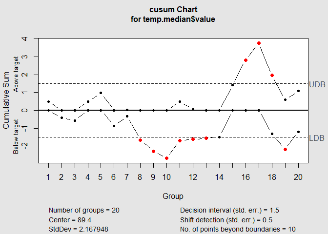

CUSUM\_for\_Change\_Detection
================
Exploring Atlanta weather Rrecords dataset

# Introduction

Here, we explore Atlanta weather Rrecords dataset to identify when
unofficial summer ends eah year. We define summer end as when the
weather starts cooling off. We will be using CUSUM approach. In part(b),
we try to make a judgment of whether Atlanta’s summer climate has gotten
warmer.

# Source of Data

Atlanta weather Rrecords dataset is available from the following link.
It contains July through October daily-high-temperature data for Atlanta
for 1996 through 2015.

Link: <http://www.iweathernet.com/atlanta-weather-records>

# Summary of solution to this problem:

1.  Read the dataset and verify the data type

2.  Explore the data, calculate the summery stats and get a perspective
    about data. Use this information to define key-values of the model.

3.  Apply the CUSM algorithm

4.  Visualize the results and verify the findings

# Part(a)- Identify when unofficial summer ends

## 1\. Read the dataset and load it as ‘data’.

``` r
data <- read.table(file = 'data/temps.txt',
                   sep = "\t",
                   header=T,
                   na.strings=c(" ","","NA"))
str(data)
```

    ## 'data.frame':    123 obs. of  21 variables:
    ##  $ DAY  : chr  "1-Jul" "2-Jul" "3-Jul" "4-Jul" ...
    ##  $ X1996: int  98 97 97 90 89 93 93 91 93 93 ...
    ##  $ X1997: int  86 90 93 91 84 84 75 87 84 87 ...
    ##  $ X1998: int  91 88 91 91 91 89 93 95 95 91 ...
    ##  $ X1999: int  84 82 87 88 90 91 82 86 87 87 ...
    ##  $ X2000: int  89 91 93 95 96 96 96 91 96 99 ...
    ##  $ X2001: int  84 87 87 84 86 87 87 89 91 87 ...
    ##  $ X2002: int  90 90 87 89 93 93 89 89 90 91 ...
    ##  $ X2003: int  73 81 87 86 80 84 87 90 89 84 ...
    ##  $ X2004: int  82 81 86 88 90 90 89 87 88 89 ...
    ##  $ X2005: int  91 89 86 86 89 82 76 88 89 78 ...
    ##  $ X2006: int  93 93 93 91 90 81 80 82 84 84 ...
    ##  $ X2007: int  95 85 82 86 88 87 82 82 89 86 ...
    ##  $ X2008: int  85 87 91 90 88 82 88 90 89 87 ...
    ##  $ X2009: int  95 90 89 91 80 87 86 82 84 84 ...
    ##  $ X2010: int  87 84 83 85 88 89 94 97 96 90 ...
    ##  $ X2011: int  92 94 95 92 90 90 94 94 91 92 ...
    ##  $ X2012: int  105 93 99 98 100 98 93 95 97 95 ...
    ##  $ X2013: int  82 85 76 77 83 83 79 88 88 87 ...
    ##  $ X2014: int  90 93 87 84 86 87 89 90 90 87 ...
    ##  $ X2015: int  85 87 79 85 84 84 90 90 91 93 ...

## 2\. Explor the data

Observe the temperature range, median and outliers for every year. Here
we want to get a perspective about what kind of data we have, what is
the range of data, how many data points we have etc.

### 2.a Summary Stats

``` r
summary(data)
```

    ##      DAY                X1996           X1997           X1998      
    ##  Length:123         Min.   :60.00   Min.   :55.00   Min.   :63.00  
    ##  Class :character   1st Qu.:79.00   1st Qu.:78.50   1st Qu.:79.50  
    ##  Mode  :character   Median :84.00   Median :84.00   Median :86.00  
    ##                     Mean   :83.72   Mean   :81.67   Mean   :84.26  
    ##                     3rd Qu.:90.00   3rd Qu.:88.50   3rd Qu.:89.00  
    ##                     Max.   :99.00   Max.   :95.00   Max.   :95.00  
    ##      X1999           X2000            X2001           X2002      
    ##  Min.   :57.00   Min.   : 55.00   Min.   :51.00   Min.   :57.00  
    ##  1st Qu.:75.00   1st Qu.: 77.00   1st Qu.:78.00   1st Qu.:78.00  
    ##  Median :86.00   Median : 86.00   Median :84.00   Median :87.00  
    ##  Mean   :83.36   Mean   : 84.03   Mean   :81.55   Mean   :83.59  
    ##  3rd Qu.:91.00   3rd Qu.: 91.00   3rd Qu.:87.00   3rd Qu.:91.00  
    ##  Max.   :99.00   Max.   :101.00   Max.   :93.00   Max.   :97.00  
    ##      X2003           X2004           X2005           X2006      
    ##  Min.   :57.00   Min.   :62.00   Min.   :54.00   Min.   :53.00  
    ##  1st Qu.:78.00   1st Qu.:78.00   1st Qu.:81.50   1st Qu.:79.00  
    ##  Median :84.00   Median :82.00   Median :85.00   Median :85.00  
    ##  Mean   :81.48   Mean   :81.76   Mean   :83.36   Mean   :83.05  
    ##  3rd Qu.:87.00   3rd Qu.:87.00   3rd Qu.:88.00   3rd Qu.:91.00  
    ##  Max.   :91.00   Max.   :95.00   Max.   :94.00   Max.   :98.00  
    ##      X2007           X2008           X2009           X2010      
    ##  Min.   : 59.0   Min.   :50.00   Min.   :51.00   Min.   :67.00  
    ##  1st Qu.: 81.0   1st Qu.:79.50   1st Qu.:75.00   1st Qu.:82.00  
    ##  Median : 86.0   Median :85.00   Median :83.00   Median :90.00  
    ##  Mean   : 85.4   Mean   :82.51   Mean   :80.99   Mean   :87.21  
    ##  3rd Qu.: 89.5   3rd Qu.:88.50   3rd Qu.:88.00   3rd Qu.:93.00  
    ##  Max.   :104.0   Max.   :95.00   Max.   :95.00   Max.   :97.00  
    ##      X2011           X2012            X2013           X2014      
    ##  Min.   :59.00   Min.   : 56.00   Min.   :56.00   Min.   :63.00  
    ##  1st Qu.:79.00   1st Qu.: 79.50   1st Qu.:77.00   1st Qu.:81.50  
    ##  Median :89.00   Median : 85.00   Median :84.00   Median :86.00  
    ##  Mean   :85.28   Mean   : 84.65   Mean   :81.67   Mean   :83.94  
    ##  3rd Qu.:94.00   3rd Qu.: 90.50   3rd Qu.:88.00   3rd Qu.:89.00  
    ##  Max.   :99.00   Max.   :105.00   Max.   :92.00   Max.   :95.00  
    ##      X2015     
    ##  Min.   :56.0  
    ##  1st Qu.:77.0  
    ##  Median :85.0  
    ##  Mean   :83.3  
    ##  3rd Qu.:90.0  
    ##  Max.   :97.0

### 2.b boxplot

We draw the box plot for each year. This give sa good perpective about
temprature range for every year.

From box-plot, we can see that the temperature medians did not vary much
over the last 20 years (except around 2010).And even though, there are
some outliers, these are in the lower temperature ranges. *That means we
should focus on the lower cusm.violations*.

``` r
library(reshape)
```

    ## Warning: package 'reshape' was built under R version 4.0.4

``` r
meltdata <- melt(data[])
```

    ## Using DAY as id variables

``` r
boxplot(data=meltdata, value~variable)
```

<!-- -->

### 2.c Summery stats for each day

Here we explore the summary stats for each day. For example, what the
average temperature is on July 1 in last 20 years.

From this plot we can see that the average daily temperature doesnt vary
much in first 50 days of summer (since July 1) That gives us a great
perspective about what the summer temperature is like in Atlanta.

``` r
# summery stats for each day
day.mean <- rep(0,123)
for (i in 1:123) {
  day.mean[i] <- mean(unlist(data[i,2:21]))
}
df.mean <- data.frame(day = unlist(data[0:123,1]),day.mean)

plot(x = 1:123, df.mean$day.mean, type="p",col="red")
```

<!-- -->

### 2.d Key-definitions

To move forward with CUSUM analysis, we need to agree on some definition
and expectations.

Based on the above data exploration, I proceed with CUSUM using these
few key definitions:

1.  *Definition of summer *: We consider ALL the data available as
    summer data points. i.e we include all the data points in our
    analysis. (If the study was about summer temperature in Montreal, we
    could probably exclude October from analysis.)

2.  *Definition of Control value *: We consider the average temperature
    for the first 50 days of summer as our control value.
    
      - The weather is certainly warm; no doubt it is summer.
      - we do not include the “cool-off” period or Fall in our control
        value
      - There is not much variation through different years.

We take the “Historical” approach to CUSUM, and we use all the history
and everything we know to determine our control values.

*control value : average( average(temp for the first 50 days) for each
year)*

3\.*Standard deviation *: This value is very important because we should
not consider normal temperature variations as unexpected change.

*expected SD : average( SD(temp for the first 50 days) for each year )*

### 2.e. Summary stats by Year

In this section, we prepare our control values for CUSUM. we caclulate
mean, median and standard deviation for first 50 days of summer for each
year.

``` r
meltdata <- melt(data[0:50,])
```

    ## Using DAY as id variables

``` r
# summery stats for each YEAR
temp.mean <- aggregate(value~variable, meltdata, mean)
temp.sd <- aggregate(value~variable, meltdata, sd)
temp.median <- aggregate(value~variable, meltdata, median)
yoy.stats <- data.frame(YEAR = temp.mean$variable,
                       Median = temp.median$value,
                       MEAN = temp.mean$value,
                       SD = temp.sd$value)

print(yoy.stats)
```

    ##     YEAR Median  MEAN       SD
    ## 1  X1996   91.0 90.16 4.386249
    ## 2  X1997   88.0 86.64 4.525483
    ## 3  X1998   88.5 88.18 3.555335
    ## 4  X1999   91.0 90.02 5.801091
    ## 5  X2000   91.0 91.72 5.439988
    ## 6  X2001   87.0 86.62 2.586385
    ## 7  X2002   90.0 89.68 3.377235
    ## 8  X2003   86.0 85.60 3.245090
    ## 9  X2004   87.5 86.60 4.115674
    ## 10 X2005   88.0 86.94 3.996989
    ## 11 X2006   91.0 90.54 4.612361
    ## 12 X2007   89.0 90.74 6.583250
    ## 13 X2008   89.0 88.54 3.202104
    ## 14 X2009   89.0 87.88 3.706806
    ## 15 X2010   93.0 91.70 3.671456
    ## 16 X2011   93.0 92.38 3.331299
    ## 17 X2012   92.0 92.08 5.029870
    ## 18 X2013   86.0 84.42 5.580908
    ## 19 X2014   87.0 86.96 3.475629
    ## 20 X2015   91.0 90.44 3.264903

``` r
plot(x = 1996:2015, temp.mean$value, type="p",col="red", 
     main = "Average temprature of the first 50 days of summer")
```

<!-- -->

``` r
plot(x = 1996:2015, temp.median$value ,type="p", col="green", 
     main = "Median temprature of the first 50 days of summer")
```

<!-- -->

## 3\. Apply the CUSM algorithm

Here we apply the CUSM algorithm using the calculated mean and SD
values.

I picked and tuned H and C, so that:

1.  “Cooling off” period will be detected rather than detecting single
    “cool” days in summer.

2.  I did not just use tex-book suggested values for C and H. But I also
    considered the nature of the data we are working with, what is the
    summer temperature in Atlanta, and how much it should cool off to
    feel like Fall.

CUSUM:

  - center = Target value of the process (Mu value):
    mean(temp.mean$value)

  - std.dev = standard deviation(s) of the process (sigma value):
    mean(temp.sd$value)

  - decision.interval = At which the cumulative sum is out of control (
    H value): 3 \* mean(temp.sd$value)

  - se.shift = The amount of shift to detect in the process ( C value ):
    0.5 \* mean(temp.sd$value)

<!-- end list -->

``` r
library(qcc)
```

    ## Warning: package 'qcc' was built under R version 4.0.5

    ## Package 'qcc' version 2.7

    ## Type 'citation("qcc")' for citing this R package in publications.

``` r
# To keep the cusm.violations for each year
model.cusum.violations <- matrix(0, nrow=ncol(data) - 1, ncol=3)


for (i in 1:(ncol(data)-1)){ # Loop over years
  
  model.cusum <- cusum(data[,i+1], 
                            center = mean(temp.mean$value),
                            std.dev = mean(temp.sd$value),
                            decision.interval= 3 * mean(temp.sd$value), 
                            se.shift = 0.5 * mean(temp.sd$value) ,#* mean(temp.sd$value) , 
                            plot = T,
                            add.stats = T)
  
  # Index for lower violations
  # This is when temperature starts to cool off
  v.index <- model.cusum$violations$lower
  model.cusum.violations[i,] <- c(YEAR = colnames(data)[i+1],
                                  Start = data[min(v.index),1],
                                  MedianS = data[median(v.index),1])
}
```

<!-- --><!-- --><!-- --><!-- --><!-- --><!-- --><!-- --><!-- --><!-- --><!-- --><!-- --><!-- --><!-- --><!-- --><!-- --><!-- --><!-- --><!-- --><!-- --><!-- -->

## 4\. Visualize the results

Lets verify our results. First, we print the “day when weather starts
cooling off” for each year. It seems that summer *usually* ends in
second week of September.

### 4.a Cool-Off day for each year

``` r
print(model.cusum.violations[,1:2])
```

    ##       [,1]    [,2]    
    ##  [1,] "X1996" "28-Sep"
    ##  [2,] "X1997" "26-Sep"
    ##  [3,] "X1998" "4-Oct" 
    ##  [4,] "X1999" "23-Sep"
    ##  [5,] "X2000" "8-Sep" 
    ##  [6,] "X2001" "25-Sep"
    ##  [7,] "X2002" "26-Sep"
    ##  [8,] "X2003" "17-Sep"
    ##  [9,] "X2004" "14-Sep"
    ## [10,] "X2005" "9-Oct" 
    ## [11,] "X2006" "21-Sep"
    ## [12,] "X2007" "3-Oct" 
    ## [13,] "X2008" "24-Sep"
    ## [14,] "X2009" "11-Sep"
    ## [15,] "X2010" "3-Oct" 
    ## [16,] "X2011" "17-Sep"
    ## [17,] "X2012" "2-Oct" 
    ## [18,] "X2013" "18-Aug"
    ## [19,] "X2014" "28-Sep"
    ## [20,] "X2015" "24-Sep"

``` r
plot(as.Date(model.cusum.violations[,2],"%d-%B"), x = 1996:2015,
     main = "First day when weather starts cooling off",
     xlab = "Years",
     ylab = "Dates")
```

<!-- -->

Now we plot the day-temperature for a couple of years to see if our
change detection algorithm really works.

### 4.b Plot day-temperature for a couple of years to validate results\*

``` r
#X1999
plot(data[,5], x = as.Date(data[,1],"%d-%B" ),
     main = "X1999 when weather starts cooling off",
     xlab = "Date",
     ylab = "Temp")
abline(v=as.Date("23-Sep","%d-%B"), col="red")
```

<!-- -->

``` r
#X2010
plot(data[,16], x = as.Date(data[,1],"%d-%B" ),
     main = "X2013 when weather starts cooling off",
     xlab = "Date",
     ylab = "Temp")
abline(v=as.Date("3-Oct","%d-%B"), col="red")
```

<!-- -->

# Part(b)- Identify if Atlanta’s summer climate has gotten warmer

Use a CUSUM approach to make a judgment of whether Atlanta’s summer
climate has gotten warmer in that time (and if so, when).

To answer this questions, we can use several methods:

1.  Apply CUSM over the summer average temperature from 1996 to 2015
2.  Apply CUSM over the summer median temperature from 1996 to 2015
3.  Apply CUSM over the summer max temperature from 1996 to 2015
4.  Apply CUSM over the summer min temperature from 1996 to 2015
5.  Apply CUSM over every day temperature from 1996 to 2015 (e.g July 1
    from 1996 to 2015 )
6.  Use the results from previous section to see if summer is getting
    longer

Here is how I proceed:

  - I pick the first two options.
  - summer definition: all the days included in our data

First, lets look at this box plot again. It has all of the above values
incluing mean, median, min, max.

``` r
boxplot(data=meltdata, value~variable)
```

<!-- -->

## Verifying if summer *average-temprature* has increased

### 1\. Calculate Averages & Standard Dev of yearly summer average-temperature

``` r
# Using summer average-temperature (i.e mean(summer.1996): mean(summer.2015))
# we already have the mean-temperature for each year in temp.median

mean.average <- mean(temp.mean$value) #to be used as control value
mean.sd <- sd(temp.mean$value)
```

*plot summer average-temperature *

``` r
plot(temp.mean$value, x = 1996:2015,type="l")
```

<!-- -->

### 2\. Apply the CUSM

Here we apply the CUSM algorithm using the calculated mean and SD
values.

I picked and tuned H and C, so that:

1.  H and C are now tighten because we can see much less variations in
    average-temperature.

2.  Based on context research about global-warming, I learned that even
    a 1 degrees Celsius temperature increase is a concern.( here we are
    working with F = 9/5 \* c)

CUSUM:

  - center = Target value of the process (Mu value):
    mean(temp.mean$value)

  - std.dev = standard deviation(s) of the process (sigma value):
    sd(temp.mean$value)

  - decision.interval = At which the cumulative sum is out of control (
    H value): 1

  - se.shift = The amount of shift to detect in the process ( C value ):
    0.5

<!-- end list -->

``` r
# To keep the cusm.violations for each year
model.cusum.violations <- matrix(0, nrow= nrow(temp.mean), ncol=3)

model.cusum <- cusum(temp.mean$value,
                     center = mean.average, 
                     std.dev = mean.sd,
                     decision.interval= 0.75, 
                     se.shift = 0.25, 
                     plot = TRUE)
```

<!-- -->

``` r
  # Index for upper violations
  # This is when temperature increase
  v.index <- model.cusum$violations$upper
  cat("This is when the summer average-temprature started to increase:\n",
      colnames(data)[v.index + 1])
```

    ## This is when the summer average-temprature started to increase:
    ##  X2000 X2007 X2008 X2010 X2011 X2012 X2013 X2014 X2015

## Verifying if summer *median-temperature* has increased

### 1\. Calculate Averages & Standard Dev of yearly summer average-temperature \*

``` r
# Using summer average-temperature (i.e median(summer.1996): median(summer.2015))
# we already have the median-temperature for each year in temp.median 
median.average <- mean(temp.median$value)
median.sd <- sd(temp.median$value)
```

*plot summer average-temperature *

``` r
plot(temp.median$value, x = 1996:2015,type="l")
```

<!-- -->

### 2\. Apply the CUSM algorithm using the calculated mean and SD values\*

``` r
# To keep the cusm.violations for each year
model.cusum.violations <- matrix(0, nrow= nrow(temp.mean), ncol=3)

model.cusum <- cusum(temp.median$value,
                     center = median.average, 
                     std.dev = median.sd,
                     decision.interval= 1.5, 
                     se.shift = 0.5 , 
                     plot = TRUE)
```

<!-- -->

``` r
  # Index for upper violations
  # This is when temperature increase
  v.index <- model.cusum$violations$upper
  cat("This is when the summer median-temprature started to increase:\n",
      colnames(data)[v.index + 1])
```

    ## This is when the summer median-temprature started to increase:
    ##  X2011 X2012 X2013

Our algorithm detects a positive change in X2011 X2012 X2013, but it did
not continue later. Overall, we cannot conclude if temperature has any
meaningful increase over the last 20 years.

My next step would be to investigate if temprature in Fall and Winter
has increased during the last 20 years. Maybe we can see a more obvious
sign of global warming in warmer Fall and Winter. But this is out of
scope of this homework.
