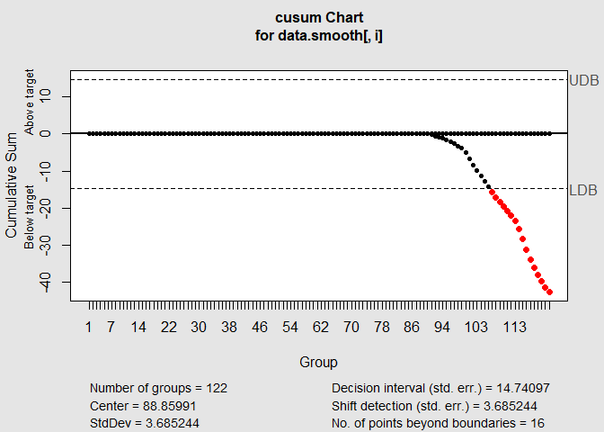

Exponential Smoothing
================
Exploring Atlanta weather Rrecords dataset

# Introduction

Here, we explore Atlanta weather Rrecords dataset to build and use an
exponential smoothing model to help make a judgment of **whether the
unofficial end of summer has gotten later over the 20 years**.

# Source of Data

Atlanta weather Rrecords dataset is available from the following link.
It contains July through October daily-high-temperature data for Atlanta
for 1996 through 2015.

Link: <http://www.iweathernet.com/atlanta-weather-records>

# Summary of solution to this problem:

1.  Read the dataset and verify the data type

2.  Explore the data, generate time series and get a perspective about
    data.

3.  Apply Exponential Smoothing on temp value to reduce fluctuations.
    Then apply CUSUM.

4.  Decompose time series. Explore seasonlity.

## 1\. Read the dataset and load it as ‘data’

``` r
data <- read.table(file = 'data/temps.txt',
                   sep = "\t",
                   header=T,
                   na.strings=c(" ","","NA"))
str(data)
```

    ## 'data.frame':    123 obs. of  21 variables:
    ##  $ DAY  : chr  "1-Jul" "2-Jul" "3-Jul" "4-Jul" ...
    ##  $ X1996: int  98 97 97 90 89 93 93 91 93 93 ...
    ##  $ X1997: int  86 90 93 91 84 84 75 87 84 87 ...
    ##  $ X1998: int  91 88 91 91 91 89 93 95 95 91 ...
    ##  $ X1999: int  84 82 87 88 90 91 82 86 87 87 ...
    ##  $ X2000: int  89 91 93 95 96 96 96 91 96 99 ...
    ##  $ X2001: int  84 87 87 84 86 87 87 89 91 87 ...
    ##  $ X2002: int  90 90 87 89 93 93 89 89 90 91 ...
    ##  $ X2003: int  73 81 87 86 80 84 87 90 89 84 ...
    ##  $ X2004: int  82 81 86 88 90 90 89 87 88 89 ...
    ##  $ X2005: int  91 89 86 86 89 82 76 88 89 78 ...
    ##  $ X2006: int  93 93 93 91 90 81 80 82 84 84 ...
    ##  $ X2007: int  95 85 82 86 88 87 82 82 89 86 ...
    ##  $ X2008: int  85 87 91 90 88 82 88 90 89 87 ...
    ##  $ X2009: int  95 90 89 91 80 87 86 82 84 84 ...
    ##  $ X2010: int  87 84 83 85 88 89 94 97 96 90 ...
    ##  $ X2011: int  92 94 95 92 90 90 94 94 91 92 ...
    ##  $ X2012: int  105 93 99 98 100 98 93 95 97 95 ...
    ##  $ X2013: int  82 85 76 77 83 83 79 88 88 87 ...
    ##  $ X2014: int  90 93 87 84 86 87 89 90 90 87 ...
    ##  $ X2015: int  85 87 79 85 84 84 90 90 91 93 ...

## 2\. Explore the data

Observe the temperature range, median and outliers for every year. Here
we want to get a perspective about what kind of data we have, what is
the range of data, how many data points we have etc.

### 2.a Summary Stats

``` r
summary(data)
```

    ##      DAY                X1996           X1997           X1998      
    ##  Length:123         Min.   :60.00   Min.   :55.00   Min.   :63.00  
    ##  Class :character   1st Qu.:79.00   1st Qu.:78.50   1st Qu.:79.50  
    ##  Mode  :character   Median :84.00   Median :84.00   Median :86.00  
    ##                     Mean   :83.72   Mean   :81.67   Mean   :84.26  
    ##                     3rd Qu.:90.00   3rd Qu.:88.50   3rd Qu.:89.00  
    ##                     Max.   :99.00   Max.   :95.00   Max.   :95.00  
    ##      X1999           X2000            X2001           X2002      
    ##  Min.   :57.00   Min.   : 55.00   Min.   :51.00   Min.   :57.00  
    ##  1st Qu.:75.00   1st Qu.: 77.00   1st Qu.:78.00   1st Qu.:78.00  
    ##  Median :86.00   Median : 86.00   Median :84.00   Median :87.00  
    ##  Mean   :83.36   Mean   : 84.03   Mean   :81.55   Mean   :83.59  
    ##  3rd Qu.:91.00   3rd Qu.: 91.00   3rd Qu.:87.00   3rd Qu.:91.00  
    ##  Max.   :99.00   Max.   :101.00   Max.   :93.00   Max.   :97.00  
    ##      X2003           X2004           X2005           X2006      
    ##  Min.   :57.00   Min.   :62.00   Min.   :54.00   Min.   :53.00  
    ##  1st Qu.:78.00   1st Qu.:78.00   1st Qu.:81.50   1st Qu.:79.00  
    ##  Median :84.00   Median :82.00   Median :85.00   Median :85.00  
    ##  Mean   :81.48   Mean   :81.76   Mean   :83.36   Mean   :83.05  
    ##  3rd Qu.:87.00   3rd Qu.:87.00   3rd Qu.:88.00   3rd Qu.:91.00  
    ##  Max.   :91.00   Max.   :95.00   Max.   :94.00   Max.   :98.00  
    ##      X2007           X2008           X2009           X2010      
    ##  Min.   : 59.0   Min.   :50.00   Min.   :51.00   Min.   :67.00  
    ##  1st Qu.: 81.0   1st Qu.:79.50   1st Qu.:75.00   1st Qu.:82.00  
    ##  Median : 86.0   Median :85.00   Median :83.00   Median :90.00  
    ##  Mean   : 85.4   Mean   :82.51   Mean   :80.99   Mean   :87.21  
    ##  3rd Qu.: 89.5   3rd Qu.:88.50   3rd Qu.:88.00   3rd Qu.:93.00  
    ##  Max.   :104.0   Max.   :95.00   Max.   :95.00   Max.   :97.00  
    ##      X2011           X2012            X2013           X2014      
    ##  Min.   :59.00   Min.   : 56.00   Min.   :56.00   Min.   :63.00  
    ##  1st Qu.:79.00   1st Qu.: 79.50   1st Qu.:77.00   1st Qu.:81.50  
    ##  Median :89.00   Median : 85.00   Median :84.00   Median :86.00  
    ##  Mean   :85.28   Mean   : 84.65   Mean   :81.67   Mean   :83.94  
    ##  3rd Qu.:94.00   3rd Qu.: 90.50   3rd Qu.:88.00   3rd Qu.:89.00  
    ##  Max.   :99.00   Max.   :105.00   Max.   :92.00   Max.   :95.00  
    ##      X2015     
    ##  Min.   :56.0  
    ##  1st Qu.:77.0  
    ##  Median :85.0  
    ##  Mean   :83.3  
    ##  3rd Qu.:90.0  
    ##  Max.   :97.0

### 2.b boxplot

We draw the box plot for each year. This gives a good perspective about
temperature range for every year.

From box-plot, we can see that the temperature medians did not vary much
over the last 20 years (except around 2010).And even though, there are
some outliers, these are in the lower temperature ranges. *That means we
should focus on the lower cusm.violations*.

``` r
library(reshape)
```

    ## Warning: package 'reshape' was built under R version 4.0.4

``` r
meltdata <- melt(data[])
```

    ## Using DAY as id variables

``` r
boxplot(data=meltdata, value~variable)
```

<!-- -->

### 2.c Generate the time series from temperature data

Here we generate time series based on 123-days data points which we have
for 20 years. That means the frequency = 123 and duration is 20 years.

I understand we do not have the temperature for every 360 days, but it
doesn’t matter. Because we have the data points for *same period* for 20
*consecutive* years.

From observing the temp.series plot, I do not see any obvious trend, but
I think there is some seasonality in the data. In order to verify my
observation, I am going to decompose the time series in part 2.d.

``` r
library(tseries)
```

    ## Warning: package 'tseries' was built under R version 4.0.5

    ## Registered S3 method overwritten by 'quantmod':
    ##   method            from
    ##   as.zoo.data.frame zoo

``` r
temp.series = ts( as.vector(unlist(data[ , 2:21])), start = 1996, frequency = 123 )
plot(temp.series[])
```

<!-- -->

### 2.d Decompose Time Series Data

Here, I decompose the time series into following components:

1.  Trend: The increasing or decreasing trend in the series.
2.  Seasonality: The repeating short-term cycle in the series.
3.  Random: The noise and random variation in the series.

This plot confirms my observation.

1.  There is no steady trend in our data over the 20 years period. There
    is an increase from 2010 to 2011, followed by a decrease till
    2013-2014. Perhaps this is the reason that CUSUM detects some change
    around 2010. But this trend did not continue.

2.  We have a have a seasonal time series.

<!-- end list -->

``` r
plot(decompose(temp.series))
```

<!-- -->

# Aproach one: Apply Exponential Smoothing on temp value

From last homework, we remember that there was too much variations in
our data. CUSUM detected un-desired change when temperature was cool
only for one single day.

Here, we apply Exponential Smoothing on temp value for each year to
smooth the plot and reduce the variations. I explore HoltWinters with
different parameter values.

## 1\. Simple Exponential Smoothing

``` r
library(stats)
se <- HoltWinters(temp.series, gamma = FALSE, beta = FALSE)
cat("optimum alpha: ", se$alpha)
```

    ## optimum alpha:  0.8388021

``` r
plot(se)
```

<!-- -->

## 2\. HoltWinters with optimum values

We will be letting the HoltWinters function choose the appropriate
values.

You can see that beta is 0. This again verifies our observation from
time series decomposition; there is no steady trend in data. On the
other hand gamma is set to non-zero values because we can see the
seasonality in our data.

There is no much difference between additive and multiplicative, but
additive has a smaller SSE.

``` r
library(stats)
se.add <- HoltWinters(temp.series, seasonal="additive")
se.mu <- HoltWinters(temp.series, seasonal="multiplicative")

cat("additive\n", "Alpha: ",se.add$alpha, "\tBeta: ",se.add$beta,
    "\tGamma: " ,se.add$gamma,"\tSSE: ",se.add$SSE)
```

    ## additive
    ##  Alpha:  0.6610618   Beta:  0    Gamma:  0.6248076   SSE:  66244.25

``` r
cat("\n\nmultiplicative\n", "Alpha: ",se.mu$alpha, "\tBeta: ", se.mu$beta,
    "\tGamma: " ,se.mu$gamma,"\tSSE: ",se.mu$SSE)
```

    ## 
    ## 
    ## multiplicative
    ##  Alpha:  0.615003    Beta:  0    Gamma:  0.5495256   SSE:  68904.57

``` r
plot(se.add)
```

<!-- -->

``` r
plot(fitted(se.add))
```

<!-- -->

``` r
plot(se.mu)
```

<!-- -->

``` r
plot(fitted(se.mu))
```

<!-- -->

## 3\. Apply CUSUM on Smoothed temperature value

Here, we apply CUSUM on temperature value for each year to see if when
temperature starts to cool-off *each year*. Before applying CUSUM, we
apply exponential smoothing.

For simplicity, here we apply simple exponential smoothing (gamma =
FALSE, beta = FALSE). plot

  - Alpha: I have tuned alpha through try and error. Because we want to
    find the “end of summer”, I tried to find an alpha which smooths the
    fluctuation in first 60-70 days of summer (when I am certain that it
    is summer, with maybe with a couple of cool days).

I have plotted the original data and smoothed data.

### 3.a Simple Exponential Smoothing for each year

``` r
data.smooth <- matrix(0, nrow=122, ncol=20)
for (i in 1:20)  {
  
  # We smooth the data variation
  model <- HoltWinters(data[,i+1], alpha = 0.2 ,gamma = FALSE, beta = FALSE)
  plot(model)
  data.smooth[,i] <- model$fitted[,2]
}
```

<!-- --><!-- --><!-- --><!-- --><!-- --><!-- --><!-- --><!-- --><!-- --><!-- --><!-- --><!-- --><!-- --><!-- --><!-- --><!-- --><!-- --><!-- --><!-- --><!-- -->

Here I plot the the smoothed data for each year. We can observe the
cooling period for each year.

``` r
plot.ts(data.smooth[,1:10])
```

<!-- -->

``` r
plot.ts(data.smooth[,11:20])
```

<!-- -->

### 3.b Apply the CUSM algorithm

To move forward with CUSUM analysis, we need to agree on some definition
and expectations.

Based on the above data exploration, I proceed with CUSUM using these
few key definitions:

1.  *Definition of summer *: We consider ALL the data available i.e we
    include all the data points in our analysis. (If the study was about
    summer temperature in Montreal, we could probably exclude October
    from analysis.)

2.  *Definition of Control value *: We consider the average temperature
    for the first 50 days of *smoothed*-summer temperature as our
    control value.
    
      - The weather is certainly warm; no doubt it is summer.
      - we do not include the “cool-off” period or Fall in our control
        value
      - There is not much variation through different years.

We take the “Historical” approach to CUSUM, and we use all the history
and everything we know to determine our control values.

``` 
   *control value : average( average(SES.temp for the first 50 days) for each year)*
```

3.  *Standard deviation *: This value is very important because we
    should not consider normal temperature variations as unexpected
    change.
    
    ``` 
     *expected SD :  average( SD(SES.temp for the first 50 days) for each year )*
    ```

Moreover, I picked and tuned H and C, so that:

1.  “Cooling off” period will be detected rather than detecting single
    “cool” days in summer.

2.  I did not just use tex-book suggested values for C and H. But I also
    considered the nature of the data we are working with, what is the
    summer temperature in Atlanta, and how much it should cool off to
    feel like Fall.

CUSUM:

  - center = Target value of the process (Mu value):
    mean(data.smooth\[1:50,\])

  - std.dev = standard deviation(s) of the process (sigma value):
    sd(data.smooth\[1:50,\])

  - decision.interval = At which the cumulative sum is out of control (
    H value): 4 \* sigma

  - se.shift = The amount of shift to detect in the process ( C value ):
    1 \* sigma

<!-- end list -->

``` r
library(qcc)
```

    ## Warning: package 'qcc' was built under R version 4.0.5

    ## Package 'qcc' version 2.7

    ## Type 'citation("qcc")' for citing this R package in publications.

``` r
# To keep the cusm.violations for each year
model.cusum.violations <- matrix(0, nrow = 20, ncol=3)

c.mean <- mean(data.smooth[1:50,])
c.sd <- sd(data.smooth[1:50,])

for (i in 1:20){ # Loop over years
  model.cusum <- cusum(data.smooth[,i], 
                            center = c.mean,
                            std.dev = c.sd,
                            decision.interval= 4 * c.sd, 
                            se.shift = 1 * c.sd ,#* mean(temp.sd$value) , 
                            plot = T,
                            add.stats = T)
  
  # Index for lower violations
  # This is when temperature starts to cool off
  v.index <- model.cusum$violations$lower
  model.cusum.violations[i,] <- c(YEAR = colnames(data)[i+1],
                                  Start = data[min(v.index),1],
                                  MedianS = data[median(v.index),1])
}
```

<!-- --><!-- --><!-- --><!-- --><!-- --><!-- --><!-- --><!-- --><!-- --><!-- --><!-- --><!-- --><!-- --><!-- --><!-- --><!-- --><!-- --><!-- --><!-- --><!-- -->

## 4\. Visualize the results

Lets verify our results. First, we print the “day when weather starts
cooling off” for each year. It seems that summer *usually* ends in first
half of October.

### 4.a Cool-Off day for each year

``` r
print(model.cusum.violations[,1:2])
```

    ##       [,1]    [,2]    
    ##  [1,] "X1996" "6-Oct" 
    ##  [2,] "X1997" "4-Oct" 
    ##  [3,] "X1998" "15-Oct"
    ##  [4,] "X1999" "4-Oct" 
    ##  [5,] "X2000" "28-Sep"
    ##  [6,] "X2001" "4-Oct" 
    ##  [7,] "X2002" "11-Oct"
    ##  [8,] "X2003" "4-Oct" 
    ##  [9,] "X2004" "30-Sep"
    ## [10,] "X2005" "18-Oct"
    ## [11,] "X2006" "9-Oct" 
    ## [12,] "X2007" "21-Oct"
    ## [13,] "X2008" "15-Oct"
    ## [14,] "X2009" "5-Oct" 
    ## [15,] "X2010" "16-Oct"
    ## [16,] "X2011" "12-Oct"
    ## [17,] "X2012" "11-Oct"
    ## [18,] "X2013" "10-Oct"
    ## [19,] "X2014" "16-Oct"
    ## [20,] "X2015" "2-Oct"

From the following plots, we can see that:

1.  Since 2005, summer has ended *more often* in 2nd and 3rd week of
    October.
2.  Before 2005, summer has ended *more often* in 1st week of October.

I am sure this interpretation can change based on different smoothing
algorithm and CUSUM parameter.

``` r
plot(as.Date(model.cusum.violations[,2],"%d-%B"), x = 1996:2015,
     main = "First day when weather starts cooling off",
     xlab = "Years",
     ylab = "Dates")
abline(h=as.Date("07-Oct","%d-%B"), col="red")
abline(v=2005, col="red")
```

<!-- -->

### 4.b Plot day-temperature for a couple of years to validate results

Now we plot the day-temperature for a couple of years to see if our
change detection algorithm really works.

Red Line: End of summer based on last homework (not-smooth data)

Green Line: End of summer based on smooth data

You can see that temperature got warmer again after the red line. And
CUSUM on smooth data had a better judgment.

``` r
#X1999
plot(data[,5], x = as.Date(data[,1],"%d-%B" ),
     main = "X1999 when weather starts cooling off",
     xlab = "Date",
     ylab = "Temp")
abline(v=as.Date("23-Sep","%d-%B"), col="red")
abline(v=as.Date("4-Oct","%d-%B"), col="green")
```

<!-- -->

``` r
#X2010
plot(data[,16], x = as.Date(data[,1],"%d-%B" ),
     main = "X2013 when weather starts cooling off",
     xlab = "Date",
     ylab = "Temp")
abline(v=as.Date("3-Oct","%d-%B"), col="red")
abline(v=as.Date("16-Oct","%d-%B"), col="green")
```

<!-- -->

# Aproach two: Seasonaly Adjust the data

When we explored the data, we noticed that our data has a seasonal
component, but not a steady trend. Thus we perform Seasonal Adjustment
on our data.

## 1\. Decompose Time Series Data

``` r
temp.decompose <- decompose(temp.series)
str(temp.series)
```

    ##  Time-Series [1:2460] from 1996 to 2016: 98 97 97 90 89 93 93 91 93 93 ...

## 2\. Remove seasonality from data

We try seasonality adjustment for both additive and multiplicative to
see which one gives better results.

*Additive*

``` r
par(mfrow=c(2,2))
temp.decomp.add <- decompose(temp.series, "additive")
temp.decomp.add.adj <- temp.decomp.add$x - temp.decomp.add$seasonal

plot(temp.decomp.add$trend, 
     main = "Temprature: Trend Component")

plot(temp.decomp.add$seasonal, 
     main = "Temprature: Seasonality Component")

plot(temp.decomp.add$x, main = "Temprature")

plot(temp.decomp.add.adj, col = "red", 
     main = "Temprature: After Removing Seasonality")
```

<!-- -->

*Lets zoom-in*, and see the effect of removng seasonality for first
year.

``` r
par(mfrow=c(1,2))
plot( (temp.decomp.add$x)[1:123],
       main = "Zoom-In: First Year")
plot( (temp.decomp.add$x - temp.decomp.add$seasonal)[1:123],
      main = "After removing seasonality")
```

<!-- -->

*Multiplicative*

``` r
par(mfrow=c(2,2))
temp.decomp.mul <- decompose(temp.series, "multiplicative")
temp.decomp.mul.adj <- temp.decomp.mul$x / temp.decomp.mul$seasonal


plot(temp.decomp.mul$trend, 
     main = "Temprature: Trend Component")

plot(temp.decomp.mul$seasonal, 
     main = "Temprature: Seasonality Component")

plot(temp.decomp.mul$x, main = "Temprature")

plot(temp.decomp.mul.adj, col = "red", 
     main = "Temprature: After Removing Seasonality")
```

<!-- -->

## Final Note

1.  Based on seasonally adjusted data, I cannot cannot make a conclusion
    about global warming.

2.  If the seasonality variation is not of primary interest, the
    seasonally adjusted series can be useful. Here **seasonality matters
    to us**; we want to know if summer is getting longer. If summer gets
    longer, the *seasonality cycle* would change, and it would be
    obvious from the seasonality component. Here we have a perfect
    seasonality.

3.  It seems most of the variations we see is from trend and noise
    component.

4.  As explained earlier, trend is not steady. But there has been an
    increasing trend around 2010 followed by a sharp decrease. **The
    amplitude of trend** became wider. Perhaps if we could access data
    from mu earlier years (e.g 1900s) we could make a better judgment.

<!-- end list -->

``` r
library(qcc)
seasonality <- temp.decomp.add$seasonal

data.smooth <- matrix(0, nrow=123, ncol=20)
for (i in 1:20)  {

  data.smooth[,i] <- seasonality[ ( (i-1)*123 +1 ):(i*123)]
}


# To keep the cusm.violations for each year
model.cusum.violations <- matrix(0, nrow = 20, ncol=3)

c.mean <- mean(data.smooth[,])
c.sd <- sd(data.smooth[,])

for (i in 1:20){ # Loop over years
  model.cusum <- cusum(data.smooth[,i], 
                            center = c.mean,
                            std.dev = c.sd,
                            decision.interval= 3 * c.sd, 
                            se.shift = 0.5 * c.sd ,#* mean(temp.sd$value) , 
                            plot = T,
                            add.stats = T)
  
  # Index for lower violations
  # This is when temperature starts to cool off
  v.index <- model.cusum$violations$lower
  model.cusum.violations[i,] <- c(YEAR = colnames(data)[i+1],
                                  Start = data[min(v.index),1],
                                  MedianS = data[median(v.index),1])
}
```

    ## Warning in min(v.index): no non-missing arguments to min; returning Inf
    
    ## Warning in min(v.index): no non-missing arguments to min; returning Inf

<!-- -->

    ## Warning in min(v.index): no non-missing arguments to min; returning Inf
    
    ## Warning in min(v.index): no non-missing arguments to min; returning Inf
    
    ## Warning in min(v.index): no non-missing arguments to min; returning Inf
    
    ## Warning in min(v.index): no non-missing arguments to min; returning Inf
    
    ## Warning in min(v.index): no non-missing arguments to min; returning Inf
    
    ## Warning in min(v.index): no non-missing arguments to min; returning Inf
    
    ## Warning in min(v.index): no non-missing arguments to min; returning Inf
    
    ## Warning in min(v.index): no non-missing arguments to min; returning Inf
    
    ## Warning in min(v.index): no non-missing arguments to min; returning Inf
    
    ## Warning in min(v.index): no non-missing arguments to min; returning Inf
    
    ## Warning in min(v.index): no non-missing arguments to min; returning Inf
    
    ## Warning in min(v.index): no non-missing arguments to min; returning Inf
    
    ## Warning in min(v.index): no non-missing arguments to min; returning Inf
    
    ## Warning in min(v.index): no non-missing arguments to min; returning Inf
    
    ## Warning in min(v.index): no non-missing arguments to min; returning Inf
    
    ## Warning in min(v.index): no non-missing arguments to min; returning Inf
    
    ## Warning in min(v.index): no non-missing arguments to min; returning Inf
    
    ## Warning in min(v.index): no non-missing arguments to min; returning Inf

<!-- -->
