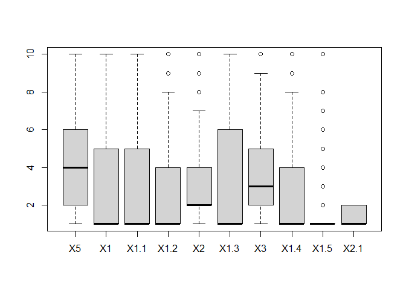
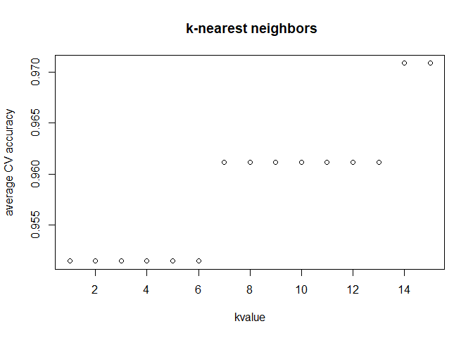
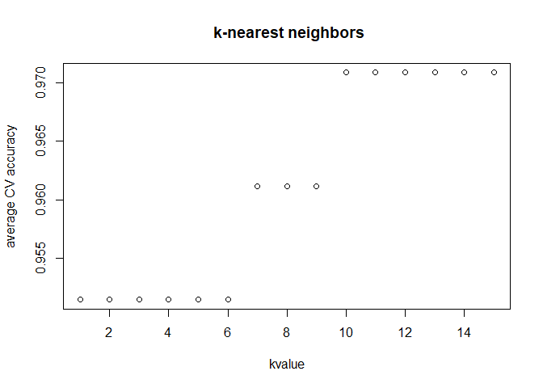
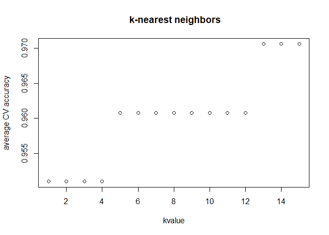

Imputation Methods and Regression
================
Exploring Breast Cancer Data Set

# Introduction

Here, we use the breast cancer data set to explore different imputation
methods.

1.  we use the mean/mode imputation method

2.  we use regression to impute missing values.

3.  we use regression with perturbation to impute missing values.

4.  We Compare the results and quality of classification models (e.g.,
    SVM, KNN)

# Source of Data

Breast cancer data set set from the following source:

<http://archive.ics.uci.edu/ml/machine-learning-databases/breast-cancer-wisconsin/>

Description is available here:

<http://archive.ics.uci.edu/ml/datasets/Breast+Cancer+Wisconsin+%28Original%29>

# Summary of the approach:

A- Read and explore the the dataset

B- Identify Missing Values (including obvious missing data, and
bad/invalid data)

C- Investigate if imputation is a proper approach

D- Use the mode imputation method

E- Use regression to impute values

F- Determine the type of regression required for imputation of missing
data

G- Use regression with perturbation to impute values

H- Compare the results and quality of classification models

## A- Read and explore the the dataset

We load the data and explore the records.

``` r
data <- read.table(file = 'data/breast-cancer-wisconsin.data.txt',
                   sep = ",",
                   header=T,
                   na.strings=c(" ","","?","NA"),
                   stringsAsFactors = FALSE)

head(data)
colnames(data)
```

Let’s quickly review the data format, and summary stats:

``` r
str(data)
```

    ## 'data.frame':    698 obs. of  11 variables:
    ##  $ X1000025: int  1002945 1015425 1016277 1017023 1017122 1018099 1018561 1033078 1033078 1035283 ...
    ##  $ X5      : int  5 3 6 4 8 1 2 2 4 1 ...
    ##  $ X1      : int  4 1 8 1 10 1 1 1 2 1 ...
    ##  $ X1.1    : int  4 1 8 1 10 1 2 1 1 1 ...
    ##  $ X1.2    : int  5 1 1 3 8 1 1 1 1 1 ...
    ##  $ X2      : int  7 2 3 2 7 2 2 2 2 1 ...
    ##  $ X1.3    : int  10 2 4 1 10 10 1 1 1 1 ...
    ##  $ X3      : int  3 3 3 3 9 3 3 1 2 3 ...
    ##  $ X1.4    : int  2 1 7 1 7 1 1 1 1 1 ...
    ##  $ X1.5    : int  1 1 1 1 1 1 1 5 1 1 ...
    ##  $ X2.1    : int  2 2 2 2 4 2 2 2 2 2 ...

``` r
summary(data)
```

    ##     X1000025              X5               X1              X1.1       
    ##  Min.   :   61634   Min.   : 1.000   Min.   : 1.000   Min.   : 1.000  
    ##  1st Qu.:  870258   1st Qu.: 2.000   1st Qu.: 1.000   1st Qu.: 1.000  
    ##  Median : 1171710   Median : 4.000   Median : 1.000   Median : 1.000  
    ##  Mean   : 1071807   Mean   : 4.417   Mean   : 3.138   Mean   : 3.211  
    ##  3rd Qu.: 1238354   3rd Qu.: 6.000   3rd Qu.: 5.000   3rd Qu.: 5.000  
    ##  Max.   :13454352   Max.   :10.000   Max.   :10.000   Max.   :10.000  
    ##                                                                       
    ##       X1.2              X2              X1.3              X3        
    ##  Min.   : 1.000   Min.   : 1.000   Min.   : 1.000   Min.   : 1.000  
    ##  1st Qu.: 1.000   1st Qu.: 2.000   1st Qu.: 1.000   1st Qu.: 2.000  
    ##  Median : 1.000   Median : 2.000   Median : 1.000   Median : 3.000  
    ##  Mean   : 2.809   Mean   : 3.218   Mean   : 3.548   Mean   : 3.438  
    ##  3rd Qu.: 4.000   3rd Qu.: 4.000   3rd Qu.: 6.000   3rd Qu.: 5.000  
    ##  Max.   :10.000   Max.   :10.000   Max.   :10.000   Max.   :10.000  
    ##                                    NA's   :16                       
    ##       X1.4            X1.5            X2.1      
    ##  Min.   : 1.00   Min.   : 1.00   Min.   :2.000  
    ##  1st Qu.: 1.00   1st Qu.: 1.00   1st Qu.:2.000  
    ##  Median : 1.00   Median : 1.00   Median :2.000  
    ##  Mean   : 2.87   Mean   : 1.59   Mean   :2.691  
    ##  3rd Qu.: 4.00   3rd Qu.: 1.00   3rd Qu.:4.000  
    ##  Max.   :10.00   Max.   :10.00   Max.   :4.000  
    ## 

### Update Response Value

Response: X2.1: Class: (2 for benign, 4 for malignant)

In order to use binomial family in logistic regression, We need to make
the response as a binary variable.We change the response to 0 and 1 for
simplicity: (0 for benign, 1 for malignant)

``` r
# Replace 1 and 2 with 0 and 1
data$X2.1[data$X2.1==2] <- 0
data$X2.1[data$X2.1==4] <- 1
data$X2.1 <- as.factor(data$X2.1)
```

## B- Identify Missing Values

### The Obvious Missing Values

When reading the data, I converted any “?” to R- NA value. Here I use
is.na() to find out:

1- which columns contains NA

2- How many NAs we have

``` r
colSums(is.na(data))
```

    ## X1000025       X5       X1     X1.1     X1.2       X2     X1.3       X3 
    ##        0        0        0        0        0        0       16        0 
    ##     X1.4     X1.5     X2.1 
    ##        0        0        0

``` r
na.col = 'X1.3'
na.index = which(is.na(data$X1.3))
na.index
```

    ##  [1]  23  40 139 145 158 164 235 249 275 292 294 297 315 321 411 617

``` r
str(data[na.col])
```

    ## 'data.frame':    698 obs. of  1 variable:
    ##  $ X1.3: int  10 2 4 1 10 10 1 1 1 1 ...

### The Bad data which might need to be replaced

Overall, it is always a good idea to investigate the outliers, and talk
to the subject matter expert to see if the outliers could be wrong
values. Maybe a data is captured by mistake. If so, then the wrong
values should be removed. Thus we get new ‘Missing data’.

1- Here, I just show the boxplot, but I assume all values are recorded
correctly.

``` r
boxplot(data[2:11])
```

<!-- -->

## C- Investigate if imputation is a proper approach here

``` r
na.percent = length(na.index)/length(data$X1.3)
na.percent
```

    ## [1] 0.02292264

1.  Because only 2% of the data is missing, we can go ahead with
    imputation.

2.  we should also verify if there is any specific relationship between
    the missing values and the response (last column). Here is the
    contibution of missing values for two possible response (2 and 4) is
    different, but not a concern (for example it is not all 2, or all
    4). So I think we can go ahead imputation.

First, we define two dataframe:

  - one without missing values (data\_clean)

  - one with only the rows which contain a missing value.(data\_missing)

<!-- end list -->

``` r
data_clean <- data[-na.index,]
data_missing <- data[na.index,]
```

Distribution of response in data\_clean:

``` r
prop.table(table(data_clean$X2.1))
```

    ## 
    ##         0         1 
    ## 0.6495601 0.3504399

Distribution of response in data\_missing:

``` r
prop.table(table(data_missing$X2.1))
```

    ## 
    ##     0     1 
    ## 0.875 0.125

## D- Use the mean/mode imputation method

The data is this table are ordinal variables.

“Eleven cytological characteristics of breast FNAs were valued on a
scale of 1 to 10, with 1 being the closest to benign and 10 the most
anaplastic…”

Thus, I user ‘mode’ rather than ‘mean’.

*Calculate the mode*

``` r
imp.mode = sort(data$X1.3, na.last = NA )[1]
imp.mode
```

    ## [1] 1

*Update the Missing values with Mode*

``` r
imputed.data = data
imputed.data$X1.3[na.index] <- imp.mode

imputed.data$X1.3[na.index]
```

    ##  [1] 1 1 1 1 1 1 1 1 1 1 1 1 1 1 1 1

## E- Use regression to impute values

First, we refer to the data description to identify which features
should be selected for this regression model:

  - Attribute Information:

  - 1.  Sample code number: id number

  - 2.  Clump Thickness: 1 - 10

  - 3.  Uniformity of Cell Size: 1 - 10

  - 4.  Uniformity of Cell Shape: 1 - 10

  - 5.  Marginal Adhesion: 1 - 10

  - 6.  Single Epithelial Cell Size: 1 - 10

  - 7.  Bare Nuclei: 1 - 10

  - 8.  Bland Chromatin: 1 - 10

  - 9.  Normal Nucleoli: 1 - 10

  - 10. Mitoses: 1 - 10

  - 11. Class: (2 for benign, 4 for malignant)

From the above, I question if ‘id number’ could be correlated to the
missing values. It could be that all the missing data are from one
specific hour of a specific day when the lab analyst was really tired
and missed to capture the data properly. But even if there is some kind
of correlation between ‘id number’ and **missing data**. I doubt there
is a correlation between ‘id number’ and value of **Bare Nuclei**.

I also think we should not use the response (last column) to estimate
the missing values. Doing so reduce the entropy contained in the missing
data, and consequently reduce it’s value.

## F- What type of regression we should use?

Based on the data-description, the predictors are ordinal.

Note that here:

  - Imputation: We want to estimate the missing values for X1.3 which is
    ordinal (Bare Nuclei: 1 - 10)

  - Later, we are going to use these ordinal variables, to estimate the
    binomial response (benign or malignant)

Thus, I think we need to perform **Ordinal logistic regression** which
is used to predict an ordinal dependent variable given one or more
independent variables.

One may argue that we need to use **Multinomial logistic regression**.
But note that, X1.3 values is not just one of the 10 possible answers-
but there is an order in values.

For example, when you say your level of pain is 10, that means your
level pain is larger than level 1-9 (ordinal), but when you say you have
a Green T-shirt, your T-Shirt is just different from Red T-shirt, but
not larger or smaller than other colors (Multinomial).

And lastly, one may pick the **Linear regression**. I do not think this
is the right approach, but even if someone decides to use linear
regression for simplicity, the least is to round the estimated values to
an integer 1 - 10. Replacing missing values for Bare Nuclei with values
like 2.1, 5.3, 7.4 is not correct.

**Conclusion**

1.  Response/X1.3 is Ordinal: To estimate missing values for X1.3, we
    need to use Ordinal logistic regression (this is not discussed in
    lectures)

2.  Predictors are Ordinal/categorical: we need to make sure predictors
    are passed to model as factors/categories not int (This is discussed
    in lectures and previous HWs.)

3.  Before using , we need to verify *proportional odds assumption*.
    Here I just assume this assumption is valid.

<!-- end list -->

``` r
# columns to be used for regression to estimate the missing values
predictors_names <- c('X5', 'X1', 'X1.1', 'X1.2', 'X2','X3', 'X1.4', 'X1.5', 'X1.3')
response_names <- 'X1.3'
data.levels <- c(1:10)
```

``` r
# columns to be used for regression to estimate the missing values
data.f <- data_clean

data.f$X5 = ordered(data.f$X5, levels = 1:10)
data.f$X1 = ordered(data.f$X1, levels = 1:10)
data.f$X1.1 = ordered(data.f$X1.1, levels = 1:10)
data.f$X1.2 = ordered(data.f$X1.2, levels = 1:10)
data.f$X2 = ordered(data.f$X2, levels = 1:10)
data.f$X3 = ordered(data.f$X3, levels = 1:10)
data.f$X1.4 = ordered(data.f$X1.4, levels = 1:10)
data.f$X1.5 = ordered(data.f$X1.5, levels = 1:10)

#response
data.f$X1.3 = ordered(data.f$X1.3, levels = 1:10)

str(data.f) 
```

    ## 'data.frame':    682 obs. of  11 variables:
    ##  $ X1000025: int  1002945 1015425 1016277 1017023 1017122 1018099 1018561 1033078 1033078 1035283 ...
    ##  $ X5      : Ord.factor w/ 10 levels "1"<"2"<"3"<"4"<..: 5 3 6 4 8 1 2 2 4 1 ...
    ##  $ X1      : Ord.factor w/ 10 levels "1"<"2"<"3"<"4"<..: 4 1 8 1 10 1 1 1 2 1 ...
    ##  $ X1.1    : Ord.factor w/ 10 levels "1"<"2"<"3"<"4"<..: 4 1 8 1 10 1 2 1 1 1 ...
    ##  $ X1.2    : Ord.factor w/ 10 levels "1"<"2"<"3"<"4"<..: 5 1 1 3 8 1 1 1 1 1 ...
    ##  $ X2      : Ord.factor w/ 10 levels "1"<"2"<"3"<"4"<..: 7 2 3 2 7 2 2 2 2 1 ...
    ##  $ X1.3    : Ord.factor w/ 10 levels "1"<"2"<"3"<"4"<..: 10 2 4 1 10 10 1 1 1 1 ...
    ##  $ X3      : Ord.factor w/ 10 levels "1"<"2"<"3"<"4"<..: 3 3 3 3 9 3 3 1 2 3 ...
    ##  $ X1.4    : Ord.factor w/ 10 levels "1"<"2"<"3"<"4"<..: 2 1 7 1 7 1 1 1 1 1 ...
    ##  $ X1.5    : Ord.factor w/ 10 levels "1"<"2"<"3"<"4"<..: 1 1 1 1 1 1 1 5 1 1 ...
    ##  $ X2.1    : Factor w/ 2 levels "0","1": 1 1 1 1 2 1 1 1 1 1 ...

Now, we use the training data (data\_clean) to train the model. For
simplicity, and focusing on learning about imputation, and Ordinal
logistic regression, I do not perform cross validation.

As you can see the output is pretty complex: we have 8 categorical
predictors, each has 8 levels. That means we get 64 coefs\!\!

Here is one example to help us understand the impact of categorical
predictors: **Maybe** when Clump Thickness \>= 8, Clump Thickness has a
strong correlation with Bare Nuclei, and significant coef, but otherwise
coef for Clump Thickness \< 8 is not significant.

**Please note that** I could not get to the best p-value here, but the
following is combination of Predictors, generated the best p-values. So
I just go ahead with this model

X1.5 is removed from model: it has the same value for all the missing
data (X1.5=1)

``` r
library(MASS)
#X1.3~ X5+ X1+ X1.1+ X1.2+ X2+ X3 + X1.4 + X1.5
model_fit <- polr(X1.3~ X1+ X1.1+ X1.2+ X3 + X1.4,
                  data = data.f, Hess = TRUE)
summary(model_fit)
```

    ## Call:
    ## polr(formula = X1.3 ~ X1 + X1.1 + X1.2 + X3 + X1.4, data = data.f, 
    ##     Hess = TRUE)
    ## 
    ## Coefficients:
    ##            Value Std. Error   t value
    ## X1.L    0.005225     0.7026  0.007437
    ## X1.Q   -1.854169     0.4617 -4.015845
    ## X1.C    0.621287     0.4208  1.476523
    ## X1^4    1.079527     0.4949  2.181359
    ## X1^5    0.890418     0.5369  1.658416
    ## X1^6    0.595925     0.4997  1.192583
    ## X1^7    0.369648     0.4328  0.854012
    ## X1^8    0.698505     0.4390  1.591281
    ## X1^9    0.545368     0.4648  1.173454
    ## X1.1.L  2.262524     0.6839  3.308484
    ## X1.1.Q -0.518229     0.4440 -1.167216
    ## X1.1.C  0.457252     0.3842  1.190250
    ## X1.1^4  0.253665     0.4528  0.560175
    ## X1.1^5 -0.139494     0.4689 -0.297498
    ## X1.1^6 -0.183249     0.4453 -0.411542
    ## X1.1^7 -0.408027     0.3998 -1.020638
    ## X1.1^8 -0.274950     0.3870 -0.710467
    ## X1.1^9 -0.434216     0.3855 -1.126348
    ## X1.2.L  2.057821     0.6303  3.265079
    ## X1.2.Q -0.092769     0.4629 -0.200398
    ## X1.2.C  0.371056     0.4177  0.888432
    ## X1.2^4  0.322125     0.6334  0.508557
    ## X1.2^5 -0.011929     0.7538 -0.015825
    ## X1.2^6 -0.312919     0.6631 -0.471895
    ## X1.2^7 -0.246816     0.5203 -0.474332
    ## X1.2^8 -0.355672     0.4716 -0.754161
    ## X1.2^9  0.065784     0.4685  0.140413
    ## X3.L    1.568087     0.5981  2.621696
    ## X3.Q   -1.679639     0.4940 -3.400401
    ## X3.C   -0.498056     0.3925 -1.268782
    ## X3^4    0.370124     0.5287  0.700025
    ## X3^5   -1.607918     0.5345 -3.008023
    ## X3^6   -1.516271     0.5222 -2.903766
    ## X3^7   -0.913376     0.4486 -2.036025
    ## X3^8   -0.421501     0.3804 -1.108050
    ## X3^9   -0.649750     0.5421 -1.198476
    ## X1.4.L -0.197478     0.4184 -0.471952
    ## X1.4.Q -0.317567     0.3955 -0.803030
    ## X1.4.C -0.285754     0.3853 -0.741629
    ## X1.4^4 -0.384100     0.4365 -0.880052
    ## X1.4^5 -0.165836     0.4819 -0.344124
    ## X1.4^6 -0.706375     0.4636 -1.523597
    ## X1.4^7 -0.924162     0.4561 -2.026137
    ## X1.4^8 -0.383858     0.4927 -0.779020
    ## X1.4^9  0.192474     0.5100  0.377389
    ## 
    ## Intercepts:
    ##      Value   Std. Error t value
    ## 1|2  -2.3207  0.2790    -8.3182
    ## 2|3  -1.8022  0.2709    -6.6521
    ## 3|4  -1.2852  0.2639    -4.8703
    ## 4|5  -0.9155  0.2598    -3.5236
    ## 5|6  -0.2931  0.2537    -1.1550
    ## 6|7  -0.2089  0.2532    -0.8252
    ## 7|8  -0.0426  0.2523    -0.1687
    ## 8|9   0.3782  0.2510     1.5071
    ## 9|10  0.5543  0.2508     2.2103
    ## 
    ## Residual Deviance: 1240.805 
    ## AIC: 1348.805

``` r
summary_table <- coef(summary(model_fit))
pval <- pnorm(abs(summary_table[, "t value"]),lower.tail = FALSE)* 2
summary_table <- data.frame(summary_table, "p_value" = round(pval,3))
summary_table
```

    ##               Value Std..Error      t.value p_value
    ## X1.L    0.005225141  0.7026181  0.007436672   0.994
    ## X1.Q   -1.854169491  0.4617134 -4.015844685   0.000
    ## X1.C    0.621286582  0.4207767  1.476523378   0.140
    ## X1^4    1.079526727  0.4948873  2.181358732   0.029
    ## X1^5    0.890418012  0.5369088  1.658415887   0.097
    ## X1^6    0.595925126  0.4996928  1.192582989   0.233
    ## X1^7    0.369647820  0.4328368  0.854011991   0.393
    ## X1^8    0.698505415  0.4389579  1.591281114   0.112
    ## X1^9    0.545368266  0.4647546  1.173454274   0.241
    ## X1.1.L  2.262523647  0.6838551  3.308484171   0.001
    ## X1.1.Q -0.518228836  0.4439870 -1.167216278   0.243
    ## X1.1.C  0.457251635  0.3841643  1.190250050   0.234
    ## X1.1^4  0.253665149  0.4528317  0.560175389   0.575
    ## X1.1^5 -0.139494317  0.4688922 -0.297497650   0.766
    ## X1.1^6 -0.183249260  0.4452743 -0.411542415   0.681
    ## X1.1^7 -0.408027048  0.3997763 -1.020638457   0.307
    ## X1.1^8 -0.274949951  0.3869990 -0.710466813   0.477
    ## X1.1^9 -0.434216331  0.3855081 -1.126347998   0.260
    ## X1.2.L  2.057821357  0.6302516  3.265079008   0.001
    ## X1.2.Q -0.092768568  0.4629213 -0.200398121   0.841
    ## X1.2.C  0.371056257  0.4176528  0.888432358   0.374
    ## X1.2^4  0.322125353  0.6334106  0.508556903   0.611
    ## X1.2^5 -0.011928726  0.7537833 -0.015825140   0.987
    ## X1.2^6 -0.312919279  0.6631114 -0.471895470   0.637
    ## X1.2^7 -0.246815768  0.5203435 -0.474332364   0.635
    ## X1.2^8 -0.355672381  0.4716131 -0.754161374   0.451
    ## X1.2^9  0.065784300  0.4685051  0.140413200   0.888
    ## X3.L    1.568086848  0.5981192  2.621696174   0.009
    ## X3.Q   -1.679639495  0.4939534 -3.400400574   0.001
    ## X3.C   -0.498056245  0.3925467 -1.268782008   0.205
    ## X3^4    0.370124442  0.5287304  0.700024923   0.484
    ## X3^5   -1.607917870  0.5345430 -3.008023477   0.003
    ## X3^6   -1.516271361  0.5221741 -2.903766003   0.004
    ## X3^7   -0.913376024  0.4486075 -2.036024766   0.042
    ## X3^8   -0.421500706  0.3803986 -1.108050030   0.268
    ## X3^9   -0.649749649  0.5421465 -1.198476124   0.231
    ## X1.4.L -0.197477539  0.4184270 -0.471952196   0.637
    ## X1.4.Q -0.317566740  0.3954607 -0.803029863   0.422
    ## X1.4.C -0.285754164  0.3853061 -0.741629047   0.458
    ## X1.4^4 -0.384099754  0.4364510 -0.880052471   0.379
    ## X1.4^5 -0.165836253  0.4819085 -0.344123954   0.731
    ## X1.4^6 -0.706374970  0.4636234 -1.523596530   0.128
    ## X1.4^7 -0.924161896  0.4561200 -2.026137447   0.043
    ## X1.4^8 -0.383857552  0.4927439 -0.779020417   0.436
    ## X1.4^9  0.192474464  0.5100166  0.377388635   0.706
    ## 1|2    -2.320664003  0.2789863 -8.318201579   0.000
    ## 2|3    -1.802220055  0.2709250 -6.652099479   0.000
    ## 3|4    -1.285193486  0.2638845 -4.870287633   0.000
    ## 4|5    -0.915477481  0.2598109 -3.523630670   0.000
    ## 5|6    -0.293051116  0.2537301 -1.154971740   0.248
    ## 6|7    -0.208912832  0.2531707 -0.825185739   0.409
    ## 7|8    -0.042556405  0.2523043 -0.168670964   0.866
    ## 8|9     0.378235636  0.2509619  1.507143550   0.132
    ## 9|10    0.554298717  0.2507839  2.210263945   0.027

*Predicting the missing values*

Here, I feed the data\_missing to model, to see the predicted values:

``` r
data.test <- data_missing

data.test$X5 = ordered(data.test$X5, levels = 1:10)
data.test$X1 = ordered(data.test$X1, levels = 1:10)
data.test$X1.1 = ordered(data.test$X1.1, levels = 1:10)
data.test$X1.2 = ordered(data.test$X1.2, levels = 1:10)
data.test$X2 = ordered(data.test$X2, levels = 1:10)
data.test$X3 = ordered(data.test$X3, levels = 1:10)
data.test$X1.4 = ordered(data.test$X1.4, levels = 1:10)
data.test$X1.5 = ordered(data.test$X1.5, levels = 1:10)

#response
#data.test$X1.3 = ordered(data.test$X1.3, levels = 1:10)

predict(model_fit, data.test)
```

    ##  [1] 10 10 1  1  1  1  1  1  1  10 1  1  10 1  1  1 
    ## Levels: 1 2 3 4 5 6 7 8 9 10

and here is the imputed portion of data:

``` r
data.test$X1.3 <- predict(model_fit, data.test)
data.test
```

    ##     X1000025 X5 X1 X1.1 X1.2 X2 X1.3 X3 X1.4 X1.5 X2.1
    ## 23   1057013  8  4    5    1  2   10  7    3    1    1
    ## 40   1096800  6  6    6    9  6   10  7    8    1    0
    ## 139  1183246  1  1    1    1  1    1  2    1    1    0
    ## 145  1184840  1  1    3    1  2    1  2    1    1    0
    ## 158  1193683  1  1    2    1  3    1  1    1    1    0
    ## 164  1197510  5  1    1    1  2    1  3    1    1    0
    ## 235  1241232  3  1    4    1  2    1  3    1    1    0
    ## 249   169356  3  1    1    1  2    1  3    1    1    0
    ## 275   432809  3  1    3    1  2    1  2    1    1    0
    ## 292   563649  8  8    8    1  2   10  6   10    1    1
    ## 294   606140  1  1    1    1  2    1  2    1    1    0
    ## 297    61634  5  4    3    1  2    1  2    3    1    0
    ## 315   704168  4  6    5    6  7   10  4    9    1    0
    ## 321   733639  3  1    1    1  2    1  3    1    1    0
    ## 411  1238464  1  1    1    1  1    1  2    1    1    0
    ## 617  1057067  1  1    1    1  1    1  1    1    1    0

## G- Use regression with perturbation to impute values

Here we adding some random variability to the imputed values from last
section. Note that the final value should be still in still and integr
between 1 and 10.

``` r
set.seed(1)
data.test.perturb  <- data.test
perturb <- rnorm(length(na.index), 
                 mean = mean(data_clean$X1.3), sd = sd(data_clean$X1.3))

imp.pb <- as.numeric(data.test.perturb$X1.3) + perturb
imp.pb <- round( ((imp.pb - min(imp.pb) )/( max(imp.pb) - min(imp.pb) )) * 9 + 1)
imp.pb
```

    ##  [1]  9 10  4  8  6  4  6  6  6  9  8  6  9  1  7  5

``` r
data.test.perturb$X1.3 <- ordered(imp.pb, levels = 1:10)
data.test.perturb
```

    ##     X1000025 X5 X1 X1.1 X1.2 X2 X1.3 X3 X1.4 X1.5 X2.1
    ## 23   1057013  8  4    5    1  2    9  7    3    1    1
    ## 40   1096800  6  6    6    9  6   10  7    8    1    0
    ## 139  1183246  1  1    1    1  1    4  2    1    1    0
    ## 145  1184840  1  1    3    1  2    8  2    1    1    0
    ## 158  1193683  1  1    2    1  3    6  1    1    1    0
    ## 164  1197510  5  1    1    1  2    4  3    1    1    0
    ## 235  1241232  3  1    4    1  2    6  3    1    1    0
    ## 249   169356  3  1    1    1  2    6  3    1    1    0
    ## 275   432809  3  1    3    1  2    6  2    1    1    0
    ## 292   563649  8  8    8    1  2    9  6   10    1    1
    ## 294   606140  1  1    1    1  2    8  2    1    1    0
    ## 297    61634  5  4    3    1  2    6  2    3    1    0
    ## 315   704168  4  6    5    6  7    9  4    9    1    0
    ## 321   733639  3  1    1    1  2    1  3    1    1    0
    ## 411  1238464  1  1    1    1  1    7  2    1    1    0
    ## 617  1057067  1  1    1    1  1    5  1    1    1    0

## H- Compare the results and quality of classification models

**Before we go ahead with running KNN on the above dataset, I must say
that there is not that much difference in performance of the model.
After all, we only imputed about 2% of the data which was distributed
across both response value (Cancer or Not).**

**Moreover, we can adjust other model parameters to compensate the
impact of 2% data.**. Thus there is some minor impact on model
parameters i.e K-value.

  - Best K-value for mode imputation is 14
  - Best K-value for regression and imputation is 10
  - Best K-value for removing missing data is 13

Let’s quickly build the datset from last 3 imputations steps:

``` r
# dataset from mode imputation: 
data.Im1 <- imputed.data

# dataset from regression imputation
data.Im2 <- imputed.data
data.Im2$X1.3[na.index] <- data.test$X1.3

# dataset from perturb imputation
data.Im3 <- imputed.data
data.Im3$X1.3[na.index] <- data.test.perturb$X1.3
```

*1- KNN- Data Imputed with mode*

``` r
# Split the whole dataset into 3 distinct sets: 
set.seed(1)
n.dataset <-nrow(data.Im1)
splitted.index <- sample(1:3,size = n.dataset, replace=TRUE, prob=c(0.70,0.15,0.15))
data.train <- data.Im1[ splitted.index == 1,] # For training (data1)
data.validation <- data.Im1[ splitted.index == 2,] # For validation (data2) 
data.test <- data.Im1[ splitted.index == 3,] # For testing (data3)

# Train all kknn  models on data1 and validate on data2
library('kknn')
```

    ## Warning: package 'kknn' was built under R version 4.0.5

``` r
K.upper = 15 # We examine only K-kknn <= 15
model.kknn.accurracy <- rep(0,times = K.upper)

for (Kvalue in 1:K.upper){ # Number of neighbors in Knn
  # a. Fit the model on the training set 
  model.knn <- kknn(data.train[,11]~., data.train[,2:10],
                    data.validation, k = Kvalue, scale=TRUE)
  
  # b. Validate all models on data.validation (data2)
  pred.kknn <- fitted(model.knn)
  model.kknn.accurracy[Kvalue] <- 
    sum(pred.kknn == data.validation[,11])/ nrow(data.validation)
}
# So far for each Kvalue, we did ''kcv times 'one' training & validation 
#print(cbind(1:K.upper,model.kknn.accurracy))

# Find the good classifier
Kvalue.chosen <- which.max(model.kknn.accurracy)


# I have already discarded the model.
# So, I will train the chosen model again on data.train to find model parameters
# And measure performance on data.test (data3).

# a. Train the chosen model on 'data1' to find model parameters 
model.knn <- kknn(data.train[,11]~., data.train[,2:10],
                    data.test, k = Kvalue.chosen, scale=TRUE)

# b. Evaluate the model on the data3
pred.kknn <- fitted(model.knn) 
model.kknn.performance <- sum(pred.kknn == data.test[,11])/ nrow(data.test)

cat("\ndata is divided into 3 groups:",
    "\ndata.train:",nrow(data.train),
    "\ndata.validation:",nrow(data.validation),
    "\ndata.test:",nrow(data.test),
    "\nbest Kvalue is:", Kvalue.chosen, 
     "with average CV.accuracy of:", model.kknn.accurracy[Kvalue.chosen],
    "\n\n Final Perforance on data.test:\nThe picked model\n accuracy:",
    model.kknn.performance, " kvalue: ",Kvalue.chosen)
```

    ## 
    ## data is divided into 3 groups: 
    ## data.train: 492 
    ## data.validation: 103 
    ## data.test: 103 
    ## best Kvalue is: 14 with average CV.accuracy of: 0.9708738 
    ## 
    ##  Final Perforance on data.test:
    ## The picked model
    ##  accuracy: 0.9708738  kvalue:  14

``` r
plot(model.kknn.accurracy, main =" k-nearest neighbors",
     ylab = "average CV accuracy", xlab ="kvalue")
```

<!-- --> 

*2- KNN- Data Imputed with Regression*

``` r
# Split the whole dataset into 3 distinct sets: 
set.seed(1)
n.dataset <-nrow(data.Im2)
splitted.index <- sample(1:3,size = n.dataset, replace=TRUE, prob=c(0.70,0.15,0.15))
data.train <- data.Im2[ splitted.index == 1,] # For training (data1)
data.validation <- data.Im2[ splitted.index == 2,] # For validation (data2) 
data.test <- data.Im2[ splitted.index == 3,] # For testing (data3)

# Train all kknn  models on data1 and validate on data2
K.upper = 15 # We examine only K-kknn <= 15
model.kknn.accurracy <- rep(0,times = K.upper)

for (Kvalue in 1:K.upper){ # Number of neighbors in Knn
  # a. Fit the model on the training set 
  model.knn <- kknn(data.train[,11]~., data.train[,2:10],
                    data.validation, k = Kvalue, scale=TRUE)
  
  # b. Validate all models on data.validation (data2)
  pred.kknn <- fitted(model.knn)
  model.kknn.accurracy[Kvalue] <- 
    sum(pred.kknn == data.validation[,11])/ nrow(data.validation)
}
# So far for each Kvalue, we did ''kcv times 'one' training & validation 
#print(cbind(1:K.upper,model.kknn.accurracy))

# Find the good classifier
Kvalue.chosen <- which.max(model.kknn.accurracy)

# I have already discarded the model.
# So, I will train the chosen model again on data.train to find model parameters
# And measure performance on data.test (data3).

# a. Train the chosen model on 'data1' to find model parameters 
model.knn <- kknn(data.train[,11]~., data.train[,2:10],
                    data.test, k = Kvalue.chosen, scale=TRUE)

# b. Evaluate the model on the data3
pred.kknn <- fitted(model.knn) 
model.kknn.performance <- sum(pred.kknn == data.test[,11])/ nrow(data.test)

cat("\ndata is divided into 3 groups:",
    "\ndata.train:",nrow(data.train),
    "\ndata.validation:",nrow(data.validation),
    "\ndata.test:",nrow(data.test),
    "\nbest Kvalue is:", Kvalue.chosen, 
     "with average CV.accuracy of:", model.kknn.accurracy[Kvalue.chosen],
    "\n\n Final Perforance on data.test:\nThe picked model\n accuracy:",
    model.kknn.performance, " kvalue: ",Kvalue.chosen)
```

    ## 
    ## data is divided into 3 groups: 
    ## data.train: 492 
    ## data.validation: 103 
    ## data.test: 103 
    ## best Kvalue is: 10 with average CV.accuracy of: 0.9708738 
    ## 
    ##  Final Perforance on data.test:
    ## The picked model
    ##  accuracy: 0.9805825  kvalue:  10

``` r
plot(model.kknn.accurracy, main =" k-nearest neighbors",
     ylab = "average CV accuracy", xlab ="kvalue")
```

<!-- -->

*3- KNN- Data Imputed with perturbation*

``` r
# Split the whole dataset into 3 distinct sets: 
set.seed(1)
n.dataset <-nrow(data.Im3)
splitted.index <- sample(1:3,size = n.dataset, replace=TRUE, prob=c(0.70,0.15,0.15))
data.train <- data.Im3[ splitted.index == 1,] # For training (data1)
data.validation <- data.Im3[ splitted.index == 2,] # For validation (data2) 
data.test <- data.Im3[ splitted.index == 3,] # For testing (data3)

# Train all kknn  models on data1 and validate on data2
K.upper = 15 # We examine only K-kknn <= 15
model.kknn.accurracy <- rep(0,times = K.upper)

for (Kvalue in 1:K.upper){ # Number of neighbors in Knn
  # a. Fit the model on the training set 
  model.knn <- kknn(data.train[,11]~., data.train[,2:10],
                    data.validation, k = Kvalue, scale=TRUE)
  
  # b. Validate all models on data.validation (data2)
  pred.kknn <- fitted(model.knn)
  model.kknn.accurracy[Kvalue] <- 
    sum(pred.kknn == data.validation[,11])/ nrow(data.validation)
}
# So far for each Kvalue, we did ''kcv times 'one' training & validation 
print(cbind(1:K.upper,model.kknn.accurracy))
```

    ##          model.kknn.accurracy
    ##  [1,]  1            0.9514563
    ##  [2,]  2            0.9514563
    ##  [3,]  3            0.9514563
    ##  [4,]  4            0.9514563
    ##  [5,]  5            0.9514563
    ##  [6,]  6            0.9514563
    ##  [7,]  7            0.9611650
    ##  [8,]  8            0.9611650
    ##  [9,]  9            0.9611650
    ## [10,] 10            0.9708738
    ## [11,] 11            0.9708738
    ## [12,] 12            0.9708738
    ## [13,] 13            0.9708738
    ## [14,] 14            0.9708738
    ## [15,] 15            0.9708738

``` r
# Find the good classifier
Kvalue.chosen <- which.max(model.kknn.accurracy)

# I have already discarded the model.
# So, I will train the chosen model again on data.train to find model parameters
# And measure performance on data.test (data3).

# a. Train the chosen model on 'data1' to find model parameters 
model.knn <- kknn(data.train[,11]~., data.train[,2:10],
                    data.test, k = Kvalue.chosen, scale=TRUE)

# b. Evaluate the model on the data3
pred.kknn <- fitted(model.knn) 
model.kknn.performance <- sum(pred.kknn == data.test[,11])/ nrow(data.test)

cat("\ndata is divided into 3 groups:",
    "\ndata.train:",nrow(data.train),
    "\ndata.validation:",nrow(data.validation),
    "\ndata.test:",nrow(data.test),
    "\nbest Kvalue is:", Kvalue.chosen, 
     "with average CV.accuracy of:", model.kknn.accurracy[Kvalue.chosen],
    "\n\n Final Perforance on data.test:\nThe picked model\n accuracy:",
    model.kknn.performance, " kvalue: ",Kvalue.chosen)
```

    ## 
    ## data is divided into 3 groups: 
    ## data.train: 492 
    ## data.validation: 103 
    ## data.test: 103 
    ## best Kvalue is: 10 with average CV.accuracy of: 0.9708738 
    ## 
    ##  Final Perforance on data.test:
    ## The picked model
    ##  accuracy: 0.9805825  kvalue:  10

``` r
plot(model.kknn.accurracy, main =" k-nearest neighbors",
     ylab = "average CV accuracy", xlab ="kvalue")
```

<!-- -->

*4- KNN- Missing values are removed*

``` r
# Split the whole dataset into 3 distinct sets: 
data.Im4 = data.Im3[-na.index,]
set.seed(1)
n.dataset <-nrow(data.Im4)
splitted.index <- sample(1:3,size = n.dataset, replace=TRUE, prob=c(0.70,0.15,0.15))
data.train <- data.Im4[ splitted.index == 1,] # For training (data1)
data.validation <- data.Im4[ splitted.index == 2,] # For validation (data2) 
data.test <- data.Im4[ splitted.index == 3,] # For testing (data3)


# Train all kknn  models on data1 and validate on data2
library('kknn')
K.upper = 15 # We examine only K-kknn <= 15
model.kknn.accurracy <- rep(0,times = K.upper)

for (Kvalue in 1:K.upper){ # Number of neighbors in Knn
  # a. Fit the model on the training set 
  model.knn <- kknn(data.train[,11]~., data.train[,2:10],
                    data.validation, k = Kvalue, scale=TRUE)
  
  # b. Validate all models on data.validation (data2)
  pred.kknn <- fitted(model.knn)
  model.kknn.accurracy[Kvalue] <- 
    sum(pred.kknn == data.validation[,11])/ nrow(data.validation)
}
# So far for each Kvalue, we did ''kcv times 'one' training & validation 
#print(cbind(1:K.upper,model.kknn.accurracy))


# Find the good classifier
Kvalue.chosen <- which.max(model.kknn.accurracy)

# I have already discarded the model.
# So, I will train the chosen model again on data.train to find model parameters
# And measure performance on data.test (data3).

# a. Train the chosen model on 'data1' to find model parameters 
model.knn <- kknn(data.train[,11]~., data.train[,2:10],
                    data.test, k = Kvalue.chosen, scale=TRUE)

# b. Evaluate the model on the data3
pred.kknn <- fitted(model.knn) 
model.kknn.performance <- sum(pred.kknn == data.test[,11])/ nrow(data.test)

cat("\ndata is divided into 3 groups:",
    "\ndata.train:",nrow(data.train),
    "\ndata.validation:",nrow(data.validation),
    "\ndata.test:",nrow(data.test),
    "\nbest Kvalue is:", Kvalue.chosen, 
     "with average CV.accuracy of:", model.kknn.accurracy[Kvalue.chosen],
    "\n\n Final Perforance on data.test:\nThe picked model\n accuracy:",
    model.kknn.performance, " kvalue: ",Kvalue.chosen)
```

    ## 
    ## data is divided into 3 groups: 
    ## data.train: 479 
    ## data.validation: 102 
    ## data.test: 101 
    ## best Kvalue is: 13 with average CV.accuracy of: 0.9705882 
    ## 
    ##  Final Perforance on data.test:
    ## The picked model
    ##  accuracy: 0.9405941  kvalue:  13

``` r
plot(model.kknn.accurracy, main =" k-nearest neighbors",
     ylab = "average CV accuracy", xlab ="kvalue")
```

<!-- -->
