Linear Regression
================
Exploring US crime dataset and Making Prediction

# Introduction

Here, we explore US crime dataset. We use regression to predict the
observed crime rate. Note that because there are only 47 data points and
15 predictors, you’ll probably notice some overfitting.

Predcition for:

M = 14.0 So = 0 Ed = 10.0 Po1 = 12.0 Po2 = 15.5 LF = 0.640 M.F = 94.0
Pop = 150 NW = 1.1 U1 = 0.120 U2 = 3.6 Wealth = 3200 Ineq = 20.1 Prob =
0.04 Time = 39.0

# Source of Data

The US crime dataset is available at the statsci.org Repository. It
contains aggregated data on 47 states of the USA for 1960.

Link: <http://www.statsci.org/data/general/uscrime.txt>

Description: <http://www.statsci.org/data/general/uscrime.html>

The data set contains the following columns:

  - M percentage of males aged 14-24 in total state population

  - So indicator variable for a southern state

  - Ed mean years of schooling of the population aged 25 years or over

  - Po1 per capita expenditure on police protection in 1960

  - Po2 per capita expenditure on police protection in 1959

  - LF labour force participation rate of civilian urban males in the
    age-group 14-24

  - M.F number of males per 100 females

  - Pop state population in 1960 in hundred thousands

  - NW percentage of nonwhites in the population

  - U1 unemployment rate of urban males 14-24

  - U2 unemployment rate of urban males 35-39

  - Wealth wealth: median value of transferable assets or family income

  - Ineq income inequality: percentage of families earning below half
    the median income

  - Prob probability of imprisonment: ratio of number of commitments to
    number of offenses

  - Time average time in months served by offenders in state prisons
    before their first release

  - Crime crime rate: number of offenses per 100,000 population in 1960

# Summary of solution to this problem:

1.  Read the dataset and xxplore the data
2.  Explore relationship between each predictor and response
3.  Standardize the data
4.  Apply Regression with and without cross-validation
5.  Predict the crime using input (Predicted value = 1304)
6.  Show model

…………………………………….

## 1\. Read the dataset

We load the data and explore the summary stats.

``` r
data <- read.table(file = 'data/uscrime.txt',
                   sep = "\t",
                   header=T,
                   na.strings=c(" ","","NA"),
                   stringsAsFactors = FALSE)
ncol(data)
```

    ## [1] 16

``` r
colnames(data)
```

    ##  [1] "M"      "So"     "Ed"     "Po1"    "Po2"    "LF"     "M.F"    "Pop"   
    ##  [9] "NW"     "U1"     "U2"     "Wealth" "Ineq"   "Prob"   "Time"   "Crime"

*Explore the data*

First I searched about the feature list:

    Variable        Description
    M       percentage of males aged 14-24 in total state population
    So      indicator variable for a southern state
    Ed      mean years of schooling of the population aged 25 years or over
    Po1     per capita expenditure on police protection in 1960
    Po2     per capita expenditure on police protection in 1959
    LF      labour force participation rate of civilian urban males in the age-group 14-24
    M.F     number of males per 100 females
    Pop     state population in 1960 in hundred thousands
    NW      percentage of nonwhites in the population
    U1      unemployment rate of urban males 14-24
    U       unemployment rate of urban males 35-39 
    Wealth      wealth: median value of transferable assets or family income
    Ineq        income inequality: percentage of families earning below half the median income
    Prob        probability of imprisonment: ratio of number of commitments to number of offenses
    Time        average time in months served by offenders in state prisons before first release
    Crime       crime rate: number of offenses per 100,000 population in 1960

### 1.a Summery Stats

``` r
summary(data)
```

    ##        M               So               Ed             Po1       
    ##  Min.   :11.90   Min.   :0.0000   Min.   : 8.70   Min.   : 4.50  
    ##  1st Qu.:13.00   1st Qu.:0.0000   1st Qu.: 9.75   1st Qu.: 6.25  
    ##  Median :13.60   Median :0.0000   Median :10.80   Median : 7.80  
    ##  Mean   :13.86   Mean   :0.3404   Mean   :10.56   Mean   : 8.50  
    ##  3rd Qu.:14.60   3rd Qu.:1.0000   3rd Qu.:11.45   3rd Qu.:10.45  
    ##  Max.   :17.70   Max.   :1.0000   Max.   :12.20   Max.   :16.60  
    ##       Po2               LF              M.F              Pop        
    ##  Min.   : 4.100   Min.   :0.4800   Min.   : 93.40   Min.   :  3.00  
    ##  1st Qu.: 5.850   1st Qu.:0.5305   1st Qu.: 96.45   1st Qu.: 10.00  
    ##  Median : 7.300   Median :0.5600   Median : 97.70   Median : 25.00  
    ##  Mean   : 8.023   Mean   :0.5612   Mean   : 98.30   Mean   : 36.62  
    ##  3rd Qu.: 9.700   3rd Qu.:0.5930   3rd Qu.: 99.20   3rd Qu.: 41.50  
    ##  Max.   :15.700   Max.   :0.6410   Max.   :107.10   Max.   :168.00  
    ##        NW              U1                U2            Wealth    
    ##  Min.   : 0.20   Min.   :0.07000   Min.   :2.000   Min.   :2880  
    ##  1st Qu.: 2.40   1st Qu.:0.08050   1st Qu.:2.750   1st Qu.:4595  
    ##  Median : 7.60   Median :0.09200   Median :3.400   Median :5370  
    ##  Mean   :10.11   Mean   :0.09547   Mean   :3.398   Mean   :5254  
    ##  3rd Qu.:13.25   3rd Qu.:0.10400   3rd Qu.:3.850   3rd Qu.:5915  
    ##  Max.   :42.30   Max.   :0.14200   Max.   :5.800   Max.   :6890  
    ##       Ineq            Prob              Time           Crime       
    ##  Min.   :12.60   Min.   :0.00690   Min.   :12.20   Min.   : 342.0  
    ##  1st Qu.:16.55   1st Qu.:0.03270   1st Qu.:21.60   1st Qu.: 658.5  
    ##  Median :17.60   Median :0.04210   Median :25.80   Median : 831.0  
    ##  Mean   :19.40   Mean   :0.04709   Mean   :26.60   Mean   : 905.1  
    ##  3rd Qu.:22.75   3rd Qu.:0.05445   3rd Qu.:30.45   3rd Qu.:1057.5  
    ##  Max.   :27.60   Max.   :0.11980   Max.   :44.00   Max.   :1993.0

### 1.b Verify if there is any specific distribution

The histogram is s skewed to the right. And even removing one or two
data points doesn’t make the distribution normal.

*Histogram*

``` r
ncrimes <- data[,ncol(data)]
hist(ncrimes)
```

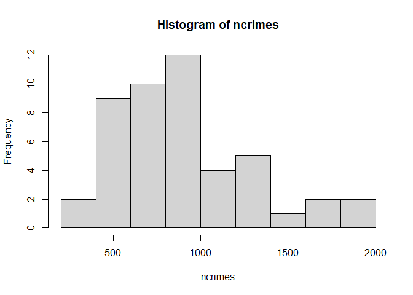<!-- -->

*QQ plot *

qqnorm creates a Normal Q-Q plot. It plots the data in sorted order
versus quantiles from a standard Normal distribution

``` r
qqnorm(data$Crime)
```

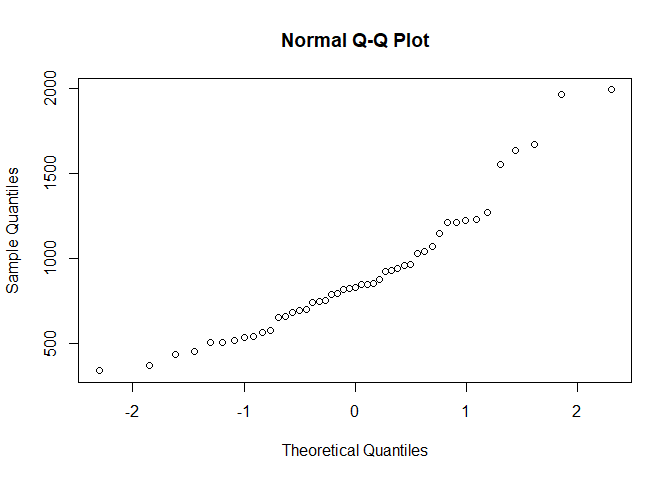<!-- -->

### 1.c Verify if any outliers

Now, we investigate the outliers using boxplot.

*Boxplot shows there are outliers *

Ideally, We need to talk to a subject matter expert to decide if the
outliers are presenting specific event or circumstance or it is a
mistake in data gathering. But here we just assume all data are good for
analysis and we do not remove any data from our dataset.

``` r
boxplot(ncrimes)
```

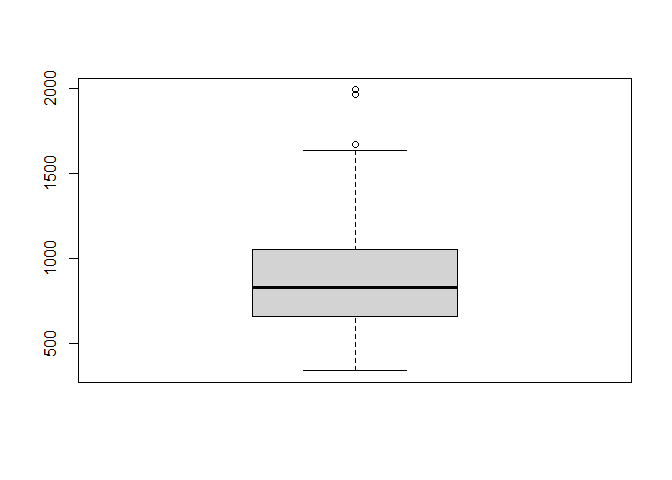<!-- -->

## 2\. Explore relationship between each predictors and response

Here, I am **not** looking for mathematics definition of correlation. I
just want to get feel about the data. I want to understand my data
better.

### 2.a Relationship between each predictors and response

``` r
par(mfrow=c(2,2))
for (i in 1:15) {
  plot( x = data[,i], y = data[,16],
        ylab = "Crimes", xlab = colnames(data)[i])
}
```

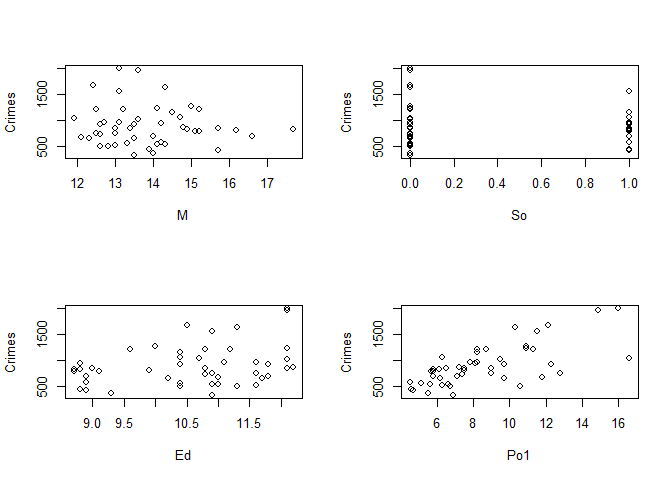<!-- -->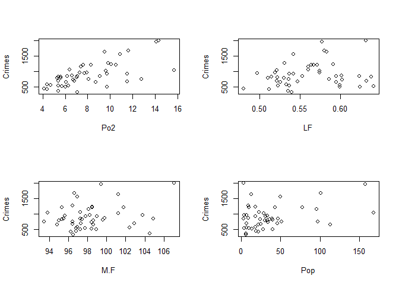<!-- -->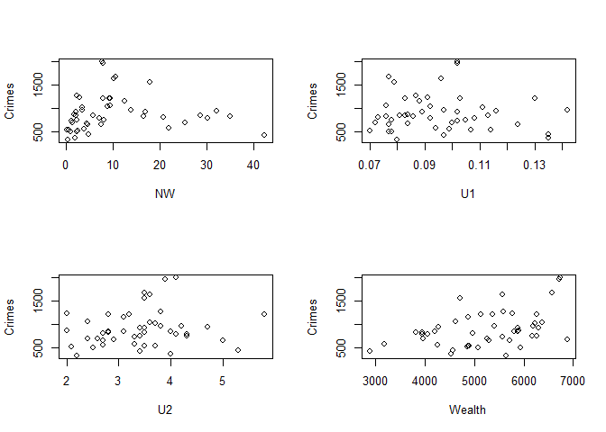<!-- -->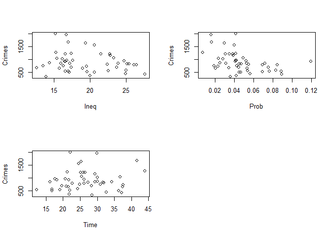<!-- -->

### 2.b Relationship between each pair of predictors

Now, let’s see if there is correlation between any pair of predictors.

  - If there is a strong correlation between two features, we may
    consider including only one of those in the regression model to
    reduce the comlexity of the model.

<!-- end list -->

``` r
library(corrplot)
```

    ## Warning: package 'corrplot' was built under R version 4.0.5

    ## corrplot 0.84 loaded

``` r
cor(data)
```

    ##                  M          So          Ed         Po1         Po2         LF
    ## M       1.00000000  0.58435534 -0.53023964 -0.50573690 -0.51317336 -0.1609488
    ## So      0.58435534  1.00000000 -0.70274132 -0.37263633 -0.37616753 -0.5054695
    ## Ed     -0.53023964 -0.70274132  1.00000000  0.48295213  0.49940958  0.5611780
    ## Po1    -0.50573690 -0.37263633  0.48295213  1.00000000  0.99358648  0.1214932
    ## Po2    -0.51317336 -0.37616753  0.49940958  0.99358648  1.00000000  0.1063496
    ## LF     -0.16094882 -0.50546948  0.56117795  0.12149320  0.10634960  1.0000000
    ## M.F    -0.02867993 -0.31473291  0.43691492  0.03376027  0.02284250  0.5135588
    ## Pop    -0.28063762 -0.04991832 -0.01722740  0.52628358  0.51378940 -0.1236722
    ## NW      0.59319826  0.76710262 -0.66488190 -0.21370878 -0.21876821 -0.3412144
    ## U1     -0.22438060 -0.17241931  0.01810345 -0.04369761 -0.05171199 -0.2293997
    ## U2     -0.24484339  0.07169289 -0.21568155  0.18509304  0.16922422 -0.4207625
    ## Wealth -0.67005506 -0.63694543  0.73599704  0.78722528  0.79426205  0.2946323
    ## Ineq    0.63921138  0.73718106 -0.76865789 -0.63050025 -0.64815183 -0.2698865
    ## Prob    0.36111641  0.53086199 -0.38992286 -0.47324704 -0.47302729 -0.2500861
    ## Time    0.11451072  0.06681283 -0.25397355  0.10335774  0.07562665 -0.1236404
    ## Crime  -0.08947240 -0.09063696  0.32283487  0.68760446  0.66671414  0.1888663
    ##                M.F         Pop          NW           U1          U2
    ## M      -0.02867993 -0.28063762  0.59319826 -0.224380599 -0.24484339
    ## So     -0.31473291 -0.04991832  0.76710262 -0.172419305  0.07169289
    ## Ed      0.43691492 -0.01722740 -0.66488190  0.018103454 -0.21568155
    ## Po1     0.03376027  0.52628358 -0.21370878 -0.043697608  0.18509304
    ## Po2     0.02284250  0.51378940 -0.21876821 -0.051711989  0.16922422
    ## LF      0.51355879 -0.12367222 -0.34121444 -0.229399684 -0.42076249
    ## M.F     1.00000000 -0.41062750 -0.32730454  0.351891900 -0.01869169
    ## Pop    -0.41062750  1.00000000  0.09515301 -0.038119948  0.27042159
    ## NW     -0.32730454  0.09515301  1.00000000 -0.156450020  0.08090829
    ## U1      0.35189190 -0.03811995 -0.15645002  1.000000000  0.74592482
    ## U2     -0.01869169  0.27042159  0.08090829  0.745924815  1.00000000
    ## Wealth  0.17960864  0.30826271 -0.59010707  0.044857202  0.09207166
    ## Ineq   -0.16708869 -0.12629357  0.67731286 -0.063832178  0.01567818
    ## Prob   -0.05085826 -0.34728906  0.42805915 -0.007469032 -0.06159247
    ## Time   -0.42769738  0.46421046  0.23039841 -0.169852838  0.10135833
    ## Crime   0.21391426  0.33747406  0.03259884 -0.050477918  0.17732065
    ##               Wealth        Ineq         Prob          Time       Crime
    ## M      -0.6700550558  0.63921138  0.361116408  0.1145107190 -0.08947240
    ## So     -0.6369454328  0.73718106  0.530861993  0.0668128312 -0.09063696
    ## Ed      0.7359970363 -0.76865789 -0.389922862 -0.2539735471  0.32283487
    ## Po1     0.7872252807 -0.63050025 -0.473247036  0.1033577449  0.68760446
    ## Po2     0.7942620503 -0.64815183 -0.473027293  0.0756266536  0.66671414
    ## LF      0.2946323090 -0.26988646 -0.250086098 -0.1236404364  0.18886635
    ## M.F     0.1796086363 -0.16708869 -0.050858258 -0.4276973791  0.21391426
    ## Pop     0.3082627091 -0.12629357 -0.347289063  0.4642104596  0.33747406
    ## NW     -0.5901070652  0.67731286  0.428059153  0.2303984071  0.03259884
    ## U1      0.0448572017 -0.06383218 -0.007469032 -0.1698528383 -0.05047792
    ## U2      0.0920716601  0.01567818 -0.061592474  0.1013583270  0.17732065
    ## Wealth  1.0000000000 -0.88399728 -0.555334708  0.0006485587  0.44131995
    ## Ineq   -0.8839972758  1.00000000  0.465321920  0.1018228182 -0.17902373
    ## Prob   -0.5553347075  0.46532192  1.000000000 -0.4362462614 -0.42742219
    ## Time    0.0006485587  0.10182282 -0.436246261  1.0000000000  0.14986606
    ## Crime   0.4413199490 -0.17902373 -0.427422188  0.1498660617  1.00000000

``` r
corrplot(cor(data))
```

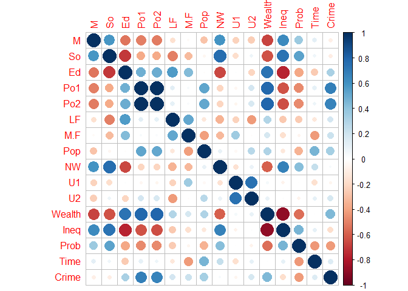<!-- -->

## 3\. Standardize the data

Before applying the regression model, we perform Standardization.
Because we are about to compare measurements that have different ranges.

``` r
data.normal <- data
for (i in 1:16) {
  data.normal[,i] <- ( data[,i] - mean(data[,i]) ) / sd(data[,i])
} 

summary(data.normal)
```

    ##        M                 So                Ed               Po1         
    ##  Min.   :-1.5575   Min.   :-0.7107   Min.   :-1.6661   Min.   :-1.3459  
    ##  1st Qu.:-0.6823   1st Qu.:-0.7107   1st Qu.:-0.7275   1st Qu.:-0.7571  
    ##  Median :-0.2048   Median :-0.7107   Median : 0.2111   Median :-0.2355  
    ##  Mean   : 0.0000   Mean   : 0.0000   Mean   : 0.0000   Mean   : 0.0000  
    ##  3rd Qu.: 0.5908   3rd Qu.: 1.3771   3rd Qu.: 0.7921   3rd Qu.: 0.6561  
    ##  Max.   : 3.0575   Max.   : 1.3771   Max.   : 1.4626   Max.   : 2.7255  
    ##       Po2                LF                M.F               Pop         
    ##  Min.   :-1.4032   Min.   :-2.00910   Min.   :-1.6636   Min.   :-0.8830  
    ##  1st Qu.:-0.7773   1st Qu.:-0.75947   1st Qu.:-0.6285   1st Qu.:-0.6991  
    ##  Median :-0.2587   Median :-0.02948   Median :-0.2043   Median :-0.3051  
    ##  Mean   : 0.0000   Mean   : 0.00000   Mean   : 0.0000   Mean   : 0.0000  
    ##  3rd Qu.: 0.5996   3rd Qu.: 0.78711   3rd Qu.: 0.3047   3rd Qu.: 0.1283  
    ##  Max.   : 2.7454   Max.   : 1.97488   Max.   : 2.9856   Max.   : 3.4510  
    ##        NW                U1                U2                Wealth       
    ##  Min.   :-0.9640   Min.   :-1.4126   Min.   :-1.655178   Min.   :-2.4602  
    ##  1st Qu.:-0.7501   1st Qu.:-0.8302   1st Qu.:-0.767126   1st Qu.:-0.6828  
    ##  Median :-0.2444   Median :-0.1924   Median : 0.002519   Median : 0.1204  
    ##  Mean   : 0.0000   Mean   : 0.0000   Mean   : 0.000000   Mean   : 0.0000  
    ##  3rd Qu.: 0.3051   3rd Qu.: 0.4732   3rd Qu.: 0.535351   3rd Qu.: 0.6852  
    ##  Max.   : 3.1302   Max.   : 2.5810   Max.   : 2.844286   Max.   : 1.6957  
    ##       Ineq              Prob              Time             Crime        
    ##  Min.   :-1.7044   Min.   :-1.7677   Min.   :-2.0317   Min.   :-1.4559  
    ##  1st Qu.:-0.7144   1st Qu.:-0.6329   1st Qu.:-0.7052   1st Qu.:-0.6376  
    ##  Median :-0.4512   Median :-0.2195   Median :-0.1125   Median :-0.1916  
    ##  Mean   : 0.0000   Mean   : 0.0000   Mean   : 0.0000   Mean   : 0.0000  
    ##  3rd Qu.: 0.8397   3rd Qu.: 0.3236   3rd Qu.: 0.5437   3rd Qu.: 0.3941  
    ##  Max.   : 2.0553   Max.   : 3.1980   Max.   : 2.4556   Max.   : 2.8129

## 4\. Apply Regression

First, we create a regression model using all features.

Then, we verify if the predictors not meaningful. A standard way to test
if the predictors are not meaningful is looking if the p-values smaller
than 0.05.

Note: There are four assumptions associated with a linear regression
model. We do not do any testing for linear regression assumptions.

``` r
lm.model.all <- lm(Crime~., data.normal)

lm.all.summary <- summary(lm.model.all)
print(lm.all.summary)
```

    ## 
    ## Call:
    ## lm(formula = Crime ~ ., data = data.normal)
    ## 
    ## Residuals:
    ##      Min       1Q   Median       3Q      Max 
    ## -1.02321 -0.25361 -0.01731  0.29214  1.32554 
    ## 
    ## Coefficients:
    ##               Estimate Std. Error t value Pr(>|t|)   
    ## (Intercept) -1.205e-16  7.885e-02   0.000  1.00000   
    ## M            2.854e-01  1.355e-01   2.106  0.04344 * 
    ## So          -4.710e-03  1.842e-01  -0.026  0.97977   
    ## Ed           5.447e-01  1.796e-01   3.033  0.00486 **
    ## Po1          1.482e+00  8.154e-01   1.817  0.07889 . 
    ## Po2         -7.911e-01  8.493e-01  -0.931  0.35883   
    ## LF          -6.936e-02  1.536e-01  -0.452  0.65465   
    ## M.F          1.326e-01  1.551e-01   0.855  0.39900   
    ## Pop         -7.215e-02  1.269e-01  -0.568  0.57385   
    ## NW           1.118e-01  1.723e-01   0.649  0.52128   
    ## U1          -2.716e-01  1.963e-01  -1.384  0.17624   
    ## U2           3.664e-01  1.798e-01   2.038  0.05016 . 
    ## Wealth       2.399e-01  2.586e-01   0.928  0.36075   
    ## Ineq         7.290e-01  2.343e-01   3.111  0.00398 **
    ## Prob        -2.854e-01  1.336e-01  -2.137  0.04063 * 
    ## Time        -6.375e-02  1.313e-01  -0.486  0.63071   
    ## ---
    ## Signif. codes:  0 '***' 0.001 '**' 0.01 '*' 0.05 '.' 0.1 ' ' 1
    ## 
    ## Residual standard error: 0.5405 on 31 degrees of freedom
    ## Multiple R-squared:  0.8031, Adjusted R-squared:  0.7078 
    ## F-statistic: 8.429 on 15 and 31 DF,  p-value: 3.539e-07

Then we eliminate the features with large p-values. This will depends on
the number of features. Here, I choose to eliminate any feature with
p-values larger than 0.1. That leaves me with the following features:

``` r
# M:      percentage of males aged 14-24 in total state population
# Ed:     mean years of schooling of the population aged 25 years or over
# Po1:    per capita expenditure on police protection in 1960
# U2:     unemployment rate of urban males 35-39
# Ineq:   income inequality: percentage of families earning below half the median income
# Prob:   probability of imprisonment: ratio of number of commitments to number of offenses
```

Now, We re-build a new regression model using a subset of features with
p-values smaller than 0.1:

``` r
lm.model.six <- lm(Crime ~M + Ed + Po1 + U2 + Ineq + Prob,
               data.normal)
```

Then, we check the p-values again, and filter the features *if
necessary*.

Here, all p-values are smaller than 0.05. So we keep all features for
rest of the analysis.

``` r
lm.six.summary <- summary(lm.model.six)
print(lm.six.summary)
```

    ## 
    ## Call:
    ## lm(formula = Crime ~ M + Ed + Po1 + U2 + Ineq + Prob, data = data.normal)
    ## 
    ## Residuals:
    ##      Min       1Q   Median       3Q      Max 
    ## -1.21696 -0.20274 -0.05089  0.34419  1.43817 
    ## 
    ## Coefficients:
    ##               Estimate Std. Error t value Pr(>|t|)    
    ## (Intercept) -1.615e-16  7.569e-02   0.000  1.00000    
    ## M            3.413e-01  1.082e-01   3.154  0.00305 ** 
    ## Ed           5.683e-01  1.295e-01   4.390 8.07e-05 ***
    ## Po1          8.838e-01  1.057e-01   8.363 2.56e-10 ***
    ## U2           1.951e-01  8.932e-02   2.185  0.03483 *  
    ## Ineq         6.979e-01  1.438e-01   4.855 1.88e-05 ***
    ## Prob        -2.235e-01  8.983e-02  -2.488  0.01711 *  
    ## ---
    ## Signif. codes:  0 '***' 0.001 '**' 0.01 '*' 0.05 '.' 0.1 ' ' 1
    ## 
    ## Residual standard error: 0.5189 on 40 degrees of freedom
    ## Multiple R-squared:  0.7659, Adjusted R-squared:  0.7307 
    ## F-statistic: 21.81 on 6 and 40 DF,  p-value: 3.418e-11

Now, let’s compare the AIC and Adjusted R-squared for both model:

``` r
lm.all.R2 <- lm.all.summary$r.squared
lm.all.aR2 <- lm.all.summary$adj.r.squared

lm.six.R2 <- lm.six.summary$r.squared
lm.six.aR2 <- lm.six.summary$adj.r.squared


cat ("Model Using 15 Features\n",
      "R2: ", lm.all.R2, "\tAdjusted R2: ", lm.all.aR2, "\tAIC value", AIC(lm.model.all),
     "\n\n\nModel Using 6 Features\n", 
     "R2: ", lm.six.R2, "\tAdjusted R: ", lm.six.aR2, "\tAIC value", AIC(lm.model.six))
```

    ## Model Using 15 Features
    ##  R2:  0.8030868  Adjusted R2:  0.7078062     AIC value 89.9948 
    ## 
    ## 
    ## Model Using 6 Features
    ##  R2:  0.7658663  Adjusted R:  0.7307463  AIC value 80.13187

We can see that AIC has improved by 10. It is because we have fewer
features in the model. On the other hand, R2 got worsen.

About Adjusted R2: “If you add more and more useless variables to a
model, adjusted r-squared will decrease”. That is why “Adjusted R2” for
the model with 15 features is smaller.

*Apply Regression and use cross validation*

The better approach is to use cross-validation. We already know that
measuring the quality of the model on training data doesn’t provide an
accurate estimate. Moreover, there is possibility of over-filling.

``` r
set.seed(1)
library(DAAG)
```

    ## Warning: package 'DAAG' was built under R version 4.0.5

    ## Loading required package: lattice

``` r
# perform 4 fold cross validation
lm.model.six.cv <- cv.lm(data.normal , lm.model.six, m = 4)
```

    ## Analysis of Variance Table
    ## 
    ## Response: Crime
    ##           Df Sum Sq Mean Sq F value  Pr(>F)    
    ## M          1   0.37    0.37    1.37 0.24914    
    ## Ed         1   4.85    4.85   18.02 0.00013 ***
    ## Po1        1  21.22   21.22   78.80 5.3e-11 ***
    ## U2         1   1.45    1.45    5.40 0.02534 *  
    ## Ineq       1   5.67    5.67   21.06 4.3e-05 ***
    ## Prob       1   1.67    1.67    6.19 0.01711 *  
    ## Residuals 40  10.77    0.27                    
    ## ---
    ## Signif. codes:  0 '***' 0.001 '**' 0.01 '*' 0.05 '.' 0.1 ' ' 1

    ## Warning in cv.lm(data.normal, lm.model.six, m = 4): 
    ## 
    ##  As there is >1 explanatory variable, cross-validation
    ##  predicted values for a fold are not a linear function
    ##  of corresponding overall predicted values.  Lines that
    ##  are shown for the different folds are approximate

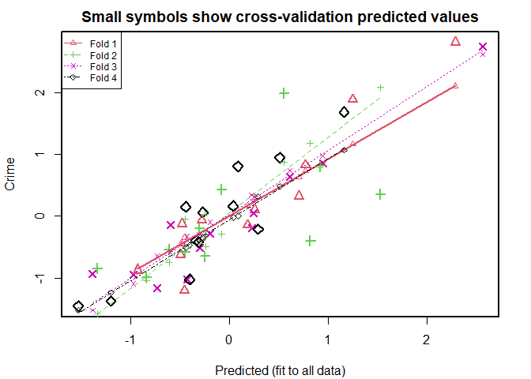<!-- -->

    ## 
    ## fold 1 
    ## Observations in test set: 11 
    ##                 2      9     14     16     20     22    26     38      41
    ## Predicted   1.248 -0.482 -0.495  0.257 0.7702 -0.457 2.286 -0.933 -0.2810
    ## cvpred      1.163 -0.449 -0.450  0.305 0.7306 -0.347 2.107 -0.819 -0.3682
    ## Crime       1.887 -0.127 -0.623  0.106 0.8272 -1.205 2.813 -0.877 -0.0649
    ## CV residual 0.725  0.322 -0.173 -0.200 0.0966 -0.858 0.706 -0.058  0.3033
    ##                 44     47
    ## Predicted    0.705  0.184
    ## cvpred       0.633  0.169
    ## Crime        0.323 -0.145
    ## CV residual -0.310 -0.314
    ## 
    ## Sum of squares = 2.23    Mean square = 0.2    n = 11 
    ## 
    ## fold 2 
    ## Observations in test set: 12 
    ##                  1      3       6   11     19      25     28     29     30
    ## Predicted   -0.244 -1.342 -0.4520 0.55  0.816 -0.8429 0.9151  1.527 -0.613
    ## cvpred      -0.486 -1.575 -0.0433 0.87  1.184 -1.0362 0.7850  2.083 -0.752
    ## Crime       -0.295 -0.846 -0.5768 1.99 -0.401 -0.9879 0.8039  0.357 -0.541
    ## CV residual  0.192  0.729 -0.5335 1.12 -1.585  0.0483 0.0189 -1.726  0.211
    ##                  33      35     39
    ## Predicted   -0.0808 -0.2509 -0.306
    ## cvpred      -0.2915  0.0368 -0.436
    ## Crime        0.4316 -0.6518 -0.204
    ## CV residual  0.7230 -0.6886  0.231
    ## 
    ## Sum of squares = 8.69    Mean square = 0.72    n = 12 
    ## 
    ## fold 3 
    ## Observations in test set: 12 
    ##                 4      5     10     12     13      15     17      34     37
    ## Predicted   2.565  0.943 -0.305 -0.599 -0.428 -0.1984 -0.977  0.2391  0.224
    ## cvpred      2.615  0.977 -0.293 -0.583 -0.328 -0.0984 -1.091  0.2407  0.342
    ## Crime       2.751  0.850 -0.517 -0.145 -1.019 -0.2769 -0.947  0.0463 -0.192
    ## CV residual 0.135 -0.126 -0.224  0.438 -0.691 -0.1784  0.144 -0.1944 -0.533
    ##                 40     42     45
    ## Predicted    0.609 -1.387 -0.732
    ## cvpred       0.738 -1.521 -0.644
    ## Crime        0.636 -0.939 -1.164
    ## CV residual -0.103  0.582 -0.520
    ## 
    ## Sum of squares = 1.75    Mean square = 0.15    n = 12 
    ## 
    ## fold 4 
    ## Observations in test set: 12 
    ##                  7     8      18      21      23      24      27     31      32
    ## Predicted   -0.444 1.160 -0.2717 -0.3150 0.08399  0.0370 -1.5329 -1.201 -0.3397
    ## cvpred      -0.509 1.070 -0.3472 -0.3776 0.00906 -0.0228 -1.5226 -1.239 -0.4269
    ## Crime        0.150 1.680  0.0618 -0.4217 0.80389  0.1627 -1.4559 -1.376 -0.3906
    ## CV residual  0.659 0.611  0.4090 -0.0441 0.79483  0.1854  0.0667 -0.137  0.0362
    ##                36     43     46
    ## Predicted   0.508  0.288 -0.405
    ## cvpred      0.486  0.316 -0.471
    ## Crime       0.949 -0.212 -1.027
    ## CV residual 0.463 -0.529 -0.556
    ## 
    ## Sum of squares = 2.47    Mean square = 0.21    n = 12 
    ## 
    ## Overall (Sum over all 12 folds) 
    ##    ms 
    ## 0.322

``` r
lm.model.all.cv <- cv.lm(data.normal , lm.model.all, m = 4)
```

    ## Analysis of Variance Table
    ## 
    ## Response: Crime
    ##           Df Sum Sq Mean Sq F value  Pr(>F)    
    ## M          1   0.37    0.37    1.26  0.2702    
    ## So         1   0.10    0.10    0.35  0.5575    
    ## Ed         1   6.05    6.05   20.72 7.7e-05 ***
    ## Po1        1  20.56   20.56   70.38 1.8e-09 ***
    ## Po2        1   1.02    1.02    3.50  0.0708 .  
    ## LF         1   0.41    0.41    1.40  0.2459    
    ## M.F        1   0.74    0.74    2.54  0.1212    
    ## Pop        1   0.29    0.29    0.98  0.3309    
    ## NW         1   0.09    0.09    0.32  0.5728    
    ## U1         1   0.05    0.05    0.16  0.6904    
    ## U2         1   1.80    1.80    6.17  0.0186 *  
    ## Wealth     1   0.23    0.23    0.79  0.3795    
    ## Ineq       1   3.66    3.66   12.52  0.0013 ** 
    ## Prob       1   1.49    1.49    5.09  0.0312 *  
    ## Time       1   0.07    0.07    0.24  0.6307    
    ## Residuals 31   9.06    0.29                    
    ## ---
    ## Signif. codes:  0 '***' 0.001 '**' 0.01 '*' 0.05 '.' 0.1 ' ' 1

    ## Warning in cv.lm(data.normal, lm.model.all, m = 4): 
    ## 
    ##  As there is >1 explanatory variable, cross-validation
    ##  predicted values for a fold are not a linear function
    ##  of corresponding overall predicted values.  Lines that
    ##  are shown for the different folds are approximate

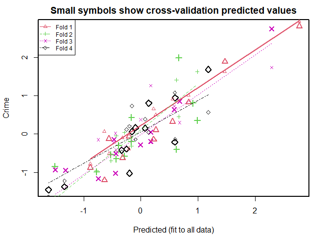<!-- -->

    ## 
    ## fold 1 
    ## Observations in test set: 11 
    ##                 2      9      14     16     20      22    26      38      41
    ## Predicted   1.470 -0.559 -0.3233  0.260  0.835 -0.6409  2.77 -0.8853 -0.2103
    ## cvpred      1.628 -0.514 -0.0977  0.505  1.018  0.0665  2.94 -0.7815 -0.3840
    ## Crime       1.887 -0.127 -0.6233  0.106  0.827 -1.2051  2.81 -0.8767 -0.0649
    ## CV residual 0.259  0.387 -0.5256 -0.399 -0.191 -1.2715 -0.13 -0.0953  0.3191
    ##                 44     47
    ## Predicted    0.558  0.224
    ## cvpred       0.911  0.658
    ## Crime        0.323 -0.145
    ## CV residual -0.588 -0.803
    ## 
    ## Sum of squares = 3.42    Mean square = 0.31    n = 11 
    ## 
    ## fold 2 
    ## Observations in test set: 12 
    ##                  1      3       6    11     19      25       28     29     30
    ## Predicted   -0.388 -1.507 -0.2900 0.663  0.622 -0.7736  0.91374  0.988 -0.523
    ## cvpred      -0.459 -1.655  0.0384 0.456  1.406 -0.9565  0.81365  1.626 -0.701
    ## Crime       -0.295 -0.846 -0.5768 1.988 -0.401 -0.9879  0.80389  0.357 -0.541
    ## CV residual  0.164  0.809 -0.6152 1.532 -1.807 -0.0314 -0.00976 -1.270  0.160
    ##                 33      35     39
    ## Predicted   -0.166 -0.4326 -0.170
    ## cvpred      -0.313 -0.0502 -0.094
    ## Crime        0.432 -0.6518 -0.204
    ## CV residual  0.745 -0.6016 -0.111
    ## 
    ## Sum of squares = 9.24    Mean square = 0.77    n = 12 
    ## 
    ## fold 3 
    ## Observations in test set: 12 
    ##                4     5     10      12      13       15     17      34     37
    ## Predicted   2.29 0.676 -0.436 -0.4733 -0.4459 -0.00448 -1.323  0.1716  0.171
    ## cvpred      1.73 0.301 -0.414 -0.2097  0.0188  0.37451 -2.075 -0.2113  1.260
    ## Crime       2.75 0.850 -0.517 -0.1450 -1.0189 -0.27688 -0.947  0.0463 -0.192
    ## CV residual 1.02 0.550 -0.104  0.0647 -1.0377 -0.65138  1.129  0.2576 -1.451
    ##                  40     42     45
    ## Predicted    0.5853 -1.496 -0.745
    ## cvpred       0.7284 -2.561 -0.148
    ## Crime        0.6358 -0.939 -1.164
    ## CV residual -0.0925  1.622 -1.016
    ## 
    ## Sum of squares = 9.97    Mean square = 0.83    n = 12 
    ## 
    ## fold 4 
    ## Observations in test set: 12 
    ##                   7     8      18      21     23      24     27     31     32
    ## Predicted    0.0752 1.181 -0.1584 -0.3367 0.1368 -0.0934 -1.618 -1.337 -0.251
    ## cvpred       0.3878 0.563  0.7348 -0.4650 0.0428 -0.1394 -1.635 -1.220  0.123
    ## Crime        0.1497 1.680  0.0618 -0.4217 0.8039  0.1627 -1.456 -1.376 -0.391
    ## CV residual -0.2381 1.117 -0.6729  0.0433 0.7611  0.3021  0.179 -0.155 -0.514
    ##                 36     43     46
    ## Predicted    0.601  0.593 -0.201
    ## cvpred      -0.138  1.083  0.205
    ## Crime        0.949 -0.212 -1.027
    ## CV residual  1.086 -1.295 -1.232
    ## 
    ## Sum of squares = 7.12    Mean square = 0.59    n = 12 
    ## 
    ## Overall (Sum over all 12 folds) 
    ##    ms 
    ## 0.633

``` r
lm.six.cv.R2 <- 1- 
  ( attr(lm.model.six.cv,"ms") * 47) / sum( (data.normal$Crime - mean(data.normal$Crime))^2 )

lm.all.cv.R2 <- 1- 
  ( attr(lm.model.all.cv,"ms") * 47) / sum( (data.normal$Crime - mean(data.normal$Crime))^2 )

cat ("lm.six.cv.R2: ", lm.six.cv.R2, "\nlm.all.cv.R2: ", lm.all.cv.R2)
```

    ## lm.six.cv.R2:  0.671 
    ## lm.all.cv.R2:  0.353

Lets see the R2 value for cross validation:

``` r
Model = c("Model Using 15 Features","Model Using 15 Features- CV" ,
          "Model Using 6 Features", "Model Using 6 Features-CV")

R2 = c(lm.all.R2, lm.all.cv.R2, lm.six.R2, lm.all.cv.R2)

data.frame(Model, R2 )
```

    ##                         Model    R2
    ## 1     Model Using 15 Features 0.803
    ## 2 Model Using 15 Features- CV 0.353
    ## 3      Model Using 6 Features 0.766
    ## 4   Model Using 6 Features-CV 0.353

From DAAG documentation: The input data frame is returned, with
additional columns Predicted (Predicted values using all observations)
and cvpred (cross-validation predictions).

We are going to plot both cvpred and Predicted for lm.model.six to see
if CV changes the results.

``` r
y_all = unlist (lm.model.six.cv[c("Predicted")])
y_cross = unlist (lm.model.six.cv[c("cvpred")])

plot(y = y_all, x = c(1:47) ,col="red", 
     main = "Red: Prediction  based on all data; Black: Prediction  based on all CV\n")
points( y = y_cross, x = c(1:47))
```

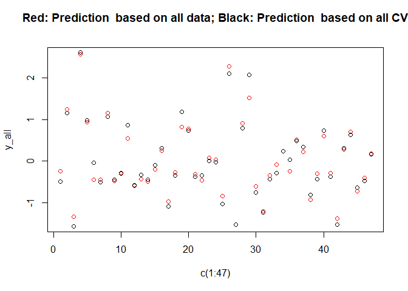<!-- -->

## 5\. Show your model

We have already discussed quality of different models. **From here, I
focus on only regression using 6 features without cross-validation.**

Here, we print the factors, the coefficients, the software output, and
the quality of fit.

### 5.a Factors and Coefficient

``` r
print(lm.model.six$coefficients)
```

    ## (Intercept)           M          Ed         Po1          U2        Ineq 
    ##   -1.62e-16    3.41e-01    5.68e-01    8.84e-01    1.95e-01    6.98e-01 
    ##        Prob 
    ##   -2.24e-01

``` r
plot(lm.model.six$fitted.values, main = "fitted values vs actual values")
points(data.normal[,16], col="red")
```

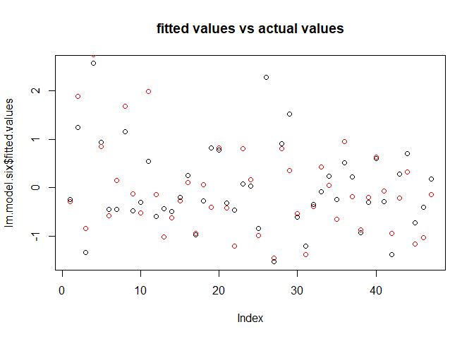<!-- -->

### 5.b Predicted response for new data

Here we see what value we predict based on thew new data provided in
questions. Note that our model was build based on standardized data.
Thus, we need to find the standardized value of the ‘new data’ before
applying the predict function.

``` r
x <- data.frame(M = 14.0, So = 0, Ed = 10.0, Po1 = 12.0, Po2 = 15.5, LF = 0.640,
       M.F = 94.0, Pop = 150, NW = 1.1, U1 = 0.120, U2 = 3.6, Wealth = 3200,
       Ineq = 20.1, Prob = 0.04, Time = 39.0)


x.normal <- x
for (i in 1:15) {
  x.normal[,i] <- ( x[,i] - mean(data[,i]) ) / sd(data[,i])
} 
```

Now, we apply predict on new standardized data.

``` r
y.normal <- predict(lm.model.six, x.normal[c(1,3,4,11,13,14)],type = "response")
cbind(x.normal ,  PredictedCime= unlist(y.normal)) 
```

    ##       M     So     Ed  Po1  Po2   LF   M.F  Pop     NW   U1    U2 Wealth  Ineq
    ## 1 0.113 -0.711 -0.504 1.18 2.67 1.95 -1.46 2.98 -0.876 1.36 0.239  -2.13 0.175
    ##     Prob Time PredictedCime
    ## 1 -0.312 1.75          1.03

To find out what is the *actual value of the predicted response*, we
need to inverse the standardization:

``` r
y <- y.normal * sd(data[,16])  +  mean(data[,16])
cbind(x ,  PredictedCime= unlist(y)) 
```

    ##    M So Ed Po1  Po2   LF M.F Pop  NW   U1  U2 Wealth Ineq Prob Time
    ## 1 14  0 10  12 15.5 0.64  94 150 1.1 0.12 3.6   3200 20.1 0.04   39
    ##   PredictedCime
    ## 1          1304

### 5.c Quality of the model

A good way to test the quality of the fit of the model is to look at the
residuals.

``` r
summary(lm.model.six$residuals)
```

    ##    Min. 1st Qu.  Median    Mean 3rd Qu.    Max. 
    ##  -1.217  -0.203  -0.051   0.000   0.344   1.438

``` r
plot(lm.model.six$residuals)
```

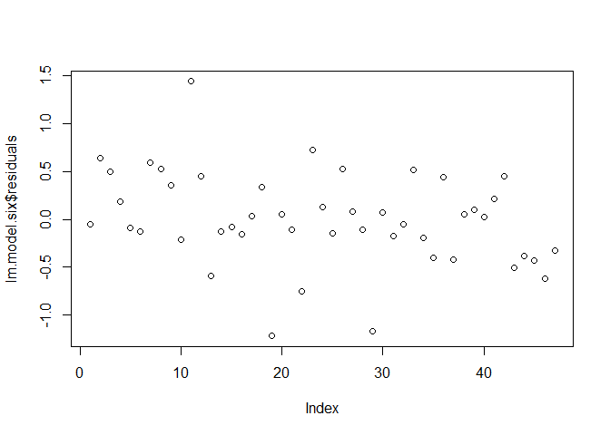<!-- -->

``` r
boxplot(lm.model.six$residuals)
```

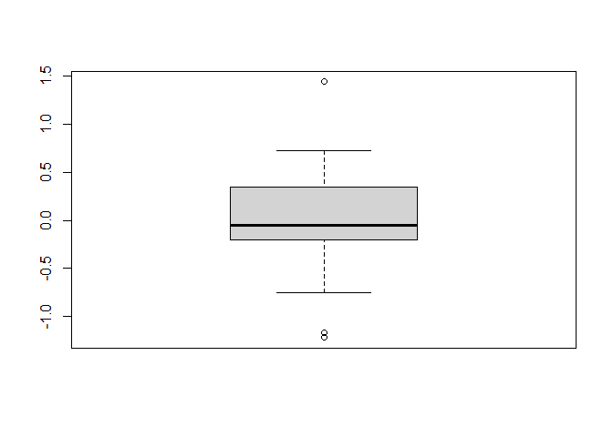<!-- -->

One measure very used to test how good is your model is R2.

R2= Explained Variation of the model / Total variation of the model

For Regression model, it is better to look into adjusted R2 so that we
consider the number of features.

``` r
Model = c("Model Using 15 Features","Model Using 15 Features- CV" ,
          "Model Using 6 Features", "Model Using 6 Features-CV")

R2 = c(lm.all.R2, lm.all.cv.R2, lm.six.R2, lm.all.cv.R2)

data.frame(Model, R2 )
```

    ##                         Model    R2
    ## 1     Model Using 15 Features 0.803
    ## 2 Model Using 15 Features- CV 0.353
    ## 3      Model Using 6 Features 0.766
    ## 4   Model Using 6 Features-CV 0.353
