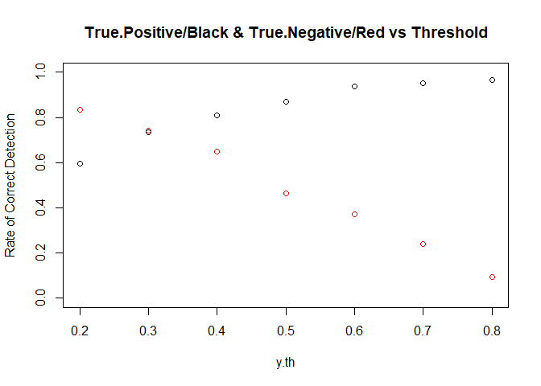
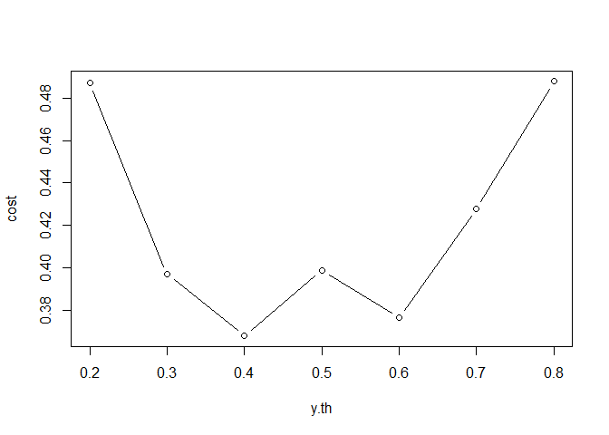

Logistic Regression
================
Exploring German Credit dataset and Making Prediction

# Introduction

Here, we explore the German Credit dataset. We use logistic regression
to decide whether credit applicants are good credit risks or not. It
contains 20 predictor variables and one categorical response.

# Source of Data

The German Credit dataset is available at the UCI Machine Learning
Repository.

Link:
<http://archive.ics.uci.edu/ml/machine-learning-databases/statlog/german>

Description:
<http://archive.ics.uci.edu/ml/datasets/Statlog+%28German+Credit+Data%29>

# Summary of solution to this problem

1.  Read the data-set, explore the data and update Credit Value
2.  Split the dataset into 2 distinct sets
3.  Build logistic regression model
4.  Calculate quality of fit
5.  Optimize threshold for logistic regression
6.  Optimize threshold for cost Estimation

## 1\. Read the dataset

We load the data and explore the summary stats.

``` r
GermanCredit <- read.table(file = 'data/germancredit.txt',
                   header=F,
                   na.strings=c(" ","","NA"),
                   stringsAsFactors = TRUE)

str(GermanCredit)
```

    ## 'data.frame':    1000 obs. of  21 variables:
    ##  $ V1 : Factor w/ 4 levels "A11","A12","A13",..: 1 2 4 1 1 4 4 2 4 2 ...
    ##  $ V2 : int  6 48 12 42 24 36 24 36 12 30 ...
    ##  $ V3 : Factor w/ 5 levels "A30","A31","A32",..: 5 3 5 3 4 3 3 3 3 5 ...
    ##  $ V4 : Factor w/ 10 levels "A40","A41","A410",..: 5 5 8 4 1 8 4 2 5 1 ...
    ##  $ V5 : int  1169 5951 2096 7882 4870 9055 2835 6948 3059 5234 ...
    ##  $ V6 : Factor w/ 5 levels "A61","A62","A63",..: 5 1 1 1 1 5 3 1 4 1 ...
    ##  $ V7 : Factor w/ 5 levels "A71","A72","A73",..: 5 3 4 4 3 3 5 3 4 1 ...
    ##  $ V8 : int  4 2 2 2 3 2 3 2 2 4 ...
    ##  $ V9 : Factor w/ 4 levels "A91","A92","A93",..: 3 2 3 3 3 3 3 3 1 4 ...
    ##  $ V10: Factor w/ 3 levels "A101","A102",..: 1 1 1 3 1 1 1 1 1 1 ...
    ##  $ V11: int  4 2 3 4 4 4 4 2 4 2 ...
    ##  $ V12: Factor w/ 4 levels "A121","A122",..: 1 1 1 2 4 4 2 3 1 3 ...
    ##  $ V13: int  67 22 49 45 53 35 53 35 61 28 ...
    ##  $ V14: Factor w/ 3 levels "A141","A142",..: 3 3 3 3 3 3 3 3 3 3 ...
    ##  $ V15: Factor w/ 3 levels "A151","A152",..: 2 2 2 3 3 3 2 1 2 2 ...
    ##  $ V16: int  2 1 1 1 2 1 1 1 1 2 ...
    ##  $ V17: Factor w/ 4 levels "A171","A172",..: 3 3 2 3 3 2 3 4 2 4 ...
    ##  $ V18: int  1 1 2 2 2 2 1 1 1 1 ...
    ##  $ V19: Factor w/ 2 levels "A191","A192": 2 1 1 1 1 2 1 2 1 1 ...
    ##  $ V20: Factor w/ 2 levels "A201","A202": 1 1 1 1 1 1 1 1 1 1 ...
    ##  $ V21: int  1 2 1 1 2 1 1 1 1 2 ...

## Explore the data\*

From the link provided in description, we can find the following
information:

Response: V21: (1 = Good, 2 = Bad)

### 1.a Summery Stats

``` r
summary(GermanCredit)
```

    ##    V1            V2         V3            V4            V5          V6     
    ##  A11:274   Min.   : 4.0   A30: 40   A43    :280   Min.   :  250   A61:603  
    ##  A12:269   1st Qu.:12.0   A31: 49   A40    :234   1st Qu.: 1366   A62:103  
    ##  A13: 63   Median :18.0   A32:530   A42    :181   Median : 2320   A63: 63  
    ##  A14:394   Mean   :20.9   A33: 88   A41    :103   Mean   : 3271   A64: 48  
    ##            3rd Qu.:24.0   A34:293   A49    : 97   3rd Qu.: 3972   A65:183  
    ##            Max.   :72.0             A46    : 50   Max.   :18424            
    ##                                     (Other): 55                            
    ##    V7            V8          V9        V10           V11          V12     
    ##  A71: 62   Min.   :1.000   A91: 50   A101:907   Min.   :1.000   A121:282  
    ##  A72:172   1st Qu.:2.000   A92:310   A102: 41   1st Qu.:2.000   A122:232  
    ##  A73:339   Median :3.000   A93:548   A103: 52   Median :3.000   A123:332  
    ##  A74:174   Mean   :2.973   A94: 92              Mean   :2.845   A124:154  
    ##  A75:253   3rd Qu.:4.000                        3rd Qu.:4.000             
    ##            Max.   :4.000                        Max.   :4.000             
    ##                                                                           
    ##       V13          V14        V15           V16          V17     
    ##  Min.   :19.00   A141:139   A151:179   Min.   :1.000   A171: 22  
    ##  1st Qu.:27.00   A142: 47   A152:713   1st Qu.:1.000   A172:200  
    ##  Median :33.00   A143:814   A153:108   Median :1.000   A173:630  
    ##  Mean   :35.55                         Mean   :1.407   A174:148  
    ##  3rd Qu.:42.00                         3rd Qu.:2.000             
    ##  Max.   :75.00                         Max.   :4.000             
    ##                                                                  
    ##       V18          V19        V20           V21     
    ##  Min.   :1.000   A191:596   A201:963   Min.   :1.0  
    ##  1st Qu.:1.000   A192:404   A202: 37   1st Qu.:1.0  
    ##  Median :1.000                         Median :1.0  
    ##  Mean   :1.155                         Mean   :1.3  
    ##  3rd Qu.:1.000                         3rd Qu.:2.0  
    ##  Max.   :2.000                         Max.   :2.0  
    ## 

### 1.b Update Credit Value

Response: V21: (1 = Good, 2 = Bad)

In order to use binomial family in logistic regression, We need to make
the response as a binary variable.Thus, We change it to the following:
(1 = Good, 2 = Bad)

``` r
# Replace 1 and 2 with 0 and 1
GermanCredit$V21[GermanCredit$V21==1] <- 0
GermanCredit$V21[GermanCredit$V21==2] <- 1
GermanCredit$V21 <- as.factor(GermanCredit$V21)
```

## 2\. Split the dataset into 2 distinct sets: data1 and data2

Now, we split the data into a training set and a validation set

``` r
set.seed(1)
n.dataset <-nrow(GermanCredit)
text.size <- floor(n.dataset*0.2) # Allocate 10% for data2
test.index <- sample(seq_len(n.dataset), size = text.size )

data.test <- GermanCredit[test.index,] # To use it for measuring performance
data.train <- GermanCredit[-test.index,] # To perform Cross-Validation on
```

Let’s verify if the data split is fair enough:

``` r
table(data.train$V21)
```

    ## 
    ##   0   1 
    ## 554 246

``` r
table(data.test$V21)
```

    ## 
    ##   0   1 
    ## 146  54

## 3\. Build logistic regression model

To build a logistic regression, we need to create dummy variable for
each categorical feature. But you can see that glm is creating some
dummy binary variables.

``` r
GermanCredit.logmod <- glm(V21 ~ .,
                           data = data.train,
                           family= binomial(link="logit"))

summary(GermanCredit.logmod)
```

    ## 
    ## Call:
    ## glm(formula = V21 ~ ., family = binomial(link = "logit"), data = data.train)
    ## 
    ## Deviance Residuals: 
    ##     Min       1Q   Median       3Q      Max  
    ## -2.2001  -0.6926  -0.3501   0.6970   2.5791  
    ## 
    ## Coefficients:
    ##               Estimate Std. Error z value Pr(>|z|)    
    ## (Intercept)  6.723e-01  1.259e+00   0.534  0.59345    
    ## V1A12       -2.837e-01  2.456e-01  -1.155  0.24805    
    ## V1A13       -1.071e+00  4.235e-01  -2.528  0.01147 *  
    ## V1A14       -1.735e+00  2.665e-01  -6.512 7.42e-11 ***
    ## V2           3.214e-02  1.065e-02   3.018  0.00254 ** 
    ## V3A31       -3.095e-02  6.257e-01  -0.049  0.96055    
    ## V3A32       -7.194e-01  4.875e-01  -1.476  0.14003    
    ## V3A33       -1.070e+00  5.411e-01  -1.978  0.04796 *  
    ## V3A34       -1.541e+00  4.943e-01  -3.117  0.00182 ** 
    ## V4A41       -2.057e+00  4.599e-01  -4.473 7.70e-06 ***
    ## V4A410      -1.333e+00  8.348e-01  -1.597  0.11033    
    ## V4A42       -8.564e-01  2.904e-01  -2.949  0.00319 ** 
    ## V4A43       -8.092e-01  2.761e-01  -2.931  0.00338 ** 
    ## V4A44        2.585e-01  8.661e-01   0.298  0.76537    
    ## V4A45       -6.018e-02  6.380e-01  -0.094  0.92485    
    ## V4A46        1.823e-01  4.373e-01   0.417  0.67674    
    ## V4A48       -2.127e+00  1.209e+00  -1.759  0.07853 .  
    ## V4A49       -8.948e-01  3.931e-01  -2.276  0.02284 *  
    ## V5           1.372e-04  5.118e-05   2.680  0.00736 ** 
    ## V6A62       -5.395e-01  3.345e-01  -1.613  0.10680    
    ## V6A63       -2.943e-01  4.396e-01  -0.670  0.50311    
    ## V6A64       -1.204e+00  5.461e-01  -2.205  0.02745 *  
    ## V6A65       -7.429e-01  2.895e-01  -2.566  0.01029 *  
    ## V7A72       -3.361e-01  4.800e-01  -0.700  0.48378    
    ## V7A73       -3.491e-01  4.579e-01  -0.762  0.44584    
    ## V7A74       -1.147e+00  4.963e-01  -2.311  0.02082 *  
    ## V7A75       -5.021e-01  4.638e-01  -1.083  0.27890    
    ## V8           3.076e-01  9.806e-02   3.137  0.00171 ** 
    ## V9A92       -8.257e-01  4.473e-01  -1.846  0.06487 .  
    ## V9A93       -1.214e+00  4.383e-01  -2.770  0.00561 ** 
    ## V9A94       -7.162e-01  5.147e-01  -1.391  0.16408    
    ## V10A102      8.694e-01  4.703e-01   1.849  0.06450 .  
    ## V10A103     -1.059e+00  4.867e-01  -2.176  0.02954 *  
    ## V11          1.432e-03  9.781e-02   0.015  0.98831    
    ## V12A122      3.785e-01  2.838e-01   1.334  0.18224    
    ## V12A123      2.245e-01  2.692e-01   0.834  0.40430    
    ## V12A124      6.706e-01  4.646e-01   1.443  0.14890    
    ## V13         -1.507e-02  1.067e-02  -1.412  0.15783    
    ## V14A142     -2.013e-01  4.650e-01  -0.433  0.66514    
    ## V14A143     -6.606e-01  2.696e-01  -2.450  0.01428 *  
    ## V15A152     -5.686e-01  2.714e-01  -2.095  0.03617 *  
    ## V15A153     -7.432e-01  5.264e-01  -1.412  0.15804    
    ## V16          2.888e-01  2.192e-01   1.318  0.18763    
    ## V17A172      1.034e+00  8.228e-01   1.256  0.20910    
    ## V17A173      8.689e-01  7.932e-01   1.095  0.27335    
    ## V17A174      8.239e-01  7.892e-01   1.044  0.29647    
    ## V18          4.069e-01  2.873e-01   1.416  0.15669    
    ## V19A192     -2.978e-01  2.302e-01  -1.293  0.19586    
    ## V20A202     -1.381e+00  7.685e-01  -1.798  0.07224 .  
    ## ---
    ## Signif. codes:  0 '***' 0.001 '**' 0.01 '*' 0.05 '.' 0.1 ' ' 1
    ## 
    ## (Dispersion parameter for binomial family taken to be 1)
    ## 
    ##     Null deviance: 987.34  on 799  degrees of freedom
    ## Residual deviance: 706.70  on 751  degrees of freedom
    ## AIC: 804.7
    ## 
    ## Number of Fisher Scoring iterations: 5

## 4\. Calculate quality of fit

Here we use our model to predict a value for validation data set. Then
we compare this with the actual response.

``` r
y.hat.german <- predict(GermanCredit.logmod,
                        newdata = data.test[,-21], type="response")


table(data.test$V21, round(y.hat.german))
```

    ##    
    ##       0   1
    ##   0 127  19
    ##   1  29  25

From above results, you can see that:

1.  True Positive rate is good.

2.  False Negative rate is not good enough. In fact the chance of
    detecting a bad credit is almost 50-50 (then We might flip a coin).

## 5\. Optimize threshold for logistic regression

Here, we try to change the threshold value for Logistic Regression:

``` r
#y.hat.german
y.th <- c(0.8, 0.7, 0.6, 0.5, 0.4, 0.3,0.2)
true.p <-rep(0,7)
true.n <-rep(0,7)

for (i in c(1:7)) {
  y.hat.th <- as.integer(y.hat.german > y.th[i])
  conf.matrix <- as.matrix (table(data.test$V21, y.hat.th))
  true.p[i] <- conf.matrix[1,1] / sum(conf.matrix[1,])
  true.n[i] <- conf.matrix[2,2] / sum(conf.matrix[2,])
}

plot(y = true.p, x = y.th, ylim = 0:1,
     main = "True.Positive/Black & True.Negative/Red vs Threshold",
     ylab = "Rate of Correct Detection")
points(y = true.n, x = y.th, col="red")
```

<!-- -->

1.  For threshold values \< = 0.4, both true.p and true.n are greater
    than 50%.

2.  True.N impacts rejecting a customer with bad credit. Larger True.N
    helps with avoiding losing money.

3.  True.P impacts rejecting a customer with good credit. Smaller True.P
    means we might lose some business.

## 6\. Optimize threshold for cost Estimation

To define a good threshold value, we should associate a cost to each
decision.

Here, I *assume* the cost of rejecting a customer with good credit and
consequently losing business is twice the cost of giving loan to a
customer with bad credit who fail to pay the mortgage.

From the following graph, you can see that for threshold = 0.4, the cost
is minimized.

``` r
cost.np <- 1.0
cost.nn <- 0.5
cost <- ( 1-true.p )* cost.np + ( 1-true.n ) * cost.nn
plot(y = cost, x = y.th, type = 'b')
```

<!-- -->
