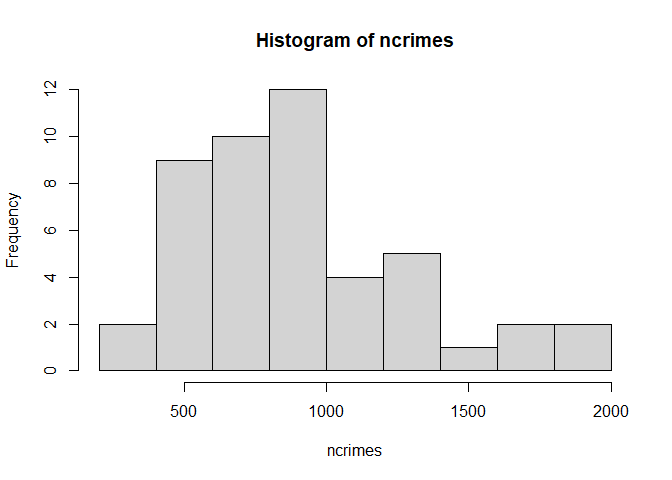
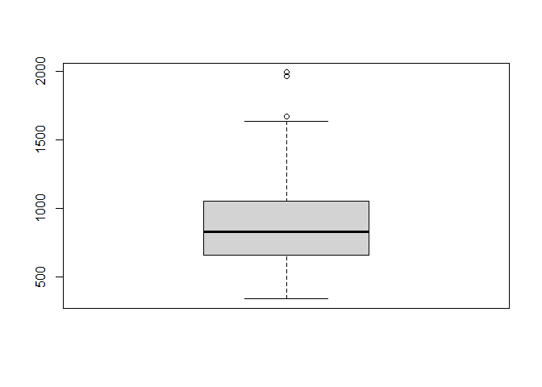

Outliers Detection
================
Exploring US crime dataset to see whether there are any outliers

# Introduction

Here, we explore US crime dataset to see whether there are any outliers
in the recorded number of crimes per 100,000 people. We use the
grubbs.test function in the outliers package.

# Source of Data

The US crime dataset is available at the statsci.org Repository. It
contains aggregated data on 47 states of the USA for 1960.

Link: <http://www.statsci.org/data/general/uscrime.txt>

Description: <http://www.statsci.org/data/general/uscrime.html>

The data set contains the following columns:

  - M percentage of males aged 14–24 in total state population

  - So indicator variable for a southern state

  - Ed mean years of schooling of the population aged 25 years or over

  - Po1 per capita expenditure on police protection in 1960

  - Po2 per capita expenditure on police protection in 1959

  - LF labour force participation rate of civilian urban males in the
    age-group 14-24

  - M.F number of males per 100 females

  - Pop state population in 1960 in hundred thousands

  - NW percentage of nonwhites in the population

  - U1 unemployment rate of urban males 14–24

  - U2 unemployment rate of urban males 35–39

  - Wealth wealth: median value of transferable assets or family income

  - Ineq income inequality: percentage of families earning below half
    the median income

  - Prob probability of imprisonment: ratio of number of commitments to
    number of offenses

  - Time average time in months served by offenders in state prisons
    before their first release

  - Crime crime rate: number of offenses per 100,000 population in 1960

# Summary of solution:

1.  Read the dataset and explore the summary stats
2.  Apply grubbs.test and report the results
3.  Verify if Crime data has a normal distribution (histogram and
    Shapiro-Wilk test)
4.  Use other methods to find outliers (boxplot)

## 1\. Read the dataset and explore the summary stats

We load the data and explore the summary stats.

``` r
data <- read.table(file = 'data/uscrime.txt',
                   sep = "\t",
                   header=T,
                   na.strings=c(" ","","NA"))
summary(data$Crime)
```

    ##    Min. 1st Qu.  Median    Mean 3rd Qu.    Max. 
    ##   342.0   658.5   831.0   905.1  1057.5  1993.0

## 2\. Use grubbs.test to see whether there are any outliers in the last column

We apply grubbs.test on our data to detect 1 outliers in each direction:
type = 10, opposite = FALSE/True

We can see that we cannot *reject* the null hypothesis because p-value
is not small enough. Thus from grubbs.test:

  - we cannot conclude if there is any outliers
  - we cannot conclude there is no outliers

<!-- end list -->

``` r
set.seed(1)
library(outliers)

result <- grubbs.test(data[,ncol(data)], type = 10, opposite = FALSE, two.sided = FALSE)
result.decision = result$p.value <= 0.05
cat ("\nwe fail to reject the null hypothesis because p-value is greater than 0.05:\n",
     "Statement: ", result$alternative, 
     "\np-value:", result$p.value)
```

    ## 
    ## we fail to reject the null hypothesis because p-value is greater than 0.05:
    ##  Statement:  highest value 1993 is an outlier 
    ## p-value: 0.07887486

``` r
result <- grubbs.test(data[,ncol(data)], type = 10, opposite = TRUE, two.sided = FALSE)
result.decision = result$p.value <= 0.05
cat ("\n\nwe fail to reject the null hypothesis because p-value is greater than 0.05:\n",
     "Statement:", result$alternative, 
     "\np-value: ",result$p.value)
```

    ## 
    ## 
    ## we fail to reject the null hypothesis because p-value is greater than 0.05:
    ##  Statement: lowest value 342 is an outlier 
    ## p-value:  1

## 3\. Verify if our data in the last column has a normal distribution

we know that Grubbs’s test is based on the *assumption of normality*. We
need to first verify if our data shows normal distribution before using
Grubbs’s test. Here I use two methods to verify the normality:

1.  Histogram
2.  Shapiro-Wilk test

### 3.a Histogram

The histogram is s skewed to the right. And even removing one or two
data points doesn’t make the distribution normal.

``` r
ncrimes <- data[,ncol(data)]
hist(ncrimes)
```

<!-- -->

We perform another test to verify if the data has normal distributions.

### 3.b Shapiro-Wilk test

From Shapiro-Wilk test, we can see that p-value \<\< 0.05. We can
conclude that the data significantly deviate from a normal distribution.

``` r
shapiro.test(ncrimes)
```

    ## 
    ##  Shapiro-Wilk normality test
    ## 
    ## data:  ncrimes
    ## W = 0.91273, p-value = 0.001882

We can see that ncrimes data is sufficiently *inconsistent with a normal
distribution*. Even if we remove one or two points from the data, the
distribution is not normal. Thus, **we should not use grubbs.test to
identify the outliers.**

## 4\. Use other methods to find outliers

Now, we investigate the outliers using boxplot.

*Boxplot shows there are outliers*

``` r
boxplot(ncrimes)
```

<!-- -->
