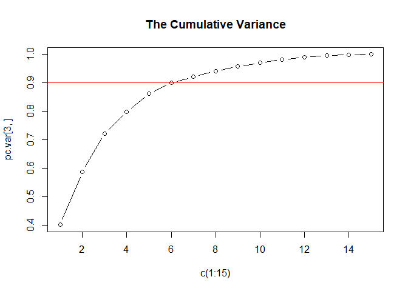
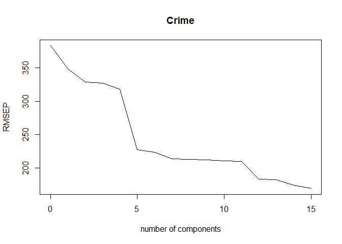
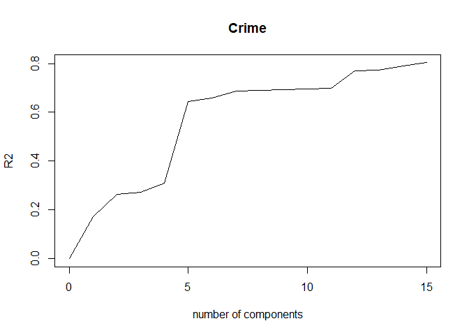

Principal Component Analysis and Linear Regression
================
Exploring US crime dataset and Making Prediction

# Introduction

Here, we explore US crime dataset. We want to apply Principal Component
Analysis and then create a regression model using the first few
principal components. Then, We use regression to predict the observed
crime rate.

Prediction for:

M = 14.0 So = 0 Ed = 10.0 Po1 = 12.0 Po2 = 15.5 LF = 0.640 M.F = 94.0
Pop = 150 NW = 1.1 U1 = 0.120 U2 = 3.6 Wealth = 3200 Ineq = 20.1 Prob =
0.04 Time = 39.0

# Source of Data

The US crime dataset is available at the statsci.org Repository. It
contains aggregated data on 47 states of the USA for 1960.

Link: <http://www.statsci.org/data/general/uscrime.txt>

Description: <http://www.statsci.org/data/general/uscrime.html>

The data set contains the following columns:

  - M percentage of males aged 14-24 in total state population

  - So indicator variable for a southern state

  - Ed mean years of schooling of the population aged 25 years or over

  - Po1 per capita expenditure on police protection in 1960

  - Po2 per capita expenditure on police protection in 1959

  - LF labour force participation rate of civilian urban males in the
    age-group 14-24

  - M.F number of males per 100 females

  - Pop state population in 1960 in hundred thousands

  - NW percentage of nonwhites in the population

  - U1 unemployment rate of urban males 14-24

  - U2 unemployment rate of urban males 35-39

  - Wealth wealth: median value of transferable assets or family income

  - Ineq income inequality: percentage of families earning below half
    the median income

  - Prob probability of imprisonment: ratio of number of commitments to
    number of offenses

  - Time average time in months served by offenders in state prisons
    before their first release

  - Crime crime rate: number of offenses per 100,000 population in 1960

# Summary of solution to this problem:

1.  Read the dataset and explore the data
2.  Standardize the Features
3.  Calculate the Co-Variance matrix.
4.  Get the eigenvalues and eigen-vectors
5.  Calculate the the principal components, and select the PCs based on
    cumulative variance
6.  Apply Regression based on first 6 and first 9 PCs. Compare R2 and
    adjusted R2.
7.  Calculate the PCR Estimator or the linear regression formula based
    on scaled features.
8.  Perform ‘Descaling’ and find the linear regression formula based on
    original features.
9.  Predict the crime using test input

## 1\. Read the dataset

We load the data and explore the summary stats.

``` r
data <- read.table(file = 'data/uscrime.txt',
                   sep = "\t",
                   header=T,
                   na.strings=c(" ","","NA"),
                   stringsAsFactors = FALSE)

summary(data)
```

    ##        M               So               Ed             Po1       
    ##  Min.   :11.90   Min.   :0.0000   Min.   : 8.70   Min.   : 4.50  
    ##  1st Qu.:13.00   1st Qu.:0.0000   1st Qu.: 9.75   1st Qu.: 6.25  
    ##  Median :13.60   Median :0.0000   Median :10.80   Median : 7.80  
    ##  Mean   :13.86   Mean   :0.3404   Mean   :10.56   Mean   : 8.50  
    ##  3rd Qu.:14.60   3rd Qu.:1.0000   3rd Qu.:11.45   3rd Qu.:10.45  
    ##  Max.   :17.70   Max.   :1.0000   Max.   :12.20   Max.   :16.60  
    ##       Po2               LF              M.F              Pop        
    ##  Min.   : 4.100   Min.   :0.4800   Min.   : 93.40   Min.   :  3.00  
    ##  1st Qu.: 5.850   1st Qu.:0.5305   1st Qu.: 96.45   1st Qu.: 10.00  
    ##  Median : 7.300   Median :0.5600   Median : 97.70   Median : 25.00  
    ##  Mean   : 8.023   Mean   :0.5612   Mean   : 98.30   Mean   : 36.62  
    ##  3rd Qu.: 9.700   3rd Qu.:0.5930   3rd Qu.: 99.20   3rd Qu.: 41.50  
    ##  Max.   :15.700   Max.   :0.6410   Max.   :107.10   Max.   :168.00  
    ##        NW              U1                U2            Wealth    
    ##  Min.   : 0.20   Min.   :0.07000   Min.   :2.000   Min.   :2880  
    ##  1st Qu.: 2.40   1st Qu.:0.08050   1st Qu.:2.750   1st Qu.:4595  
    ##  Median : 7.60   Median :0.09200   Median :3.400   Median :5370  
    ##  Mean   :10.11   Mean   :0.09547   Mean   :3.398   Mean   :5254  
    ##  3rd Qu.:13.25   3rd Qu.:0.10400   3rd Qu.:3.850   3rd Qu.:5915  
    ##  Max.   :42.30   Max.   :0.14200   Max.   :5.800   Max.   :6890  
    ##       Ineq            Prob              Time           Crime       
    ##  Min.   :12.60   Min.   :0.00690   Min.   :12.20   Min.   : 342.0  
    ##  1st Qu.:16.55   1st Qu.:0.03270   1st Qu.:21.60   1st Qu.: 658.5  
    ##  Median :17.60   Median :0.04210   Median :25.80   Median : 831.0  
    ##  Mean   :19.40   Mean   :0.04709   Mean   :26.60   Mean   : 905.1  
    ##  3rd Qu.:22.75   3rd Qu.:0.05445   3rd Qu.:30.45   3rd Qu.:1057.5  
    ##  Max.   :27.60   Max.   :0.11980   Max.   :44.00   Max.   :1993.0

## 2\. Standardize the Features

Before applying the regression model, we perform Standardization.
Because we are about to compare measurements that have different ranges.
I do not include Response in Standardization.

``` r
features.normal <- data[,1:15]
# sd for each feature to be used for scaling and de scaling
feature.sd <- rep(0.05, 15)

# mean for each feature to be used for scaling and de scaling
feature.mean <- rep(0.05, 15)
  
for (i in 1:15) {
  feature.sd[i] <- sd(data[,i])
  feature.mean[i] <- mean(data[,i])
  
  features.normal[,i] <- ( data[,i] - feature.mean[i] ) / feature.sd[i]
} 

summary(features.normal)
```

    ##        M                 So                Ed               Po1         
    ##  Min.   :-1.5575   Min.   :-0.7107   Min.   :-1.6661   Min.   :-1.3459  
    ##  1st Qu.:-0.6823   1st Qu.:-0.7107   1st Qu.:-0.7275   1st Qu.:-0.7571  
    ##  Median :-0.2048   Median :-0.7107   Median : 0.2111   Median :-0.2355  
    ##  Mean   : 0.0000   Mean   : 0.0000   Mean   : 0.0000   Mean   : 0.0000  
    ##  3rd Qu.: 0.5908   3rd Qu.: 1.3771   3rd Qu.: 0.7921   3rd Qu.: 0.6561  
    ##  Max.   : 3.0575   Max.   : 1.3771   Max.   : 1.4626   Max.   : 2.7255  
    ##       Po2                LF                M.F               Pop         
    ##  Min.   :-1.4032   Min.   :-2.00910   Min.   :-1.6636   Min.   :-0.8830  
    ##  1st Qu.:-0.7773   1st Qu.:-0.75947   1st Qu.:-0.6285   1st Qu.:-0.6991  
    ##  Median :-0.2587   Median :-0.02948   Median :-0.2043   Median :-0.3051  
    ##  Mean   : 0.0000   Mean   : 0.00000   Mean   : 0.0000   Mean   : 0.0000  
    ##  3rd Qu.: 0.5996   3rd Qu.: 0.78711   3rd Qu.: 0.3047   3rd Qu.: 0.1283  
    ##  Max.   : 2.7454   Max.   : 1.97488   Max.   : 2.9856   Max.   : 3.4510  
    ##        NW                U1                U2                Wealth       
    ##  Min.   :-0.9640   Min.   :-1.4126   Min.   :-1.655178   Min.   :-2.4602  
    ##  1st Qu.:-0.7501   1st Qu.:-0.8302   1st Qu.:-0.767126   1st Qu.:-0.6828  
    ##  Median :-0.2444   Median :-0.1924   Median : 0.002519   Median : 0.1204  
    ##  Mean   : 0.0000   Mean   : 0.0000   Mean   : 0.000000   Mean   : 0.0000  
    ##  3rd Qu.: 0.3051   3rd Qu.: 0.4732   3rd Qu.: 0.535351   3rd Qu.: 0.6852  
    ##  Max.   : 3.1302   Max.   : 2.5810   Max.   : 2.844286   Max.   : 1.6957  
    ##       Ineq              Prob              Time        
    ##  Min.   :-1.7044   Min.   :-1.7677   Min.   :-2.0317  
    ##  1st Qu.:-0.7144   1st Qu.:-0.6329   1st Qu.:-0.7052  
    ##  Median :-0.4512   Median :-0.2195   Median :-0.1125  
    ##  Mean   : 0.0000   Mean   : 0.0000   Mean   : 0.0000  
    ##  3rd Qu.: 0.8397   3rd Qu.: 0.3236   3rd Qu.: 0.5437  
    ##  Max.   : 2.0553   Max.   : 3.1980   Max.   : 2.4556

## 3\. Co-Variance matrix

Calculate the Co-Variance matrix.

``` r
cov.matrix <- cov(features.normal) # a matrix of 15x15
```

## 4\. Eigenvectors and Eigenvalues

Get the eigenvalues and eigenvectors

``` r
e <- eigen(cov.matrix)
e$values
```

    ##  [1] 6.018952657 2.801847026 2.004944334 1.162207801 0.958298972 0.553193900
    ##  [7] 0.321818687 0.307401270 0.235155292 0.199880931 0.175685403 0.128190107
    ## [13] 0.069341691 0.058467765 0.004614165

``` r
e$vectors  # a vector of 15x15
```

    ##              [,1]        [,2]          [,3]        [,4]        [,5]
    ##  [1,] -0.30371194  0.06280357 -0.1724199946  0.02035537 -0.35832737
    ##  [2,] -0.33088129 -0.15837219 -0.0155433104 -0.29247181 -0.12061130
    ##  [3,]  0.33962148  0.21461152 -0.0677396249 -0.07974375 -0.02442839
    ##  [4,]  0.30863412 -0.26981761 -0.0506458161 -0.33325059 -0.23527680
    ##  [5,]  0.31099285 -0.26396300 -0.0530651173 -0.35192809 -0.20473383
    ##  [6,]  0.17617757  0.31943042 -0.2715301768  0.14326529 -0.39407588
    ##  [7,]  0.11638221  0.39434428  0.2031621598 -0.01048029 -0.57877443
    ##  [8,]  0.11307836 -0.46723456 -0.0770210971  0.03210513 -0.08317034
    ##  [9,] -0.29358647 -0.22801119 -0.0788156621 -0.23925971 -0.36079387
    ## [10,]  0.04050137  0.00807439  0.6590290980  0.18279096 -0.13136873
    ## [11,]  0.01812228 -0.27971336  0.5785006293  0.06889312 -0.13499487
    ## [12,]  0.37970331 -0.07718862 -0.0100647664 -0.11781752  0.01167683
    ## [13,] -0.36579778 -0.02752240  0.0002944563  0.08066612 -0.21672823
    ## [14,] -0.25888661  0.15831708  0.1176726436 -0.49303389  0.16562829
    ## [15,] -0.02062867 -0.38014836 -0.2235664632  0.54059002 -0.14764767
    ##               [,6]        [,7]        [,8]        [,9]       [,10]       [,11]
    ##  [1,]  0.449132706 -0.15707378  0.55367691  0.15474793  0.01443093  0.39446657
    ##  [2,]  0.100500743  0.19649727 -0.22734157 -0.65599872 -0.06141452  0.23397868
    ##  [3,]  0.008571367 -0.23943629  0.14644678 -0.44326978 -0.51887452 -0.11821954
    ##  [4,]  0.095776709  0.08011735 -0.04613156  0.19425472  0.14320978 -0.13042001
    ##  [5,]  0.119524780  0.09518288 -0.03168720  0.19512072  0.05929780 -0.13885912
    ##  [6,] -0.504234275 -0.15931612 -0.25513777  0.14393498 -0.03077073  0.38532827
    ##  [7,]  0.074501901  0.15548197  0.05507254 -0.24378252  0.35323357 -0.28029732
    ##  [8,] -0.547098563  0.09046187  0.59078221 -0.20244830  0.03970718  0.05849643
    ##  [9,] -0.051219538 -0.31154195 -0.20432828  0.18984178 -0.49201966 -0.20695666
    ## [10,] -0.017385981 -0.17354115  0.20206312  0.02069349 -0.22765278 -0.17857891
    ## [11,] -0.048155286 -0.07526787 -0.24369650  0.05576010  0.04750100  0.47021842
    ## [12,]  0.154683104 -0.14859424 -0.08630649 -0.23196695  0.11219383  0.31955631
    ## [13,] -0.272027031  0.37483032 -0.07184018 -0.02494384  0.01390576 -0.18278697
    ## [14,] -0.283535996 -0.56159383  0.08598908 -0.05306898  0.42530006 -0.08978385
    ## [15,]  0.148203050 -0.44199877 -0.19507812 -0.23551363  0.29264326 -0.26363121
    ##             [,12]       [,13]       [,14]         [,15]
    ##  [1,]  0.16580189 -0.05142365  0.04901705  0.0051398012
    ##  [2,] -0.05753357 -0.29368483 -0.29364512  0.0084369230
    ##  [3,]  0.47786536  0.19441949  0.03964277 -0.0280052040
    ##  [4,]  0.22611207 -0.18592255 -0.09490151 -0.6894155129
    ##  [5,]  0.19088461 -0.13454940 -0.08259642  0.7200270100
    ##  [6,]  0.02705134 -0.27742957 -0.15385625  0.0336823193
    ##  [7,] -0.23925913  0.31624667 -0.04125321  0.0097922075
    ##  [8,] -0.18350385  0.12651689 -0.05326383  0.0001496323
    ##  [9,] -0.36671707  0.22901695  0.13227774 -0.0370783671
    ## [10,] -0.09314897 -0.59039450 -0.02335942  0.0111359325
    ## [11,]  0.28440496  0.43292853 -0.03985736  0.0073618948
    ## [12,] -0.32172821 -0.14077972  0.70031840 -0.0025685109
    ## [13,]  0.43762828 -0.12181090  0.59279037  0.0177570357
    ## [14,]  0.15567100 -0.03547596  0.04761011  0.0293376260
    ## [15,]  0.13536989 -0.05738113 -0.04488401  0.0376754405

## 5\. The Principal Components

Determine the principal components.

``` r
pc <- data.frame(matrix(ncol = ncol(data)-1 , nrow = nrow(data)))
for (i in 1:(ncol(data)-1)) {
  v <- e$vectors[,i] 
  pc[,i] <- as.matrix(features.normal) %*%  v
}
print(pc)
```

    ##            X1          X2          X3          X4           X5          X6
    ## 1  -4.1992835 -1.09383120  1.11907395 -0.67178115  0.055283376 -0.30733835
    ## 2   1.1726630  0.67701360  0.05244634  0.08350709 -1.173199821  0.58323731
    ## 3  -4.1737248  0.27677501  0.37107658 -0.37793995  0.541345246 -0.71872230
    ## 4   3.8349617 -2.57690596 -0.22793998 -0.38262331 -1.644746496 -0.72948841
    ## 5   1.8392999  1.33098564 -1.27882805 -0.71814305  0.041590320  0.39409015
    ## 6   2.9072336 -0.33054213 -0.53288181 -1.22140635  1.374360960  0.69225131
    ## 7   0.2457752 -0.07362562  0.90742064 -1.13685873  0.718644387  0.93107472
    ## 8  -0.1301330 -1.35985577 -0.59753132 -1.44045387 -0.222781388 -0.04912052
    ## 9  -3.6103169 -0.68621008 -1.28372246 -0.55171150 -0.324292990 -0.12683417
    ## 10  1.1672376  3.03207033 -0.37984502  0.28887026 -0.646056610 -0.33130781
    ## 11  2.5384879 -2.66771358 -1.54424656  0.87671210 -0.324083561 -0.44365740
    ## 12  1.0065920 -0.06044849 -1.18861346  1.31261964  0.358087724 -0.25696957
    ## 13  0.5161143  0.97485189 -1.83351610  1.59117618  0.599881946 -1.04761756
    ## 14  0.4265556  1.85044812 -1.02893477  0.07789173  0.741887592 -0.61569775
    ## 15 -3.3435299  0.05182823  1.01358113 -0.08840211  0.002969448 -0.17074576
    ## 16 -3.0310689 -2.10295524  1.82993161 -0.52347187 -0.387454246  0.20965321
    ## 17 -0.2262961  1.44939774  1.37565975 -0.28960865  1.337784608  0.25633983
    ## 18 -0.1127499 -0.39407030  0.38836278 -3.97985093  0.410914404 -0.09317136
    ## 19  2.9195668 -1.58646124 -0.97612613 -0.78629766  1.356288600  0.89044651
    ## 20  2.2998485 -1.73396487  2.82423222  0.23281758 -0.653038858 -0.68615337
    ## 21  1.1501667  0.13531015 -0.28506743  2.19770548  0.084621572 -0.45958300
    ## 22 -5.6594827 -1.09730404 -0.10043541  0.05245484 -0.689327990 -0.13338054
    ## 23 -0.1011749 -0.57911362 -0.71128354  0.44394773  0.689939865 -0.54002731
    ## 24  1.3836281  1.95052341  2.98485490  0.35942784 -0.744371276 -0.01453851
    ## 25  0.2727756  2.63013778 -1.83189535 -0.05207518  0.803692524 -1.52313508
    ## 26  4.0565577  1.17534729  0.81690756 -1.66990720 -2.895110075  0.47766314
    ## 27  0.8929694  0.79236692 -1.26822542  0.57575615  1.830793964  1.11656766
    ## 28  0.1514495  1.44873320 -0.10857670  0.51040146 -1.023229895  0.74149513
    ## 29  3.5592481 -4.76202163 -0.75080576 -0.64692974  0.309946510 -0.72486153
    ## 30 -4.1184576 -0.38073981 -1.43463965 -0.63330834 -0.254715638  0.42316550
    ## 31 -0.6811731  1.66926027  2.88645794  1.30977099 -0.470913997  0.45866080
    ## 32  1.7157269 -1.30836339  0.55971313  0.70557980  0.331277622 -1.30802615
    ## 33 -1.8860627  0.59058174 -1.43570145 -0.18239089  0.291863659  0.13885903
    ## 34  1.9526349  0.52395429  0.75642216 -0.44289927  0.723474420  0.42036754
    ## 35  1.5888864 -3.12998571  1.73107199  1.68604766  0.665406182 -0.54144206
    ## 36  1.0709414 -1.65628271 -0.79436888  1.85172698  0.020031154  2.43356674
    ## 37 -4.1101715  0.15766712 -2.36296974  0.56868399 -2.469679496 -0.07239996
    ## 38 -0.7254706  2.89263339  0.36348376  0.50612576  0.028157162 -1.06465126
    ## 39 -3.3451254 -0.95045293 -0.19551398  0.27716645  0.487259213  0.20571166
    ## 40 -1.0644466 -1.05265304 -0.82886286  0.12042931 -0.645884788 -0.63320546
    ## 41  1.4933989  1.86712106 -1.81853582  1.06112429  0.009855774  1.03480444
    ## 42 -0.6789284  1.83156328  1.65435992 -0.95121379  2.115630145  0.02332805
    ## 43 -2.4164258 -0.46701087 -1.42808323 -0.41149015 -0.867397522  1.13982198
    ## 44  2.2978729  0.41865689  0.64422929  0.63462770 -0.703116983  0.65215040
    ## 45 -2.9245282 -1.19488555  3.35139309  1.48966984  0.806659622  0.48157983
    ## 46  1.7654525  0.95655926 -0.98576138 -1.05683769  0.542466034 -0.71712602
    ## 47  2.3125056  2.56161119  1.58223354 -0.59863946 -1.140712406 -0.39563373
    ##              X7           X8           X9          X10           X11
    ## 1  -0.566408161  0.007801727  0.223509947 -0.452743650 -0.0847454174
    ## 2   0.195611187 -0.154566472  0.436777195 -0.212085890 -0.0339166059
    ## 3   0.103306929 -0.351138883  0.062992321  0.067190215 -0.4814915573
    ## 4   0.266994985  1.547460841 -0.379541806 -0.229223052  0.1098495110
    ## 5   0.070507664  0.543237437  0.224632448 -0.477690842 -0.3295818584
    ## 6   0.226482092 -0.562323186  0.417722172 -0.091009390  0.0102296864
    ## 7   0.307507661 -1.056861503 -1.160218292 -0.791683164  0.2829470570
    ## 8   0.911404993 -0.693339330 -0.421314146 -0.613278523 -0.3211719754
    ## 9  -0.417420968  0.053270500  0.232662026 -0.065541569  0.1212937342
    ## 10  0.009579488  0.329270845 -0.123629746 -0.200126861 -0.0005664179
    ## 11 -0.182961180 -0.587179568 -0.070907596  0.556615080 -0.1727018439
    ## 12 -0.462577031 -0.307351101 -0.105197263  0.132898969  0.2984659116
    ## 13 -0.494631320 -0.753702337 -0.384056907  0.340154686 -0.3093005372
    ## 14 -0.087093101  0.046931419 -0.159138488 -0.280005792  0.1705829803
    ## 15  1.040213660  0.139392628 -0.147546022  1.024276227  0.7966941694
    ## 16  0.262430717 -0.641818600  0.526895635 -0.828407330 -0.2016395195
    ## 17 -0.754882880  0.959968310  0.351808733  0.046049514  0.1106976222
    ## 18 -1.227238054 -0.280226677 -0.412734008  1.074780984  0.1309449295
    ## 19  0.387161139  0.002276046  0.555855685 -0.598093089  0.3873076362
    ## 20 -0.401936004 -0.240456772  0.341543809 -0.229195572  0.7640552201
    ## 21 -0.179283176 -0.772072202 -0.344317021  0.192047623 -0.2491916653
    ## 22 -1.337728458 -0.261648468  0.225568667 -0.361253314 -1.2502555533
    ## 23  0.995827754 -0.371597176  1.073655584 -0.033997150 -0.0148920689
    ## 24  0.042135169  0.210603749 -0.111463892 -0.570729260 -0.2891751385
    ## 25 -0.341012092 -0.390172476 -0.015090214  0.107776581  0.0126408264
    ## 26 -0.110906098 -0.991890307  0.232407672  0.727397771 -0.1821057801
    ## 27 -0.199196211  0.044269305 -0.015729946  0.046457518 -0.2413405035
    ## 28  0.113082804  0.677219677  0.151930973 -0.076617716 -0.4139560352
    ## 29  0.248081636  0.844089307  0.230269486  0.342149453 -0.8429456727
    ## 30 -0.116127247  0.891169193 -0.011731985  0.435636015  0.0144413727
    ## 31  0.704852096  0.538600585  0.439137868  0.709658521 -0.5740441221
    ## 32 -0.786980332  0.067086938 -0.169888285 -0.072917031  0.6056884273
    ## 33  0.767856496 -0.027448832 -0.773125607 -0.126124015  0.1459949892
    ## 34  0.181257930 -0.115379461 -0.101718594 -0.321007813 -0.4060548228
    ## 35 -0.449541256  0.276891496  0.007657702 -0.202491328  0.0936192141
    ## 36 -0.333843509 -0.384707595  0.642612190  0.727991803  0.1824929850
    ## 37 -0.343611407 -0.157984131  0.915881371 -0.481641023  1.1919120577
    ## 38  0.863051754  0.058247210  0.341385143  0.133649827 -0.5185529852
    ## 39  0.966860079 -0.059557654  0.039345212 -0.034036490  0.2185933062
    ## 40  0.767470212  0.704833575 -1.109887730 -0.106827471  0.1951224135
    ## 41 -0.589160590  0.468876595 -0.528478950 -0.430811630  0.1829897714
    ## 42 -0.557413301  0.963360913  0.485515025 -0.007295728  0.4739341401
    ## 43  0.041128192  0.573696577 -0.773992630  0.447789368 -0.1172352964
    ## 44 -0.442990964  0.093002011 -0.515838387 -0.241578722 -0.1363783451
    ## 45  0.233636019 -0.379908278 -0.815127937  0.541397364  0.2642920144
    ## 46  0.847914876 -0.172381544  0.657987377  0.480124036  0.1175554086
    ## 47 -0.171412192 -0.327844331 -0.167078790  0.002371858  0.2888983375
    ##            X12          X13          X14           X15
    ## 1   0.22096639 -0.112616798  0.326964861  0.0233840087
    ## 2   0.35686524  0.297516509  0.252356741 -0.0607636781
    ## 3  -0.04701948  0.052160542 -0.486551130  0.0421174952
    ## 4   0.17727101  0.088381306  0.149678420  0.0291749700
    ## 5   0.41807551 -0.722152235  0.131027187 -0.0751493967
    ## 6  -0.70661980 -0.135172709  0.194925675  0.0155861048
    ## 7  -0.65196573  0.168327740  0.145473719 -0.0654492790
    ## 8   0.49089082  0.218057687 -0.623230400 -0.0259344691
    ## 9  -0.29249322 -0.242429444  0.026476592  0.0252300906
    ## 10 -0.21063943 -0.257769674 -0.276967642  0.0232404560
    ## 11 -0.33472808  0.238074383  0.255472039  0.0992321732
    ## 12 -0.26641418  0.171319693  0.094123766  0.0190525547
    ## 13  0.59785665 -0.132203906  0.027925309 -0.0148583070
    ## 14  0.18719968  0.571485989  0.250689865  0.0127642083
    ## 15  0.56068471  0.217331625  0.037229143  0.0452385996
    ## 16 -0.16367226 -0.082957159  0.137971468 -0.0210413021
    ## 17  0.33986466 -0.128534101 -0.246396571 -0.0073811334
    ## 18 -0.16259339 -0.474477655  0.096820598  0.0107830419
    ## 19  0.49141798  0.110318335 -0.185686144  0.1027680411
    ## 20  0.05854928  0.173991982  0.041243802 -0.0108009160
    ## 21  0.03436398 -0.407556122  0.094462966 -0.0062668835
    ## 22  0.15171519  0.319206246  0.003834903 -0.0005073113
    ## 23  0.08607424 -0.037204214  0.545497655  0.0129578778
    ## 24 -0.20783571 -0.240516367 -0.122497400 -0.0342080182
    ## 25  0.37619331  0.117057471 -0.105183565 -0.0510978767
    ## 26  0.30036333  0.137225797 -0.134072192 -0.1184870411
    ## 27 -0.51580918  0.066145794 -0.186576416  0.0791823778
    ## 28  0.24306271 -0.140043507  0.629391628 -0.0354269136
    ## 29  0.03561083 -0.229673348 -0.234477116  0.0387679658
    ## 30 -0.36730664  0.388569856 -0.025869303 -0.0300544785
    ## 31 -0.79220655  0.007892720 -0.201914013  0.0766956405
    ## 32 -0.34195913  0.154638372  0.085491563 -0.0800132601
    ## 33  0.25911938 -0.316086918 -0.024206874  0.1045722437
    ## 34  0.25952688  0.166191625  0.152140934  0.0830313640
    ## 35 -0.33281300  0.047752123 -0.312239740 -0.1013067365
    ## 36  0.47165172  0.049320737 -0.382422475 -0.0704633747
    ## 37 -0.31784996 -0.395326593 -0.238009619  0.0858414347
    ## 38 -0.25514910  0.169135060 -0.013058191 -0.0353381517
    ## 39  0.08796506  0.030789317 -0.067516845 -0.1026461875
    ## 40 -0.05840207 -0.137544171 -0.177710919 -0.0704026331
    ## 41 -0.26187866 -0.058757893 -0.113235908 -0.0939372094
    ## 42  0.33534399  0.291642167  0.013605734 -0.0399895760
    ## 43 -0.26398492  0.427157629  0.266115989 -0.0276514754
    ## 44  0.17238472  0.005592707  0.142206916  0.1612571077
    ## 45  0.39144866 -0.508852301  0.223930669  0.0073779464
    ## 46 -0.56753437 -0.172018049  0.056680914 -0.0850410458
    ## 47  0.01440895  0.246609753 -0.223916593  0.1659609523

Now, we find the components which explain the maximum variance. We need
to calculate the variance, proportional variance, and cumulative
variance for each principal component.

``` r
pc.var <- data.frame(matrix(ncol = ncol(data)-1 , nrow = 3))

# Variance for each PCs
for (i in 1:(ncol(data)-1)) {
  pc.var[1,i] <- var( pc[,i])
}

# Proportion variance 
for (i in 1:(ncol(data)-1)) {
  pc.var[2,i] <- pc.var[1,i]/sum(pc.var[1,])
}

# cumulative variance
pc.var[3,1] <- pc.var[2,1]
for (i in 2:(ncol(data)-1)) {
  pc.var[3,i] <- pc.var[3,(i-1)] + pc.var[2,i]
}

print(pc.var)
```

    ##          X1        X2        X3         X4        X5         X6         X7
    ## 1 6.0189527 2.8018470 2.0049443 1.16220780 0.9582990 0.55319390 0.32181869
    ## 2 0.4012635 0.1867898 0.1336630 0.07748052 0.0638866 0.03687959 0.02145458
    ## 3 0.4012635 0.5880533 0.7217163 0.79919679 0.8630834 0.89996298 0.92141756
    ##           X8         X9       X10        X11         X12         X13
    ## 1 0.30740127 0.23515529 0.1998809 0.17568540 0.128190107 0.069341691
    ## 2 0.02049342 0.01567702 0.0133254 0.01171236 0.008546007 0.004622779
    ## 3 0.94191098 0.95758800 0.9709134 0.98262575 0.991171759 0.995794538
    ##           X14         X15
    ## 1 0.058467765 0.004614165
    ## 2 0.003897851 0.000307611
    ## 3 0.999692389 1.000000000

1.  From “The Cumulative Variance” plot, we can see that with 6 PC,
    almost 90% of the variance or total variability is explained.

2.  Note that X1 with 40% total variability is significant. After X7 we
    see just 2% or less variance for each Principal Components. 2% is
    not significant.

3.  X1,X2,…,X9 explains 96% of total variability.

That means we could reduce the dimensions from 15 to 6 or 9 without much
compromising on total variability.

``` r
plot(y= pc.var[3,], x= c(1:15), type = "b", main = "The Cumulative Variance")
abline(h=0.90, col = "red")
```

<!-- -->

I move forward with linear regression based on the follwoing two
scenario:

1.  The first 6 principle component.
2.  The first 9 principle component.

## 6\. Apply Linear Regression

First, we create the training data frame and regression model based on
the first 6 principle component.

``` r
pc.r <- data.frame(PC = pc[,1:6], Crime = data[,16])
lm.model.6 <- lm(Crime~., pc.r)
lm.6.summary <- summary(lm.model.6)
print(lm.6.summary)
```

    ## 
    ## Call:
    ## lm(formula = Crime ~ ., data = pc.r)
    ## 
    ## Residuals:
    ##     Min      1Q  Median      3Q     Max 
    ## -377.15 -172.23   25.81  132.10  480.38 
    ## 
    ## Coefficients:
    ##             Estimate Std. Error t value Pr(>|t|)    
    ## (Intercept)   905.09      35.35  25.604  < 2e-16 ***
    ## PC.X1          65.22      14.56   4.478 6.14e-05 ***
    ## PC.X2         -70.08      21.35  -3.283  0.00214 ** 
    ## PC.X3         -25.19      25.23  -0.998  0.32409    
    ## PC.X4         -69.45      33.14  -2.095  0.04252 *  
    ## PC.X5        -229.04      36.50  -6.275 1.94e-07 ***
    ## PC.X6          60.21      48.04   1.253  0.21734    
    ## ---
    ## Signif. codes:  0 '***' 0.001 '**' 0.01 '*' 0.05 '.' 0.1 ' ' 1
    ## 
    ## Residual standard error: 242.3 on 40 degrees of freedom
    ## Multiple R-squared:  0.6586, Adjusted R-squared:  0.6074 
    ## F-statistic: 12.86 on 6 and 40 DF,  p-value: 4.869e-08

Then, we create the training data frame and regression model based on
the first 9 principle component.

``` r
pc.r <- data.frame(PC = pc[,1:9], Crime = data[,16])
lm.model.9 <- lm(Crime~., pc.r)
lm.9.summary <- summary(lm.model.9)
print(lm.9.summary)
```

    ## 
    ## Call:
    ## lm(formula = Crime ~ ., data = pc.r)
    ## 
    ## Residuals:
    ##    Min     1Q Median     3Q    Max 
    ## -455.9 -132.5   21.5  139.9  393.0 
    ## 
    ## Coefficients:
    ##             Estimate Std. Error t value Pr(>|t|)    
    ## (Intercept)   905.09      34.91  25.928  < 2e-16 ***
    ## PC.X1          65.22      14.38   4.535 5.88e-05 ***
    ## PC.X2         -70.08      21.08  -3.325  0.00201 ** 
    ## PC.X3         -25.19      24.92  -1.011  0.31857    
    ## PC.X4         -69.45      32.73  -2.122  0.04061 *  
    ## PC.X5        -229.04      36.04  -6.355 2.08e-07 ***
    ## PC.X6          60.21      47.44   1.269  0.21228    
    ## PC.X7         117.26      62.20   1.885  0.06728 .  
    ## PC.X8         -28.72      63.64  -0.451  0.65446    
    ## PC.X9         -37.18      72.76  -0.511  0.61244    
    ## ---
    ## Signif. codes:  0 '***' 0.001 '**' 0.01 '*' 0.05 '.' 0.1 ' ' 1
    ## 
    ## Residual standard error: 239.3 on 37 degrees of freedom
    ## Multiple R-squared:  0.692,  Adjusted R-squared:  0.6171 
    ## F-statistic: 9.239 on 9 and 37 DF,  p-value: 3.588e-07

Now, let’s compare the R-squared and Adjusted R-squared for both model:

``` r
lm.6.R2 <- lm.6.summary$r.squared
lm.6.aR2 <- lm.6.summary$adj.r.squared

lm.9.R2 <- lm.9.summary$r.squared
lm.9.aR2 <- lm.9.summary$adj.r.squared


cat ("Model Using the first 6 PC\n",
      "R2: ", lm.6.R2, "\tAdjusted R2: ", lm.6.aR2,
     "\n\nModel Using the first 9 PC\n", 
     "R2: ", lm.9.R2, "\tAdjusted R2: ", lm.9.aR2,
     "\n\n\nModel Using 15 Features\n",
      "R2: ", 0.803 , "\tAdjusted R2: ", 0.708,
     "\n\nModel Using 6 Features\n", 
     "R2: ", 0.766 , "\tAdjusted R: ",  0.731)
```

    ## Model Using the first 6 PC
    ##  R2:  0.6586023  Adjusted R2:  0.6073927 
    ## 
    ## Model Using the first 9 PC
    ##  R2:  0.6920491  Adjusted R2:  0.6171422 
    ## 
    ## 
    ## Model Using 15 Features
    ##  R2:  0.803  Adjusted R2:  0.708 
    ## 
    ## Model Using 6 Features
    ##  R2:  0.766  Adjusted R:  0.731

About Adjusted R2: “If you add more and more useless variables to a
model, adjusted r-squared will decrease”. That is why “Adjusted R2” for
the model with 15 features is smaller.

## 7\. Calculate the PCR Estimator

**For rest of the process, I focus only on the model based on the first
6 principal component.**

``` r
PC.index <- c(1:6)

# vector having the first first k columns of V (eignevectors)
V.k <- e[["vectors"]][,PC.index]

# matrix having the first k principal components as its columns
#pc[,PC.index]

# vector of estimated regression coefficients for principal components
A.k <- as.vector(lm.model.6$coefficients[2:7])


# the final PCR estimator of beta based on the selected k PCs
alpha.scaled <- V.k %*% A.k
Intercept.scaled <- unlist(lm.model.6$coefficients[1])
```

This means that :

\(Predicted.values = as.matrix(features.normal) \%*\% alpha.scaled + Intercept.scaled\)

## 8\. Descaling the Alpha values

``` r
# the final PCR estimator of beta based on the selected k PCs
#alpha.scaled 
#Intercept.scaled

# sd for each feature to be used for scaling and de scaling
#feature.sd 

# mean for each feature to be used for scaling and de scaling
#feature.mean 

alpha <- alpha.scaled/feature.sd 
Intercept <- Intercept.scaled - ( t(alpha.scaled) %*% (feature.mean/feature.sd) )
```

This means that :

\(Predicted.values = as.matrix(features) \%*\% alpha + Intercept\)

where

``` r
cat("Intercept = \n",Intercept,
    "\n\nalpha = \n", unlist(alpha))
```

    ## Intercept = 
    ##  -5923.647 
    ## 
    ## alpha = 
    ##  69.89232 91.65344 18.29254 41.42536 42.43282 1135.641 38.21603 0.681293 9.237458 100.945 34.86602 0.04689284 1.434742 -2274.397 5.097975

## 9\. Predicted response for new data

Here we see what value we predict based on the new data provided in
questions.

``` r
x <- data.frame(M = 14.0, So = 0, Ed = 10.0, Po1 = 12.0, Po2 = 15.5, LF = 0.640,
       M.F = 94.0, Pop = 150, NW = 1.1, U1 = 0.120, U2 = 3.6, Wealth = 3200,
       Ineq = 20.1, Prob = 0.04, Time = 39.0)

crime.predicted <- as.vector(unlist(x)) %*% alpha + Intercept

cat("Predicted value from last home work =\n 1304",
    "\nPredicted value based on PCA=\n", crime.predicted )
```

    ## Predicted value from last home work =
    ##  1304 
    ## Predicted value based on PCA=
    ##  1248.427

``` r
library(pls)
```

    ## Warning: package 'pls' was built under R version 4.0.5

    ## 
    ## Attaching package: 'pls'

    ## The following object is masked from 'package:stats':
    ## 
    ##     loadings

``` r
pcr_regression_component<-pcr(Crime ~ ., data = data, scale = TRUE, ncomp = 15)
validationplot(pcr_regression_component)
```

<!-- -->

``` r
validationplot(pcr_regression_component,val.type="R2")
```

<!-- -->
