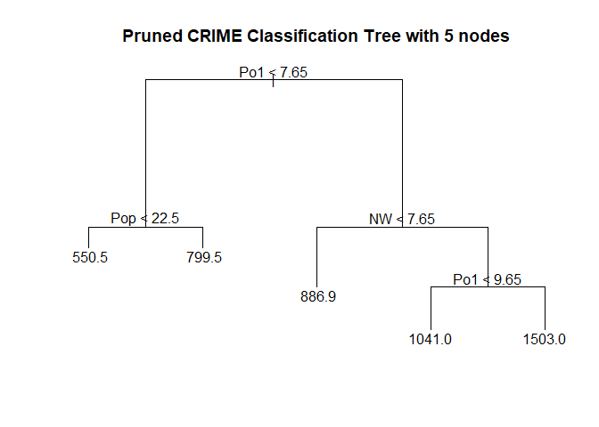

Regression Tree and Random Forest
================
Exploring US crime dataset and Making Prediction

# Introduction

Here, we explore US crime dataset. We want to use a regression tree
model, and a random forest model to predict the observed crime rate.

Prediction for:

M = 14.0 So = 0 Ed = 10.0 Po1 = 12.0 Po2 = 15.5 LF = 0.640 M.F = 94.0
Pop = 150 NW = 1.1 U1 = 0.120 U2 = 3.6 Wealth = 3200 Ineq = 20.1 Prob =
0.04 Time = 39.0

# Source of Data

The US crime dataset is available at the statsci.org Repository. It
contains aggregated data on 47 states of the USA for 1960.

Link: <http://www.statsci.org/data/general/uscrime.txt>

Description: <http://www.statsci.org/data/general/uscrime.html>

The data set contains the following columns:

  - M percentage of males aged 14-24 in total state population

  - So indicator variable for a southern state

  - Ed mean years of schooling of the population aged 25 years or over

  - Po1 per capita expenditure on police protection in 1960

  - Po2 per capita expenditure on police protection in 1959

  - LF labour force participation rate of civilian urban males in the
    age-group 14-24

  - M.F number of males per 100 females

  - Pop state population in 1960 in hundred thousands

  - NW percentage of nonwhites in the population

  - U1 unemployment rate of urban males 14-24

  - U2 unemployment rate of urban males 35-39

  - Wealth wealth: median value of transferable assets or family income

  - Ineq income inequality: percentage of families earning below half
    the median income

  - Prob probability of imprisonment: ratio of number of commitments to
    number of offenses

  - Time average time in months served by offenders in state prisons
    before their first release

  - Crime crime rate: number of offenses per 100,000 population in 1960

# Summary of solution to this problem:

1.  Read the data-set
2.  Build regression tree model
3.  Visualize the results
4.  Prune the tree
5.  Calculate quality of fit for tree with different size
6.  Cross-Validation: repeat above steps using cross validation
7.  Random forest with and without cross-validation

# Part(a): Regression tree model

## 1\. Read the dataset

We load the data and explore the records.

``` r
library(tree)
library(randomForest)
data <- read.table(file = 'data/uscrime.txt',
                   sep = "\t",
                   header=T,
                   na.strings=c(" ","","NA"),
                   stringsAsFactors = FALSE)
```

``` r
str(data)
```

    ## 'data.frame':    47 obs. of  16 variables:
    ##  $ M     : num  15.1 14.3 14.2 13.6 14.1 12.1 12.7 13.1 15.7 14 ...
    ##  $ So    : int  1 0 1 0 0 0 1 1 1 0 ...
    ##  $ Ed    : num  9.1 11.3 8.9 12.1 12.1 11 11.1 10.9 9 11.8 ...
    ##  $ Po1   : num  5.8 10.3 4.5 14.9 10.9 11.8 8.2 11.5 6.5 7.1 ...
    ##  $ Po2   : num  5.6 9.5 4.4 14.1 10.1 11.5 7.9 10.9 6.2 6.8 ...
    ##  $ LF    : num  0.51 0.583 0.533 0.577 0.591 0.547 0.519 0.542 0.553 0.632 ...
    ##  $ M.F   : num  95 101.2 96.9 99.4 98.5 ...
    ##  $ Pop   : int  33 13 18 157 18 25 4 50 39 7 ...
    ##  $ NW    : num  30.1 10.2 21.9 8 3 4.4 13.9 17.9 28.6 1.5 ...
    ##  $ U1    : num  0.108 0.096 0.094 0.102 0.091 0.084 0.097 0.079 0.081 0.1 ...
    ##  $ U2    : num  4.1 3.6 3.3 3.9 2 2.9 3.8 3.5 2.8 2.4 ...
    ##  $ Wealth: int  3940 5570 3180 6730 5780 6890 6200 4720 4210 5260 ...
    ##  $ Ineq  : num  26.1 19.4 25 16.7 17.4 12.6 16.8 20.6 23.9 17.4 ...
    ##  $ Prob  : num  0.0846 0.0296 0.0834 0.0158 0.0414 ...
    ##  $ Time  : num  26.2 25.3 24.3 29.9 21.3 ...
    ##  $ Crime : int  791 1635 578 1969 1234 682 963 1555 856 705 ...

## 2\. Build regression tree model

First, we build and evaluate the model using all dataset for training.

Later, we use cross validation and compare the results.

``` r
# Build regression tree model
crime.tree <- tree(Crime ~ ., data )
print(summary(crime.tree))
```

    ## 
    ## Regression tree:
    ## tree(formula = Crime ~ ., data = data)
    ## Variables actually used in tree construction:
    ## [1] "Po1" "Pop" "LF"  "NW" 
    ## Number of terminal nodes:  7 
    ## Residual mean deviance:  47390 = 1896000 / 40 
    ## Distribution of residuals:
    ##     Min.  1st Qu.   Median     Mean  3rd Qu.     Max. 
    ## -573.900  -98.300   -1.545    0.000  110.600  490.100

## 3\. Visualize the results

Here, we visualize the regression tree, and see how many points are in
each leaf.

``` r
# Lets see the details
print(crime.tree$frame)
```

    ##       var  n        dev      yval splits.cutleft splits.cutright
    ## 1     Po1 47 6880927.66  905.0851          <7.65           >7.65
    ## 2     Pop 23  779243.48  669.6087          <22.5           >22.5
    ## 4      LF 12  243811.00  550.5000        <0.5675         >0.5675
    ## 8  <leaf>  7   48518.86  466.8571                               
    ## 9  <leaf>  5   77757.20  667.6000                               
    ## 5  <leaf> 11  179470.73  799.5455                               
    ## 3      NW 24 3604162.50 1130.7500          <7.65           >7.65
    ## 6     Pop 10  557574.90  886.9000          <21.5           >21.5
    ## 12 <leaf>  5  146390.80 1049.2000                               
    ## 13 <leaf>  5  147771.20  724.6000                               
    ## 7     Po1 14 2027224.93 1304.9286          <9.65           >9.65
    ## 14 <leaf>  6  170828.00 1041.0000                               
    ## 15 <leaf>  8 1124984.88 1502.8750

``` r
print(crime.tree$where)
```

    ##  1  2  3  4  5  6  7  8  9 10 11 12 13 14 15 16 17 18 19 20 21 22 23 24 25 26 
    ##  6 13  4 13  9 10 12 13  6  5 13  6  6  5  6 12  4 13 10 13  6  4 12  9  5 13 
    ## 27 28 29 30 31 32 33 34 35 36 37 38 39 40 41 42 43 44 45 46 47 
    ##  4 12 13  6  4 12  6  9 10  9  6  5  6 12  5  4  6 10  4 10  9

``` r
plot(crime.tree, main = "CRIME Classification Tree")
text(crime.tree)
title("CRIME Classification Tree")
```

<!-- -->

## 4\. Prune the tree

Here, we prune the tree to **5 nodes** and verify deviance.

``` r
terminal.nodes <- 5
crime.tree.pruned.5 <- prune.tree(crime.tree, best = terminal.nodes)
summary(crime.tree.pruned.5)
```

    ## 
    ## Regression tree:
    ## snip.tree(tree = crime.tree, nodes = c(4L, 6L))
    ## Variables actually used in tree construction:
    ## [1] "Po1" "Pop" "NW" 
    ## Number of terminal nodes:  5 
    ## Residual mean deviance:  54210 = 2277000 / 42 
    ## Distribution of residuals:
    ##    Min. 1st Qu.  Median    Mean 3rd Qu.    Max. 
    ##  -573.9  -107.5    15.5     0.0   122.8   490.1

``` r
plot(crime.tree.pruned.5, main = "Pruned CRIME Classification Tree with 5 nodes")
text(crime.tree.pruned.5)
title("Pruned CRIME Classification Tree with 5 nodes")
```

<!-- -->

Here, we prune the tree to **4 nodes** and verify deviance.

``` r
terminal.nodes <- 4
crime.tree.pruned.4 <- prune.tree(crime.tree, best = terminal.nodes)
summary(crime.tree)
```

    ## 
    ## Regression tree:
    ## tree(formula = Crime ~ ., data = data)
    ## Variables actually used in tree construction:
    ## [1] "Po1" "Pop" "LF"  "NW" 
    ## Number of terminal nodes:  7 
    ## Residual mean deviance:  47390 = 1896000 / 40 
    ## Distribution of residuals:
    ##     Min.  1st Qu.   Median     Mean  3rd Qu.     Max. 
    ## -573.900  -98.300   -1.545    0.000  110.600  490.100

``` r
plot(crime.tree.pruned.4, main = "Pruned CRIME Classification Tree with 4 nodes")
text(crime.tree.pruned.4)
title("Pruned CRIME Classification Tree with 4 nodes")
```

<!-- -->

Here, we plot the predicted value from different trees (with 7, 5 and 4
nodes), and compare the results with actual response. This is just for
observation. Later we use proper CV for evaluation.

``` r
y.hat.7 <- predict(crime.tree, data = data[,1:15])
y.hat.5 <- predict(crime.tree.pruned.5, data = data[,1:15])
y.hat.4 <- predict(crime.tree.pruned.4, data = data[,1:15])
plot(y=data[,16], x=c(1:47), main = "Comparison of predicted value from different Trees")
points(y.hat.7, col="red", pch = 2)
points(y.hat.5, col="blue", pch = 18)
points(y.hat.4, col="green", pch = 4)
```

<!-- -->

## 5\. Calculate quality of fit

Calculate quality of fit for the original tree, and the pruned tree.

deviance is defined as the difference of likelihoods between the fitted
model and the saturated model:

1.  Obviously, fewer number of nodes results in higher deviance. The
    highest deviance is when we have a node for each response
    (satudrated model).

2.  R2 has decreased by 10% after removing one node. Considering that
    the model is simpler it might worse it. So we should use a metric
    which takes simplicity in account.

<!-- end list -->

``` r
TSS <- sum( (data[,16] - mean(data[,16])) ^2 )
RSS.7 <- sum( (y.hat.7 - data[,16]) ^2 )
RSS.5 <- sum( (y.hat.5 - data[,16]) ^2 )
RSS.4 <- sum( (y.hat.4 - data[,16]) ^2 )

R2.7 <- 1 - RSS.7/TSS
R2.5 <- 1 - RSS.5/TSS
R2.4 <- 1 - RSS.4/TSS

tree.dev <- prune.tree(crime.tree)$dev

cat("R2.7: ", R2.7, " devariance.7: ", tree.dev[1],
    "\nR2.5: ", R2.5, " devariance.5: ", tree.dev[3],
    "\nR2.4: ", R2.4, " devariance.4: ", tree.dev[4])
```

    ## R2.7:  0.7244962  devariance.7:  1895722 
    ## R2.5:  0.6691333  devariance.5:  2276670 
    ## R2.4:  0.6174017  devariance.4:  2632631

## 6\. Cross-Validation: Build regression tree model

Here, I build the cross-validation, to find what value of
“Terminal.Nodes” is best.

1.  Results are not good at all. Because we have only 47 data which is
    too little and also it’s a primary number. Thus, we cannot perform a
    good CV.

2.  Deviance calculated using CV is larger than deviance calculated for
    same tree size but without CV. This shows CV is helping with
    over-fitting.

<!-- end list -->

``` r
set.seed(1)
cv.crime <- cv.tree(crime.tree)
plot(cv.crime, type = 'b')
```

<!-- -->

``` r
cat(cv.crime$dev)
```

    ## 7870297 7978845 8281875 8304665 8913771 7767232 8249636

``` r
cat("Lets compare the CV deviance with pruned tree.\n
    Is CV$deviance larger than pruned$deviance?:\n ",
    cv.crime$dev > prune.tree(crime.tree)$dev )
```

    ## Lets compare the CV deviance with pruned tree.
    ## 
    ##     Is CV$deviance larger than pruned$deviance?:
    ##   TRUE TRUE TRUE TRUE TRUE TRUE TRUE

# Part(a): Random forest model

## 1\. Build Random forest model

Here, we build the random forest with the recommended value for terminal
nodes = 1 + log(n).

``` r
tree.size <- round( 1+ log(47) )
crime.rf <- randomForest(Crime ~ ., data, 
                         importance = TRUE, 
                         nodesize = tree.size, 
                         ntree = 500)
crime.rf
```

    ## 
    ## Call:
    ##  randomForest(formula = Crime ~ ., data = data, importance = TRUE,      nodesize = tree.size, ntree = 500) 
    ##                Type of random forest: regression
    ##                      Number of trees: 500
    ## No. of variables tried at each split: 5
    ## 
    ##           Mean of squared residuals: 87091.8
    ##                     % Var explained: 40.51

## 2\. Calculate quality of fit

``` r
crime.rf.pred <- predict(crime.rf, data[,-16])
RSS <- sum( (crime.rf.pred - data[,16] ) ^2 )
R2 <- 1 - RSS/TSS
R2
```

    ## [1] 0.892363

## 3\. Cross-Validation

``` r
set.seed(1)
n.dataset <-nrow(data)
text.size <- floor(n.dataset*0.1) # Allocate 10% for data2
test.index <- sample(seq_len(n.dataset), size = text.size )

data.test <- data[test.index,] # To use it for measuring performance
data.train <- data[-test.index,] # To perform Cross-Validation on

kcv = 5 # k in k-fold cross validation

# define a function to split the data
cv.folds <- function(n, nfolds){
  split(sample(n), rep(1:nfolds, length = n) )
}

# Split the data.train into 'kcv' groups
cv.folds.index <- cv.folds(nrow(data.train), kcv)


model.rsq <- matrix(0,nrow= 7, ncol = kcv)
model.rsq.kcv <- c()


for(ts in c(7,6,5,4,3,2,1) ) {
  
    for (i in 1:kcv) { # For each k-fold group:
    
      # a. Take one group as validation.data set
      validation.index <- unlist( cv.folds.index[i] )
      validation.data <- data.train[validation.index,1:16] 
    
      # b. Take the remaining groups as a train.data set
      train.data <- data.train[-validation.index,1:16]
      response.data <- data.train[-validation.index,16]

      # c. Fit the model on the training set 
      model.rf <- randomForest(Crime ~ ., train.data, 
                         importance = TRUE, 
                         nodesize = ts, 
                         ntree = 500)
      
      # d. Evaluate the model on the validation set
      rf.pred <- predict(model.rf, validation.data[,-16])
      RSS <- sum( (rf.pred - validation.data[,16] ) ^2 )
      R2 <- 1 - RSS/TSS
      
      #pseudo R-squared
      model.rsq.kcv[i] <- R2
    }
  model.rsq[ts,] <- model.rsq.kcv
}

model.rsq
```

    ##           [,1]      [,2]      [,3]      [,4]      [,5]
    ## [1,] 0.8175496 0.9289104 0.9484118 0.8745288 0.8643981
    ## [2,] 0.8205835 0.9257559 0.9383708 0.8660001 0.8602481
    ## [3,] 0.8195270 0.9284328 0.9394030 0.8773708 0.8620579
    ## [4,] 0.8145681 0.9286695 0.9422923 0.8758753 0.8576740
    ## [5,] 0.8240597 0.9295383 0.9346833 0.8834048 0.8577137
    ## [6,] 0.8185631 0.9296687 0.9420218 0.8739185 0.8564657
    ## [7,] 0.8241053 0.9284521 0.9451681 0.8763320 0.8554588

``` r
plot(y = rowMeans(model.rsq), x = c(7,6,5,4,3,2,1), main = "CV- pseudo R-squared")
```

<!-- -->

From the above graph, it seems the best value for Tree.Size is 5. But
there is a lot of over-fitting. The main reason is the size of data set.
