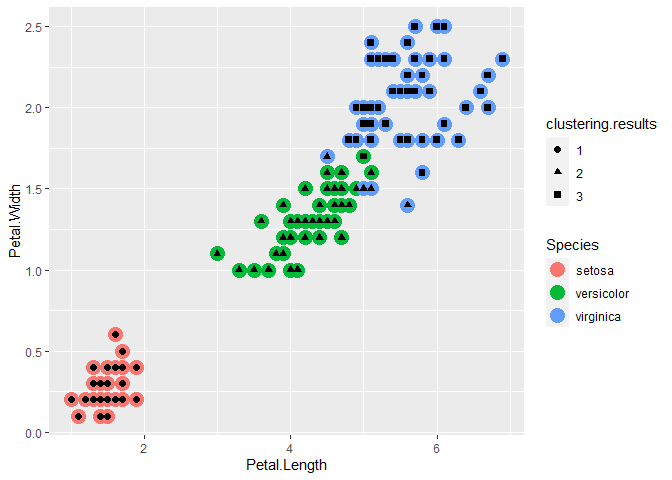

kmeans Clustering
================
Exploring Iris dataset to cluster flower type

# Introduction

Here, we explore Iris dataset, and apply kmeans clustering algorithm,
and report:

1)  The best combination of predictors
2)  our suggested number of clusters (k)
3)  and how well our best clustering predicts flower type.

# Source of Data

The Iris dataset is available from the R library datasets. It is also
available at the UCI Machine Learning Repository. It contains four
predictor variables and one categorical response. The response values
are only given to see how well a specific method performed and should
not be used to build the model.

Link: <https://archive.ics.uci.edu/ml/datasets/Iris>

## 1\. Load iris from datasets package

``` r
library(datasets)
library(ggplot2)
library(cluster)

data(iris)
```

## 2\. Remove labels during the cluster training

``` r
iris.features<- iris[,c(1,2,3,4)]
iris.lables<- iris[,"Species"]
head(iris.features)
```

    ##   Sepal.Length Sepal.Width Petal.Length Petal.Width
    ## 1          5.1         3.5          1.4         0.2
    ## 2          4.9         3.0          1.4         0.2
    ## 3          4.7         3.2          1.3         0.2
    ## 4          4.6         3.1          1.5         0.2
    ## 5          5.0         3.6          1.4         0.2
    ## 6          5.4         3.9          1.7         0.4

## 3\. Normalize the features to range of 0-1

``` r
normalize <- function(x){
  iris.norm <- x
  for (i in 1:length(x) ){
    iris.norm[i] <- (iris.norm[i] - min(iris.norm[i]))/max(iris.norm[i])
  }
  return(iris.norm)
}
summary(iris)
```

    ##   Sepal.Length    Sepal.Width     Petal.Length    Petal.Width   
    ##  Min.   :4.300   Min.   :2.000   Min.   :1.000   Min.   :0.100  
    ##  1st Qu.:5.100   1st Qu.:2.800   1st Qu.:1.600   1st Qu.:0.300  
    ##  Median :5.800   Median :3.000   Median :4.350   Median :1.300  
    ##  Mean   :5.843   Mean   :3.057   Mean   :3.758   Mean   :1.199  
    ##  3rd Qu.:6.400   3rd Qu.:3.300   3rd Qu.:5.100   3rd Qu.:1.800  
    ##  Max.   :7.900   Max.   :4.400   Max.   :6.900   Max.   :2.500  
    ##        Species  
    ##  setosa    :50  
    ##  versicolor:50  
    ##  virginica :50  
    ##                 
    ##                 
    ## 

``` r
summary(iris.norm <-normalize(iris.features))
```

    ##   Sepal.Length     Sepal.Width      Petal.Length      Petal.Width    
    ##  Min.   :0.0000   Min.   :0.0000   Min.   :0.00000   Min.   :0.0000  
    ##  1st Qu.:0.1013   1st Qu.:0.1818   1st Qu.:0.08696   1st Qu.:0.0800  
    ##  Median :0.1899   Median :0.2273   Median :0.48551   Median :0.4800  
    ##  Mean   :0.1954   Mean   :0.2403   Mean   :0.39971   Mean   :0.4397  
    ##  3rd Qu.:0.2658   3rd Qu.:0.2955   3rd Qu.:0.59420   3rd Qu.:0.6800  
    ##  Max.   :0.4557   Max.   :0.5455   Max.   :0.85507   Max.   :0.9600

## 5\. We need to find the number of clusters. We use elbow plot.

``` r
#Total within-cluster sum of squares
tot.withinss <- vector(mode="character", length=15)
for (i in 1:15){
  results <- kmeans(iris.norm, center=i,iter.max = 100)
  tot.withinss[i] <- results$tot.withinss
}
#visualizing the elbow plot
plot(1:15, tot.withinss, type="b", pch=19, 
     xlab = "The number of clusters",
     main = "Elbow method for identifying the best k (=3)")
```

<!-- -->

# First we apply kmeans using all features

## 6\. Apply kmeans clustering algorithm with k = 3

``` r
result<- kmeans(iris.norm,centers = 3, iter.max = 100)
result$size
```

    ## [1] 50 52 48

``` r
result$centers
```

    ##   Sepal.Length Sepal.Width Petal.Length Petal.Width
    ## 1   0.08936709   0.3245455   0.06695652      0.0584
    ## 2   0.20423564   0.1678322   0.47770346      0.4900
    ## 3   0.29614979   0.2310606   0.66183575      0.7825

``` r
result$cluster
```

    ##   [1] 1 1 1 1 1 1 1 1 1 1 1 1 1 1 1 1 1 1 1 1 1 1 1 1 1 1 1 1 1 1 1 1 1 1 1 1 1
    ##  [38] 1 1 1 1 1 1 1 1 1 1 1 1 1 2 2 2 2 2 2 2 2 2 2 2 2 2 2 2 2 2 2 2 2 3 2 2 2
    ##  [75] 2 2 2 3 2 2 2 2 2 2 2 2 2 2 2 2 2 2 2 2 2 2 2 2 2 2 3 3 3 3 3 3 2 3 3 3 3
    ## [112] 3 3 3 3 3 3 3 3 2 3 3 3 3 3 3 3 3 3 3 3 3 3 2 2 3 3 3 3 3 3 3 3 3 3 3 3 3
    ## [149] 3 3

## 7\. Identify which cluster maps to which label

``` r
results.table <- table(result$cluster,iris.lables)
cat("Cluster 1, Cluster 2, Cluster 3:\n",
    colnames(results.table)[apply(results.table,1,which.max)])
```

    ## Cluster 1, Cluster 2, Cluster 3:
    ##  setosa versicolor virginica

## 8\. Evaluate the clustering results

``` r
accuracy.cluster1 <- max(results.table[1,])/sum(results.table[1,])*100
accuracy.cluster2 <- max(results.table[2,])/sum(results.table[2,])*100
accuracy.cluster3 <- max(results.table[3,])/sum(results.table[3,])*100
kmeans.accuracy <- sum(accuracy.cluster1,accuracy.cluster2,accuracy.cluster3)/3

cat("\nAccuracy Cluster 1:\t",accuracy.cluster1,
    "\nAccuracy Cluster 2:\t",accuracy.cluster2,
    "\nAccuracy Cluster 3:\t",accuracy.cluster3,
    "\nAccuracy Cluster Algorithm:\t",kmeans.accuracy)
```

    ## 
    ## Accuracy Cluster 1:   100 
    ## Accuracy Cluster 2:   92.30769 
    ## Accuracy Cluster 3:   95.83333 
    ## Accuracy Cluster Algorithm:   96.04701

## 9\. Visualize the clustering results

``` r
clustering.results <- as.factor(result$cluster)
p <- ggplot(iris, aes(Petal.Length, Petal.Width)) + geom_point(aes(col=Species), size=5)
p + geom_point(aes(shape = clustering.results),size=2)
```

<!-- -->

Above plot illustrates both clustering results, and real Species values.
Observations are represented by points along the Petal.Length and
Petal.Width attributes. We can see that one cluster has larger
intra-cluster distance with the other two. And two of the clusters seems
to have a overlap.

``` r
p <- ggplot(iris, aes(Sepal.Length, Sepal.Width)) + geom_point(aes(col=Species), size=5)
p + geom_point(aes(shape = clustering.results),size=2)
```

<!-- -->

Above plot illustrates both clustering results, and real Species values.
Observations are represented by points along the Sepal.Length and
Sepal.Width attributes. Clusters on this plot have more overlaps than
the previous plot.This might suggest us that Petal.Length and
Petal.Width attributes are better predictors.

``` r
pairs(iris.norm, col=as.factor(result$cluster), pch=20)
```

<!-- -->

based on above graph, we can see that the best combination of predictors
are Petal.Length and Petal.Width, because there is less overlap between
the colored-clusters. On the other hand, it seems hard to cluster the
points based on only Sepal.Length and Sepal.Width.

``` r
clusplot(iris.norm, result$cluster, color=T, shade=T, labels=0, lines=0)
```

<!-- -->

# Second we apply kmeans using only some features

## 10\. Report the best combination of predictors

There are several methods to identify the best combination of
predictors.

  - ‘Subspace clustering’ is probably the most comprehensive methods.
    For a problem with 4 features, there are {2^{4}} = 16 different
    combinations to be evaluated.

  - ‘Correlation clustering’ is another method which is based on the
    correlation between predictors.

  - ‘feature ranking’: is ordering the predictors based on their
    relevance. For example, Sepal.Length may not have a great relevance
    to Spices value.

## 11\. Evaluate ALL combination of predictors. We use BSS/TSS ratio

``` r
# Generate all combination of predictors
comb.index <- expand.grid( c(TRUE, FALSE), c(TRUE, FALSE),
                           c(TRUE, FALSE),c(TRUE, FALSE))[1:15,]

colnames(comb.index) <- colnames(iris.features)
comb.score <-rep(0,15)
for (j in 1:15){
  index <- comb.index[j,]
  comb.norm <- iris.norm[,unlist(index)]
  
  # Apply kmeans on this subset of features
  result <- kmeans(comb.norm,centers = 3, iter.max = 100)
  
  # measure the performance. I use BSS/TSS ratio
  comb.score[j] <- result$betweenss/result$totss

}
result.score <- data.frame(comb.index, score = comb.score)
print(result.score)
```

    ##    Sepal.Length Sepal.Width Petal.Length Petal.Width     score
    ## 1          TRUE        TRUE         TRUE        TRUE 0.8941945
    ## 2         FALSE        TRUE         TRUE        TRUE 0.9105676
    ## 3          TRUE       FALSE         TRUE        TRUE 0.9209521
    ## 4         FALSE       FALSE         TRUE        TRUE 0.9401952
    ## 5          TRUE        TRUE        FALSE        TRUE 0.8688360
    ## 6         FALSE        TRUE        FALSE        TRUE 0.8941464
    ## 7          TRUE       FALSE        FALSE        TRUE 0.9101300
    ## 8         FALSE       FALSE        FALSE        TRUE 0.9431809
    ## 9          TRUE        TRUE         TRUE       FALSE 0.8602979
    ## 10        FALSE        TRUE         TRUE       FALSE 0.8799039
    ## 11         TRUE       FALSE         TRUE       FALSE 0.9121807
    ## 12        FALSE       FALSE         TRUE       FALSE 0.9464537
    ## 13         TRUE        TRUE        FALSE       FALSE 0.5403555
    ## 14        FALSE        TRUE        FALSE       FALSE 0.7557987
    ## 15         TRUE       FALSE        FALSE       FALSE 0.8321085

``` r
comb.index.best <- which.max(result.score$score)

result.score[comb.index.best,] 
```

    ##    Sepal.Length Sepal.Width Petal.Length Petal.Width     score
    ## 12        FALSE       FALSE         TRUE       FALSE 0.9464537

``` r
cat("Best combination of predictors is:\n",
    colnames(iris)[unlist(comb.index[comb.index.best,])],
    "\n with performance:\n",result.score$score[comb.index.best])
```

    ## Best combination of predictors is:
    ##  Petal.Length 
    ##  with performance:
    ##  0.9464537

``` r
plot(result.score$score)
```

<!-- -->

## Report how well your best clustering predicts flower type

``` r
# Predictor = Petal.Length, K = 3
result <- kmeans(iris.norm[3],centers = 3, iter.max = 100)

#Identify which cluster maps to which label
results.table <- table(result$cluster,iris.lables)
cat("Cluster 1, Cluster 2, Cluster 3:\n",
    colnames(results.table)[apply(results.table,1,which.max)])
```

    ## Cluster 1, Cluster 2, Cluster 3:
    ##  setosa versicolor virginica

``` r
results.table
```

    ##    iris.lables
    ##     setosa versicolor virginica
    ##   1     50          0         0
    ##   2      0         46         3
    ##   3      0          4        47

``` r
#Evaluate the clustering results
accuracy.cluster1 <- max(results.table[1,])/sum(results.table[1,])*100
accuracy.cluster2 <- max(results.table[2,])/sum(results.table[2,])*100
accuracy.cluster3 <- max(results.table[3,])/sum(results.table[3,])*100
kmeans.accuracy <- sum(accuracy.cluster1,accuracy.cluster2,accuracy.cluster3)/3

cat("\nAccuracy Cluster 1:\t",accuracy.cluster1,
    "\nAccuracy Cluster 2:\t",accuracy.cluster2,
    "\nAccuracy Cluster 3:\t",accuracy.cluster3,
    "\nAccuracy Cluster Algorithm:\t",kmeans.accuracy)
```

    ## 
    ## Accuracy Cluster 1:   100 
    ## Accuracy Cluster 2:   93.87755 
    ## Accuracy Cluster 3:   92.15686 
    ## Accuracy Cluster Algorithm:   95.3448

Please note that we picked our model based on BSS/TSS ratio not
clustering accuracy. Here, Clustering accuracy is calculated based
labels. In a real un-supervised learning scenario such lables are not
available.
